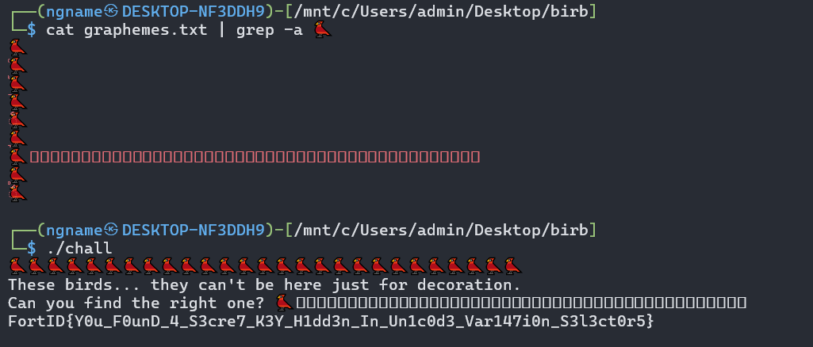

# Tổng quát

Chương trình chạy hàm lấy dữ liệu người dùng (chỉ lấy 1 kí tự) sau đó quét grapheme (emoji) từ 1tr byte dữ liệu được harcode sẵn 

Lấy dữ liệu đó làm key, rồi decrypt ciphertext (ct và iv đều được hardcode sẵn) nếu kết quả bắt đầu bằng `FortID{` thì sẽ in ra nó không thì báo `Nope`

Như vậy ta sẽ lấy 1 triệu byte đó ra, tạo 1 script để trích xuất các grapheme hợp lệ sau đó grep những emoji con chim vì bài có nói rằng "Có 1 emoji con chim phải đúng"

Như trong ảnh thì có 1 emoji có rất nhiều byte ẩn đằng sau nó, nhập nó vào sẽ đưa ta flag của bài