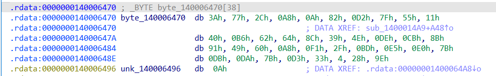

# Phân tích

Chạy thử phát

```
$ ./crackme-rust-fun.exe
Hello! Included is a prompt asking for a flag.You should try to get the flag.You could sit here and brute force the flag
, but that would be too easy.
What is the flag?
flag
Incorrect! The flag is not: flag
```

Lần này thì sau khi nhập flag thì nếu sai sẽ báo Incorrect và print lại cái flag mình vừa nhập

Thử kiểm tra strings xem sao

```
$ strings crackme-rust-fun.exe | grep -i correct
b87a5dae3a3686ddd6f14ebcb4f4d49bIncorrect! The flag is not:
Correct! The flag is:
```

Có `Correct`, vào IDA xong tìm cái string này sẽ cho ta vào hàm `sub_1400014A9`, xem pseudo code để biết flag đúng được so sánh như nào

```C
  if ( v69 == (unsigned __int8 *)38 )
  {
    v71 = 0xDFB432BC61353FB0uLL;
    v72 = 0;
    while ( v72 != 38 )
    {
      v71 = 0xCFA8C7711A026A35uLL - 0x453E9537620FF1E3LL * v71;
      v73 = (v70[v72] ^ (unsigned __int8)((unsigned int)v71 >> 21)) == byte_140006470[v72];
      ++v72;
      if ( !v73 )
        goto LABEL_143;
    }
    v87[0] = v79;
    v74 = &off_140006530;
  }
  else
  {
LABEL_143:
    v87[0] = v79;
    v74 = (char **)&off_1400064F8;
  }
  *(_QWORD *)IoStatusBlock = v74;
  *(_QWORD *)&IoStatusBlock[8] = 2;
  v91 = 0;
  v87[1] = sub_1400028DF;
  *(_QWORD *)&IoStatusBlock[16] = v87;
  v90 = 1;
  sub_140003E21();
  return sub_1400022C2(v80, v49);
}
```

`v71` là một biến rất to và được cập nhật liên tục qua từng vòng lặp phục vụ cho mục đích mã hoá thôi

`v72` là counter và đi từ 0->37, tổng 38 bước, biết cái gì cũng có 38 kí tự ko, đó là flag. Vậy có thể thấy rằng `v70` chính là input của người dùng và `v73` là một biến 0 hoặc 1, nếu `v73 == 0` sẽ nhảy đến `LABEL_143` lúc đó print Incorrect. Vậy là nếu muốn tìm ra flag chính xác thì phải biết được `byte_140006470` có gì, bởi vì từng byte của `(v70[v72] ^ (unsigned __int8)((unsigned int)v71 >> 21))` sẽ được so sánh với từng byte của `byte_140006470`. Nếu tất cả 38 ký tự đều giống nhau thì print Correct

Trên IDA chỉ cần ấn vào để xem 



# Flag

Tạo một script python để đảo ngược lại đưa các byte trên thành flag thôi

```py
byte_140006470 = [ 0x3A, 0x77, 0x2C, 0xA8, 0x0A, 0x82, 0xD2, 0x7F, 0x55, 0x11, 0x40, 0xB6, 0x62, 0x64, 
                  0x8C, 0x39, 0x4E, 0xDE, 0xCB, 0x8B, 0x91, 0x49, 0x60, 0xA8, 0xF1, 0x2F, 0xBD, 0xE5, 
                  0xE0, 0x7B, 0xDB, 0xDA, 0x7B, 0xD3, 0x33, 0x04, 0x28, 0x9E, 0x0A ]

v71 = 0xDFB432BC61353FB0

for i in range(38):
    v71 = 0xCFA8C7711A026A35 - 0x453E9537620FF1E3 * v71
    for c in range(0x20, 0x7F):
        if (c ^ (v71 >> 21 & 0xff)) == byte_140006470[i]:
            print(chr(c), end='')
            break
print()
```

`flag{ed817c62d7f7dcdb05c0f6e520a7069e}`