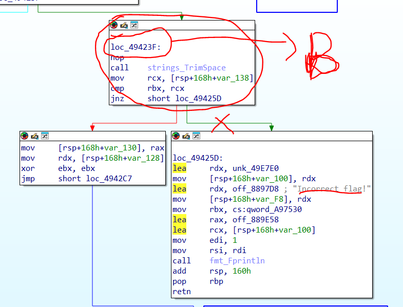

# Mô tả

Did you see the strings? One of those is right, I can just feel it.

# Phân tích

Bài cho ta một file ELF được packed bằng upx, ta có thể unpack nó = `upx -d flagsflagsflags`

Đưa file vào DiE biết file được viết = go lang

Chạy thử 

```
$ ./flagsflagsflags
Enter the flag:
flag{hihello}
Incorrect flag!
```

Chương trình khá đơn giả, nhập flag vào và báo đúng hoặc sai

Vì mô tả nói đến strings thì khi strings thử file ra sẽ có rất nhiều flag khác nhau, đến đây đoán được rằng flag chính xác đã được hardcode sẵn trong chương trình rồi và sẽ được load vào để so sánh với flag người dùng nhập khi kiểm tra flag

Thử đưa vào IDA, trong function có thư mục main với 2 hàm là `main_main` với `main_generateFlag` ta phân tích `main_main` trước

```C
// main.main
void __fastcall main_main()
{
  __int64 v0; // rbx
  __int128 v1; // xmm15
  __int64 v2; // rbx
  int v3; // r8d
  int v4; // r9d
  int v5; // r10d
  int v6; // r11d
  __int64 *v7; // rdi
  __int64 v8; // rcx
  __int64 *v9; // rbp
  int v10; // r8d
  int v11; // r9d
  int v12; // r10d
  int v13; // r11d
  char *v14; // rsi
  int String; // eax
  __int64 v16; // rcx
  int v17; // r8d
  int v18; // r9d
  int v19; // r10d
  int v20; // r11d
  __int64 v21; // rax
  int v22; // r8d
  int v23; // r9d
  int v24; // r10d
  int v25; // r11d
  __int64 v26; // rcx
  __int64 v27; // rdx
  __int64 v28; // rbx
  int v29; // r8d
  int v30; // r9d
  __int64 *v31; // [rsp+0h] [rbp-178h]
  __int64 v32; // [rsp+10h] [rbp-168h] BYREF
  __int64 v33; // [rsp+18h] [rbp-160h]
  __int64 v34; // [rsp+20h] [rbp-158h]
  __int64 v35; // [rsp+28h] [rbp-150h]
  __int64 v36; // [rsp+30h] [rbp-148h]
  __int64 v37; // [rsp+38h] [rbp-140h]
  __int64 v38; // [rsp+40h] [rbp-138h]
  __int64 v39; // [rsp+48h] [rbp-130h]
  __int64 Flag; // [rsp+50h] [rbp-128h]
  _QWORD v41[2]; // [rsp+58h] [rbp-120h] BYREF
  _QWORD v42[2]; // [rsp+68h] [rbp-110h] BYREF
  _QWORD v43[2]; // [rsp+78h] [rbp-100h] BYREF
  _QWORD v44[2]; // [rsp+88h] [rbp-F0h] BYREF
  __int128 v45; // [rsp+98h] [rbp-E0h]
  __int128 v46; // [rsp+A8h] [rbp-D0h] BYREF
  __int64 v47; // [rsp+B8h] [rbp-C0h]
  _UNKNOWN **v48; // [rsp+C0h] [rbp-B8h]
  __int64 v49; // [rsp+C8h] [rbp-B0h]
  __int64 v50; // [rsp+F0h] [rbp-88h]
  __int64 v51; // [rsp+F8h] [rbp-80h]
  _OWORD v52[5]; // [rsp+100h] [rbp-78h] BYREF
  _QWORD v53[2]; // [rsp+158h] [rbp-20h] BYREF
  __int64 v54; // [rsp+168h] [rbp-10h]
  __int64 v55; // [rsp+170h] [rbp-8h] BYREF

  Flag = main_generateFlag();
  v38 = v0;
  v53[0] = &unk_49E7E0;
  v53[1] = &off_8897B8;
  v2 = qword_A97530;
  fmt_Fprintln(
    (unsigned int)&off_889E58,
    qword_A97530,
    (unsigned int)v53,
    1,
    1,
    v3,
    v4,
    v5,
    v6,
    v32,
    v33,
    v34,
    v35,
    v36);
  v54 = qword_A97528;
  v52[0] = v1;
  v7 = &v32 + 25;
  v31 = &v55;
  ((void (__golang *)(__int64, __int64, __int64, __int64 *))loc_46E6F0)(qword_A97528, v2, v8, v7);
  v9 = v31;
  runtime_makeslice((unsigned int)&unk_49E860, 4096, 4096, (_DWORD)v7, 1, v10, v11, v12, v13, v32, v33, v34);
  v46 = v1;
  v31 = v9;
  *(_QWORD *)&v46 = ((__int64 (__fastcall *)(__int64 *))loc_46E6F0)(&v32 + 14);
  *((_QWORD *)&v46 + 1) = 4096;
  v47 = 4096;
  v48 = &off_889E38;
  v49 = v54;
  v50 = -1;
  v51 = -1;
  *(_QWORD *)&v52[0] = v46;
  v14 = (char *)&v46 + 8;
  ((void (__fastcall *)(char *, char *))loc_46EA5A)((char *)v52 + 8, (char *)&v46 + 8);
  String = bufio__ptr_Reader_ReadString(v52, 10);
  if ( v16 )
  {
    v45 = v1;
    v44[0] = &unk_49E7E0;
    v44[1] = &off_8897C8;
    *(_QWORD *)&v45 = *(_QWORD *)(v16 + 8);
    *((_QWORD *)&v45 + 1) = (char *)v52 + 8;
    fmt_Fprintln(
      (unsigned int)&off_889E58,
      qword_A97530,
      (unsigned int)v44,
      2,
      2,
      v17,
      v18,
      v19,
      v20,
      v32,
      v33,
      v34,
      v35,
      v36);
  }
  else
  {
    v21 = strings_TrimSpace(String, 10, 0, (unsigned int)v52 + 8, (unsigned int)&v46 + 8, v17, v18, v19, v20, v32, v33);
    v26 = v38;
    if ( v38 == 10 )
    {
      v39 = v21;
      v27 = Flag;
      v28 = 0;
      while ( v26 > v28 )
      {
        v29 = *(unsigned __int8 *)(v28 + v21);
        v30 = *(unsigned __int8 *)(v27 + v28);
        if ( (_BYTE)v30 != (_BYTE)v29 )
        {
          v42[0] = &unk_49E7E0;
          v42[1] = &off_8897D8;
          fmt_Fprintln(
            (unsigned int)&off_889E58,
            qword_A97530,
            (unsigned int)v42,
            1,
            1,
            v29,
            v30,
            v24,
            v25,
            v32,
            v33,
            v34,
            v35,
            v36);
          return;
        }
        v37 = v28;
        time_Sleep(100000000, v28, v26, (unsigned int)v52 + 8, (_DWORD)v14, v29, v30, v24, v25, v32);
        v28 = v37 + 1;
        v26 = v38;
        v27 = Flag;
        LODWORD(v14) = v39;
        v21 = v39;
      }
      v41[0] = &unk_49E7E0;
      v41[1] = &off_8897E8;
      fmt_Fprintln(
        (unsigned int)&off_889E58,
        qword_A97530,
        (unsigned int)v41,
        1,
        1,
        v22,
        v23,
        v24,
        v25,
        v32,
        v33,
        v34,
        v35,
        v36);
    }
    else
    {
      v43[0] = &unk_49E7E0;
      v43[1] = &off_8897D8;
      fmt_Fprintln(
        (unsigned int)&off_889E58,
        qword_A97530,
        (unsigned int)v43,
        1,
        1,
        v22,
        v23,
        v24,
        v25,
        v32,
        v33,
        v34,
        v35,
        v36);
    }
  }
}
```

Khá dài nhưng các điểm đáng lưu ý là 

```C
__int64 v27; // rdx 
Flag = main_generateFlag();
```

Khởi tạo biến v27(thanh ghi rdx) sau đó gán `Flag` = giá trị trả về của hàm `main_generateFlag()` vậy suy ra được rằng trong chương thì flag chính xác sẽ được khởi tạo ngay đầu sau đó gọi hàm `strings_TrimSpace` để làm sạch input của người dùng và được đặt vào `v21`

```C
v21 = strings_TrimSpace(String, 10, 0, (unsigned int)v52 + 8, (unsigned int)&v46 + 8, v17, v18, v19, v20, v32, v33);
    v26 = v38;
    if ( v38 == 10 )
    {
      v39 = v21;
      v27 = Flag;
      v28 = 0;
      while ( v26 > v28 )
      {
        v29 = *(unsigned __int8 *)(v28 + v21);
        v30 = *(unsigned __int8 *)(v27 + v28);
        if ( (_BYTE)v30 != (_BYTE)v29 )
        {
          v42[0] = &unk_49E7E0;
          v42[1] = &off_8897D8;
          fmt_Fprintln(
            (unsigned int)&off_889E58,
            qword_A97530,
            (unsigned int)v42,
            1,
            1,
            v29,
            v30,
            v24,
            v25,
            v32,
            v33,
            v34,
            v35,
            v36);
          return;
        }
```

Vòng if, while có thêm biến mới là `v21 - input của người dùng được làm sạch ` `v27 - Flag chính xác ` `v28 - counter `, ` v29 = *(unsigned __int8 *)(v28 + v21); v30 = *(unsigned __int8 *)(v27 + v28);` `v29 v30` là vị trí của byte số `v28` từ chuỗi input người dùng và flag rồi sau đó `if ( (_BYTE)v30 != (_BYTE)v29 )` sẽ so sánh từng byte tương ứng của input người dùng và flag

Ví dụ kiểu `v27 = flag{12345}` thì `v30 = *(unsigned __int8 *)(v27 + v28)` sẽ tương tự như `v30 = v27[v28]`

Vậy tóm tắt lại, Flag chính xác được đưa vào biến `v27 - thanh ghi rdx` sau đó chương trình yêu cầu người dùng nhập, làm sạch input người dùng, rồi so sánh từng byte với flag, nếu đúng in ra `Correct flag` còn sai thì `Incorrect`

# Flag

Vì là file ELF nên ta sẽ phải debug bằng GDB, IDA chỉ dùng để phân tích, tìm các địa chỉ đặt breakpoint

Trong IDA ta sẽ tìm đến địa gần khi gọi hàm  `strings_TrimSpace` (Chỉ cần trước khi so sánh sai và nhảy ra incorrect là được) và đặt breakpoint tại đó



Ở đây tôi đặt breakpoint tại `0x49423F` trong GDB `b*0x49423F` rồi chạy bằng `r` sau đó nhập flag khi chương trình hỏi thì gdb sẽ chạy đến khi break

Lưu ý khi nhập flag phải nhập đúng độ dài so với mấy flag mà ta tìm thấy trong strings, ví dụ: `flag{01234567890123456789012345678901}`

```
[#0] Id 1, Name: "flagsflagsflags", stopped 0x49423f in ?? (), reason: BREAKPOINT

-- code:x86:64
●    0x49423f                  nop
 →   0x494240                  call   0x4757c0
   ↳    0x4757c0                  cmp    rsp, QWORD PTR [r14+0x10]
        0x4757c4                  jbe    0x4758de
        0x4757ca                  push   rbp
        0x4757cb                  mov    rbp, rsp
        0x4757ce                  sub    rsp, 0x18
        0x4757d2                  mov    QWORD PTR [rsp+0x28], rax
```

Ta đi tiếp vài bước nữa bằng `ni` cho đến đoạn có dữ liệu được đưa vào thanh ghi `rdx` ở trên thì chưa thấy nên cứ next cho đến khi nào thấy như dưới đây

```
─────────────────────────────────────────────────────────────────────────────────────────────────────── code:x86:64 ────
     0x49424a                  cmp    rbx, rcx
     0x49424d                  jne    0x49425d
     0x49424f                  mov    QWORD PTR [rsp+0x38], rax
 →   0x494254                  mov    rdx, QWORD PTR [rsp+0x40]
     0x494259                  xor    ebx, ebx
     0x49425b                  jmp    0x4942c7
     0x49425d                  lea    rdx, [rip+0xa57c]        # 0x49e7e0
     0x494264                  mov    QWORD PTR [rsp+0x68], rdx
     0x494269                  lea    rdx, [rip+0x3f5568]        # 0x8897d8
```

`ni` một lần nữa rồi lướt lên đến đoạn `registers` sẽ thấy có flag được đưa vào thanh `rdx` 

```
───────────────────────────────────────────────────────────────────────────────────────────────────────── registers ────
$rax   : 0x000000c0000b0000  →  "flag{01234567890123456789012345678901}\n"
$rbx   : 0x26
$rcx   : 0x26
$rdx   : 0x0000000000519e85  →  "flag{20dec9363618a397e9b2a0bf5a35b2e3}flag{84d71da[...]"
$rsp   : 0x000000c00037fde0  →  0x000000c0000b0000  →  "flag{01234567890123456789012345678901}\n"
$rbp   : 0x000000c00037ff40  →  0x000000c00037ffd0  →  0x0000000000000000
```

Đây cũng chính là flag

`flag{20dec9363618a397e9b2a0bf5a35b2e3}`