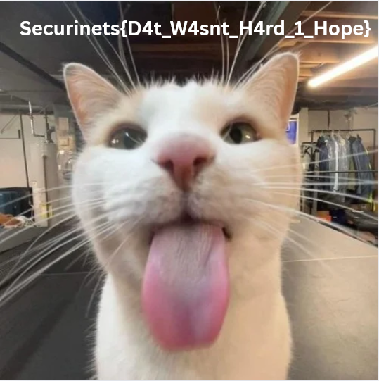

**Bài cho ta 1 file pcap và 1 thư mục của người dùng**

# Phân tích

Phân tích thư mục thấy tất cả mọi file đều đã bị mã hoá với 1 file `IMPORTANT_NOTICE.txt` là ransom note và `powershell_history.txt`

Kiểm tra các packet trong pcap trước thì thấy protocol `DNS` có các query khá là lạ từ ip `192.168.85.175` đến `10.0.0.2` với nội dung kiểu <Chuỗi Base32>.<Số thứ tự>.meow

`ip.dst == 10.0.0.2 && dns && ip.addr == 192.168.85.175` filter sau đó lưu ra file `dns.pcapng` để tiện phân tích sau

Kiểm tra `powershell_history.txt` thấy người dùng tải và chạy `app.py` từ github https://github.com/youssefnoob003/dns100-free.git

Xem `app.py` và `dns_server.py` trên đó thì thấy đều trống không, chuyển sang kiểm tra commit

Tại commit `8e9313c` khôi phục được `app.py` nhưng `dns_server.py` vẫn chưa đầy đủ lắm

Tại commit `c62c7d1` thấy có hàm xử lí query DNS `.meow` ghép lại một file `exe` khi gặp query có `end` thì chạy file đó => Khôi phục được `dns_server.py`

Từ logic xử lí base32 trong `dns_server.py` ta ghép lại và giải mã được một file `exe`

Kiểm tra thấy bị pack bằng UPX => thực hiện unpack

Tiếp tục kiểm tra trong IDA tìm được hàm mã hoá file `sub401460()`:

- Seed 32-bit ban đầu v3 = XOR “đóng gói theo 4 byte” của:

- Từng byte của FileName (đường dẫn+tên file ở thời điểm mã hoá)

- 37 byte của chuỗi `evilsecretcodeforevilsecretencryption`

- Keystream tạo bằng LCG: v3 = 1664525*v3 + 1013904223; out[i] = (uint8_t)v3;

- XOR file với keystream đó → mã hoá/giải mã đối xứng

Dựng lại thuật toán này trong python để giải mã file `sillyflag.png`

