# Mô tả
crackme
# Phân tích
## Stage 1
Chạy thử trước

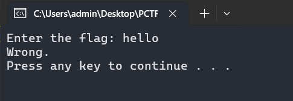

Khi đưa vào IDA thì hàm start của chương trình chỉ làm nhiệm vụ tạo 1 socket kết nối đến `127.0.0.1:1337` sau đó cho người dùng nhập vào rồi gửi đến socket đó và chỉ khi server trả về `1702195796` thì mới là đúng mật khẩu

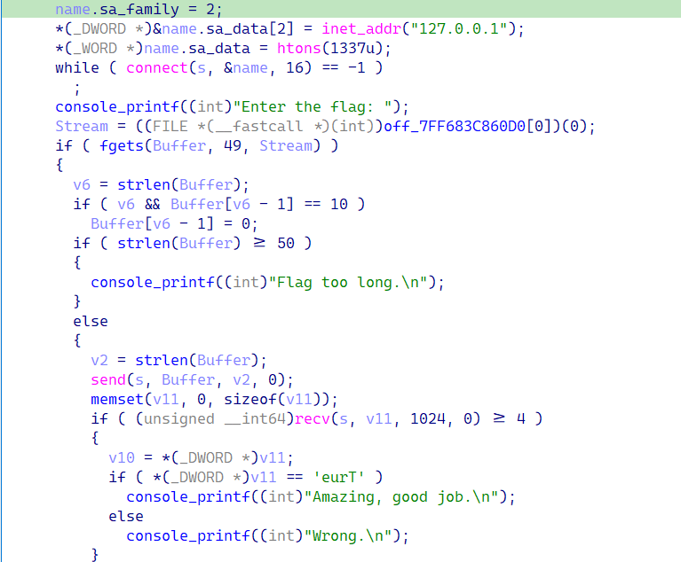

Thử tìm loanh quanh trong chương trình không thấy hàm nào khác khởi tạo socket khác nữa. Nhìn qua phần export thấy rằng chương trình có `TLS callback` nên tôi đoán rằng có lẽ đoạn thực hiện kiểm tra mật khẩu và trả về 1 giá trị như `1702195796` sẽ được thực hiện trước khi chương trình nhảy vào entrypoint

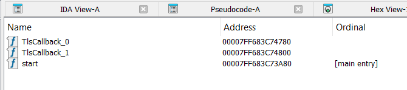

Sau một lúc thì tôi tìm được một hàm khá là lạ (Tạm đặt tên là `init`) thực hiện giải mã một header PE 256 byte, load `msvcrt.dll`, giải mã một chuỗi tên API, gọi nó để thực thi hàm `fn_process_injection`

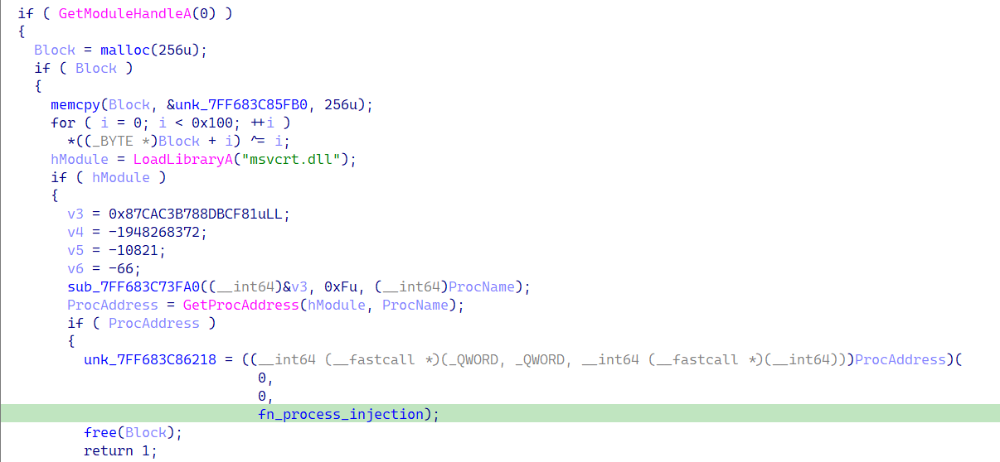

Hàm `fn_process_injection` cũng thực hiện việc giải mã khá nhiều tên tên API. Để ý ở cuối hàm có logic khá giống process hollowing. Giải mã và sau đó đưa 1 shellcode (`unk_7FF683C80FB0`) vào vùng nhớ của process đó, đặt entrypoint tại địa chỉ `2432` (`0x980`) rồi `ResumeThread` thực hiện payload

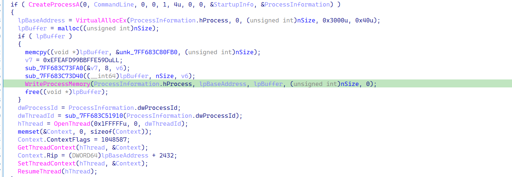

Vậy ta sẽ phải debug lại vào lúc chương trình gọi `TLS callback` đến sau khi giải mã xong shellcode để dump ra

>Do một vài lí do (lười) nên tôi đã dùng python để vá lại entrypoint của chương trình vào lúc nó gọi hàm init kia cho tiện

```py
import pefile
pe = pefile.PE("AntiChatGPT-pro.exe")
pe.OPTIONAL_HEADER.AddressOfEntryPoint = 0x1900
pe.write("patched.exe")
```

Được rồi bây giờ ta sẽ thực hiện debug, tôi đặt breakpoint trước khi gọi `WriteProcessMemory` và dump địa chỉ thanh ghi `r8`


>Độ lớn của shellcode ở thanh ghi `r9` 4FF0 (20464) byte

Bởi vì shellcode có độ lớn rất to nên ta sẽ phải dump từ vùng memorymap, sau đó cắt `20464` byte từ vị trí `39B0`. Cuối cùng ta sẽ dùng sclauncher để đặt entrypoint vào `0x980` và chuyển thành file `exe` cho dễ debug

```
sclauncher.exe -f="extracted_0x39b0_20464.bin" -pe -64 -ep="0x980" -o="stage2.exe"
```

## Stage 2

Đưa file này vào IDA kiểm tra hàm start cũng thấy có cơ chế resolve API từ việc xor và kiểm tra hash

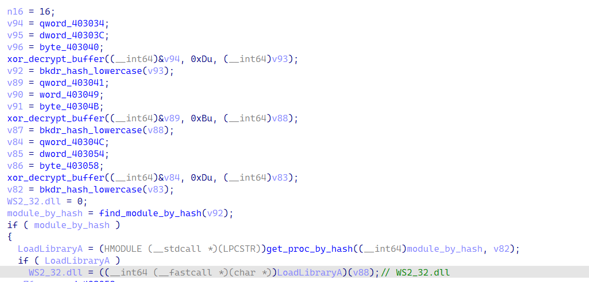

Có thể thấy API đầu tiên được gọi là `LoadLibraryA` sau đó sử dụng nó để load `WS2_32.dll`. Trong tài liệu của microsoft về [WS2_32.dll](https://learn.microsoft.com/en-us/windows/win32/winsock/initialization-2) nói rằng đây là một thư viện thuộc về `Windows Socket API`, khá là liên quan đến hàm main trong chương trình của bài

Tiếp tục phân tích và debug thì biết được shellcode tiếp tục resolve và gọi các API liên quan đến socket

Ở đoạn này có thể thấy shellcode đang chuẩn bị một socket với ip và port 1337 (Đây cũng là port mà chương trình chính sử dụng)

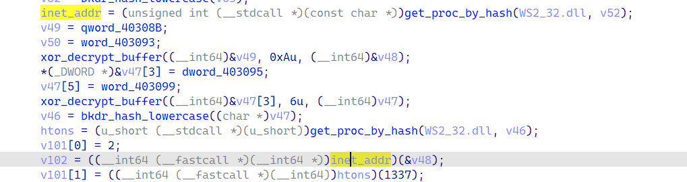

>Khi debug thì biết rằng địa chỉ ip chính là `127.0.0.1`

Đi tiếp sẽ thấy gọi `bind` và `listen` trên `127.0.0.1:1337`

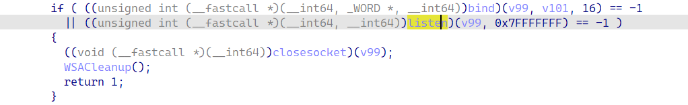

Và sau đó `accept` chờ client thiết lập kết nối rồi dùng `recv` để nhận dữ liệu từ client

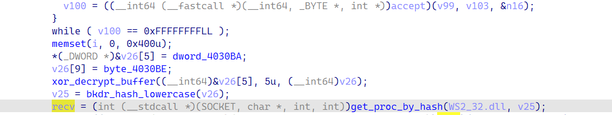

Và cuối cùng shellcode thực hiện giải mã một chuỗi bằng `RC4` sau đó so sánh với chuỗi người dùng nhập vào và gửi lại cho client một số `1702195796` nếu khớp và `1869771351` nếu sai. Đối chiếu lại với chương trình lúc đầu cũng thấy rằng có nhận `1702195796` từ server thì mới in ra `Amazing goodjob`

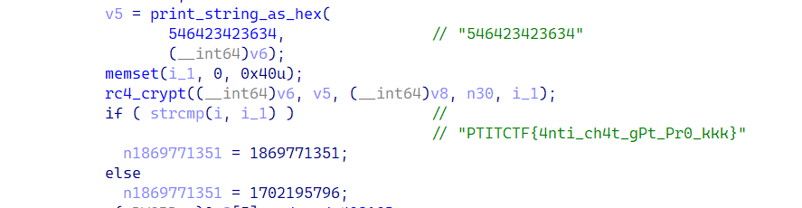

Vậy để biết được mật khẩu (flag) là gì ta chỉ cần debug `stage2.exe` sử dụng x64dbg đặt breakpoint tại hàm `accept` và `strcmp` rồi ấn run. Lúc này chương trình sẽ dừng lại tại đoạn call `accept` bởi vì đang chờ client kết nối

Sau đó chạy `AntiChatGPT-Pro.exe` làm client, nhập mật khẩu vào sau đó quay lại x64dbg ấn run lần nữa sẽ dừng tại hàm `strcmp`

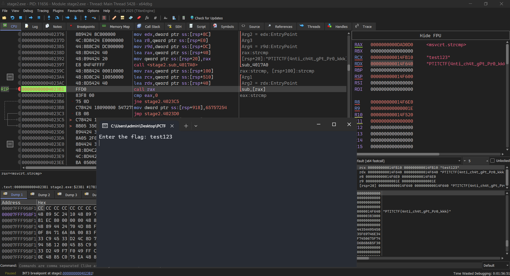

>**PTITCTF{4nti_ch4t_gPt_Pr0_kkk}**