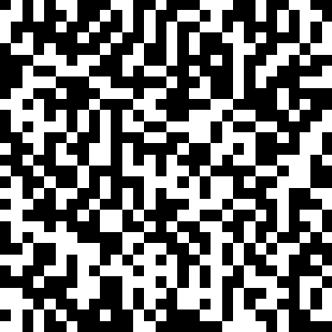

# Mô tả
What does this image mean?? 

# Phân tích
Bài cho ta một file `png` khi mở ra thì nhìn thấy rằng khá giống mã QR nhưng khi quét lại không được

Đã thử một vài cách khác như tăng giảm kích cỡ ảnh, hay là cố gắng đưa luôn về format của mã QR nhưng không được

Cuối cùng thử lấy binary data từ ảnh thì thành công khi để các pixel black=0 và white=1 trên https://www.dcode.fr/binary-image

# Flag
Decode binary ra base64 rồi decode base64 là ra flag

`gigem{b1n4ry_d3c0d1n6_h319y2z8}`
