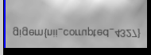

# Mô tả
Cant seem to open the file

https://ctfd.tamuctf.com/files/ba211efed4b1d4660a3e911c3208c3e3/nii.tar.gz?token=eyJ1c2VyX2lkIjozNCwidGVhbV9pZCI6MjIsImZpbGVfaWQiOjMxfQ.Z-uk8g.ZdTrjyqkyPwNPGaUuzcDsvxU0uc

# Phân tích 
Bài cho ta một file `nii` qua tìm hiểu thì đây là viết tắt cho `nifti` dùng trong chụp chiếu não

Thử tải lên https://socr.umich.edu/HTML5/BrainViewer/ lại không thành công, có thể file đã bị corrupted, nếu dùng `file flag.nii` thì cũng chỉ trả về `data`

Kiểm tra hexdump thấy rằng các byte đầu là 0000, không khớp với file signature 

https://brainder.org/2012/09/23/the-nifti-file-format/

https://en.wikipedia.org/wiki/List_of_file_signatures

Theo 2 cái trên thì magic byte sẽ bắt đầu tại offset 344

```
nam@DESKTOP-NF3DDH9:/mnt/c/Users/admin/Desktop/Giải2025/tamucCTF/NII$ xxd -s 344 -l 4 flag.nii
00000158: 0000 0000
```

# Flag
Sửa magic byte

`printf '\x6E\x2B\x31\x00' | dd of=flag.nii bs=1 seek=344 count=4 conv=notrunc`

Giờ `file` đã trả về

```
nam@DESKTOP-NF3DDH9:/mnt/c/Users/admin/Desktop/Giải2025/tamucCTF/NII$ file flag.nii
flag.nii: NIfTI-1 neuroimaging data, little endian, float64 datatype with scaling, 3-dimensional (size 170x192x193, voxel size 0.138097 x 0.138097 x 0.138097), with sform to aligned coordinates
```

Dùng `mricron` để xem ảnh `mricron flag.nii`

Lướt một chút sẽ thấy flag nhưng bị ngược



`gigem{nii_corrupted_4327}`
