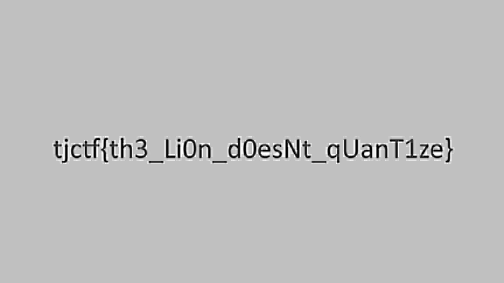

# Mô tả

If we dont try to find the data, is it really lost?

# Phân tích

Tên bài là quant, đề bài nói đến việc khôi phục dữ liệu đã bị mất, thử tìm "jpeg quant" trên google thì ra 1 tài liệu về jpeg quant table

JPEG Quantization Table là một thành phần quan trọng trong quá trình nén ảnh JPEG. Nó quyết định mức độ nén và chất lượng của ảnh đầu ra bằng cách làm tròn và giảm độ chính xác của hệ số tần số trong khối DCT (Discrete Cosine Transform)

Quy trình nén jpeg

- Ảnh được chia thành các khối 8x8 pixel

- Mỗi khối được biến đổi bằng DCT, tạo ra 64 hệ số tần số.

- Các hệ số này sau đó được chia cho các giá trị trong Quantization Table, rồi làm tròn. Đây là bước làm mất dữ liệu và giúp giảm kích thước ảnh đáng kể.

- Sau đó ảnh được mã hóa và lưu lại

Tìm hiểu thêm một chút nữa thì để xem quant table của 1 ảnh jpeg có thể dùng `dpeg` https://stackoverflow.com/questions/25706042/how-to-read-a-jpeg-quantization-table

```bash
$ djpeg -verbose -verbose lost.jpg > /dev/null
libjpeg-turbo version 2.1.5 (build 20241028)
Copyright (C) 2009-2023 D. R. Commander
Copyright (C) 2015, 2020 Google, Inc.
Copyright (C) 2019-2020 Arm Limited
Copyright (C) 2015-2016, 2018 Matthieu Darbois
Copyright (C) 2011-2016 Siarhei Siamashka
Copyright (C) 2015 Intel Corporation
Copyright (C) 2013-2014 Linaro Limited
Copyright (C) 2013-2014 MIPS Technologies, Inc.
Copyright (C) 2009, 2012 Pierre Ossman for Cendio AB
Copyright (C) 2009-2011 Nokia Corporation and/or its subsidiary(-ies)
Copyright (C) 1999-2006 MIYASAKA Masaru
Copyright (C) 1991-2020 Thomas G. Lane, Guido Vollbeding

Emulating The Independent JPEG Group's software, version 6b  27-Mar-1998

Start of Image
JFIF APP0 marker: version 1.01, density 144x144  1
Define Quantization Table 0  precision 0
           0    0    0    0    0    0    0    0
           0    0    0    0    0    0    0    0
           0    0    0    0    0    0    0    0
           0    0    0    0    0    0    0    0
           0    0    0    0    0    0    0    0
           0    0    0    0    0    0    0    0
           0    0    0    0    0    0    0    0
           0    0    0    0    0    0    0    0
Define Quantization Table 1  precision 0
           0    0    0    0    0    0    0    0
           0    0    0    0    0    0    0    0
           0    0    0    0    0    0    0    0
           0    0    0    0    0    0    0    0
           0    0    0    0    0    0    0    0
           0    0    0    0    0    0    0    0
           0    0    0    0    0    0    0    0
           0    0    0    0    0    0    0   12
Start Of Frame 0xc0: width=1152, height=648, components=3
    Component 1: 2hx2v q=0
    Component 2: 1hx1v q=1
    Component 3: 1hx1v q=1
Define Huffman Table 0x00
          0   1   5   1   1   1   1   1
          1   0   0   0   0   0   0   0
Define Huffman Table 0x10
          0   2   1   3   3   2   4   3
          5   5   4   4   0   0   1 125
Define Huffman Table 0x01
          0   3   1   1   1   1   1   1
          1   1   1   0   0   0   0   0
Define Huffman Table 0x11
          0   2   1   2   4   4   3   4
          7   5   4   4   0   1   2 119
Start Of Scan: 3 components
    Component 1: dc=0 ac=0
    Component 2: dc=1 ac=1
    Component 3: dc=1 ac=1
  Ss=0, Se=63, Ah=0, Al=0
End Of Image
```

Qua bảng trên thấy rằng có 1 điểm khá bất thường: chỉ có một giá trị duy nhất là `12` ở vị trí cuối bảng 1. Tất cả các giá trị còn lại là 0, điều này không hợp lệ theo chuẩn JPEG

Một quant table bình thường sẽ trông như này

```bash
Start of Image
JFIF APP0 marker: version 1.01, density 72x72  1
Define Quantization Table 0  precision 0
           3    2    2    3    5    8   10   12
           2    2    3    4    5   12   12   11
           3    3    3    5    8   11   14   11
           3    3    4    6   10   17   16   12
           4    4    7   11   14   22   21   15
           5    7   11   13   16   21   23   18
          10   13   16   17   21   24   24   20
          14   18   19   20   22   20   21   20
Define Quantization Table 1  precision 0
           3    4    5    9   20   20   20   20
           4    4    5   13   20   20   20   20
           5    5   11   20   20   20   20   20
           9   13   20   20   20   20   20   20
          20   20   20   20   20   20   20   20
          20   20   20   20   20   20   20   20
          20   20   20   20   20   20   20   20
          20   20   20   20   20   20   20   20
```

Để sửa lại và khôi phục lại flag có thể dùng `jpegqs`

https://manpages.ubuntu.com/manpages/jammy/man1/jpegqs.1.html

`sudo apt install jpegqs` tải về linux rồi chạy

```bash
$ jpegqs lost.jpg notlost.jpg
component[0] : table 0, samp 2x2
component[1] : table 1, samp 1x1
component[2] : table 1, samp 1x1
quant[0]:
0000 0000 0000 0000 0000 0000 0000 0000
0000 0000 0000 0000 0000 0000 0000 0000
0000 0000 0000 0000 0000 0000 0000 0000
0000 0000 0000 0000 0000 0000 0000 0000
0000 0000 0000 0000 0000 0000 0000 0000
0000 0000 0000 0000 0000 0000 0000 0000
0000 0000 0000 0000 0000 0000 0000 0000
0000 0000 0000 0000 0000 0000 0000 0000
quant[1]:
0000 0000 0000 0000 0000 0000 0000 0000
0000 0000 0000 0000 0000 0000 0000 0000
0000 0000 0000 0000 0000 0000 0000 0000
0000 0000 0000 0000 0000 0000 0000 0000
0000 0000 0000 0000 0000 0000 0000 0000
0000 0000 0000 0000 0000 0000 0000 0000
0000 0000 0000 0000 0000 0000 0000 0000
0000 0000 0000 0000 0000 0000 0000 000c
component[1] : size 72x41
component[2] : size 72x41
quantsmooth: 30.888ms
```



