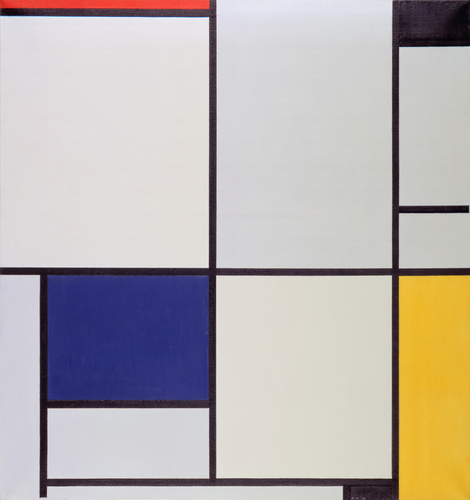

# Phân tích

Osint tool -> dựng lại ảnh phù hợp với tool -> flag

Tìm piet trên mạng thấy https://esolangs.org/wiki/Piet ngôn ngữ lập trình piet dùng màu làm opcode dựa trên hoạ sĩ tranh trừu tượng piet, có interpreter online https://www.bertnase.de/npiet/npiet-execute.php

Ảnh là một bức tranh của piet nhưng nếu cho vào interpreter thì không chạy được bởi vì interpreter chỉ đọc opcode của các màu đơn giản thôi, ảnh kia là chụp lại từ tranh nên nhiều màu phức tạp



Để ý kỹ lại sẽ thấy trong ảnh có các dấu chấm nhỏ, mỗi cột cách nhau 15 pixel từ (0,0) đến (1845,0) và mỗi hàng cách nhau 100 pixel từ (0, 0) đến (0, 1000) => sẽ phải dựng lại ảnh 124x11

Tạo 1 script làm việc đấy

```py
from PIL import Image

# Mở ảnh
image = Image.open("runme.png")

# Lấy các pixel từ (0,0) đến (1845,1000) với khoảng cách 15 pixel theo x và 100 pixel theo y
pixels = []
coordinates = []

# Duyệt từ y=0 đến y=1000 với bước nhảy 100
for y in range(0, 1001, 100):  # 1001 để bao gồm cả 1000
    row_pixels = []
    # Duyệt từ x=0 đến x=1845 với bước nhảy 15
    for x in range(0, 1846, 15):  # 1846 để bao gồm cả 1845
        try:
            pixel_value = image.getpixel((x, y))
            row_pixels.append(pixel_value)
            coordinates.append((x, y))
            print(f"Pixel tại ({x}, {y}): {pixel_value}")
        except IndexError:
            print(f"Tọa độ ({x}, {y}) nằm ngoài phạm vi ảnh")
            break
    
    if row_pixels:  # Chỉ thêm hàng nếu có pixel
        pixels.append(row_pixels)
    else:
        break

print(f"\nTổng cộng đã lấy {len(pixels)} hàng, mỗi hàng có {len(pixels[0]) if pixels else 0} pixel")
print(f"Tọa độ đầu tiên: {coordinates[0] if coordinates else 'Không có'}")
print(f"Tọa độ cuối cùng: {coordinates[-1] if coordinates else 'Không có'}")

# Tạo ảnh mới từ các pixel đã lấy
if pixels:
    # Kích thước ảnh mới
    height = len(pixels)  # Số hàng
    width = len(pixels[0])  # Số pixel trong mỗi hàng
    
    # Tạo ảnh mới với mode giống ảnh gốc
    new_image = Image.new(image.mode, (width, height))
    
    # Đặt các pixel vào ảnh mới
    for y, row in enumerate(pixels):
        for x, pixel_value in enumerate(row):
            new_image.putpixel((x, y), pixel_value)
    
    # Lưu ảnh mới
    new_image.save("extracted_pixels.png")
    print(f"\nĐã lưu ảnh mới 'extracted_pixels.png' với kích thước {width}x{height}")
    
    # Tùy chọn: Tạo ảnh phóng to để dễ xem (mỗi pixel thành 1 ô vuông 10x10)
    scale_factor = 10
    scaled_image = new_image.resize((width * scale_factor, height * scale_factor), Image.NEAREST)
    scaled_image.save("extracted_pixels_scaled.png")
    print(f"Đã lưu ảnh phóng to 'extracted_pixels_scaled.png' với kích thước {width * scale_factor}x{height * scale_factor}")
else:
    print("Không có pixel nào để lưu")
```

Chạy script để có ảnh (code piet print ra flag)


Đưa lên interpreter để chạy 

`tjctf{p1et_pr1nt3r}`