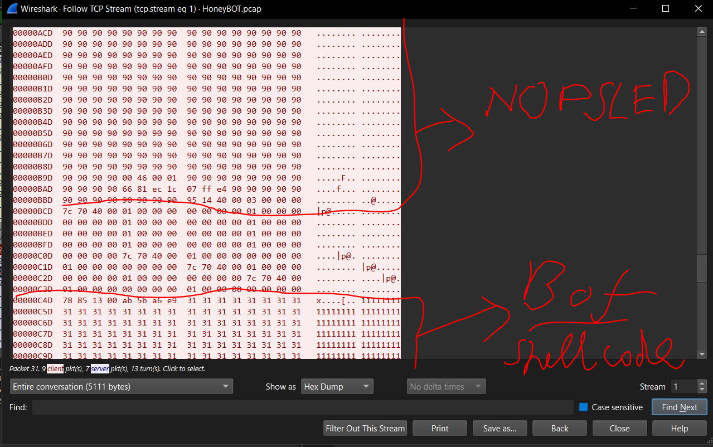
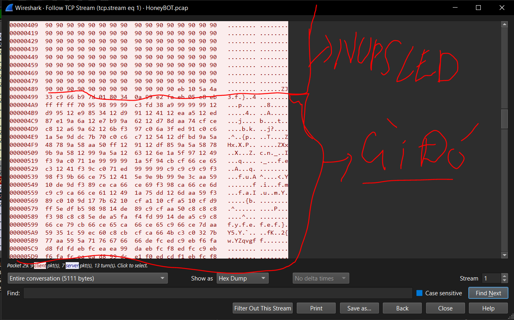

# Mô tả

**A PCAP analysis exercise highlighting attacker's interactions with honeypots and how automatic exploitation works.. (Note that the IP address of the victim has been changed to hide the true location.)**

**As a soc analyst, analyze the artifacts and answer the questions.**

# Phân tích

## Q12 + 13

**What is the key used to encode the shellcode?**

**What is the port number the shellcode binds to?**

Từ câu 1->11 không khó lắm, tất cả thông tin đều nằm trong pcap

Sau đó biết được hacker đã lợi dụng một lỗ hổng buffer overflow để thực hiện RCE (CVE-2003-0533)

```
Stack-based buffer overflow in certain Active Directory service functions in LSASRV.DLL of the Local Security Authority Subsystem Service (LSASS) in Microsoft Windows NT 4.0 SP6a, 2000 SP2 through SP4, XP SP1, Server 2003, NetMeeting, Windows 98, and Windows ME, allows remote attackers to execute arbitrary code via a packet that causes the DsRolerUpgradeDownlevelServer function to create long debug entries for the DCPROMO.LOG log file, as exploited by the Sasser worm.
```

Vậy thì trước khi lỗi xảy ra protocol `DsRolerUpgradeDownlevelServer` ở packet 33 thì hacker chắc chắn thực hiện một lệnh nào đó, kiểm tra các packet ở trước đó thì thấy tại 2 packet là 31 với cả 29 TCP có truyền đi các đoạn giống như là shellcode

**Packet 31**



Đoạn shellcode được bắt đầu với rất nhiều `0x90` đây là một NOP(no operation) không làm gì cả. Nó sẽ có tác dụng tạo ra một vùng nhớ rất lớn để khi mà thực hiện buffer overflow thì lúc nhảy vào vùng nhớ của payload của hacker thì sẽ có tỉ lệ thành công cao hơn bởi vì có vùng NOP rất lớn, lúc này sẽ tiếp tục chạy qua cái nopsled cuối cùng là thực hiện payload shellcode của hacker

**Packet 29**

Đây là packet có thực hiện một shellcode nào đó, rất có thể sẽ liên quan đến câu trả lời



Chuyển chế độ `Show as/Raw` sau đó lưu 2 packet này về. Để phân tích có thể dùng option `/findsc` trong [scdbg](https://sandsprite.com/CodeStuff/scdbg_manual/MANUAL_EN.html)

```
$ ./scdbg.exe -f shellcode.bin /findsc
Loaded cf8 bytes from file shellcode.bin
Testing 3320 offsets  |  Percent Complete: 99%  |  Completed in 2032 ms
0) offset=0x7c         steps=MAX    final_eip=7c80ae40   GetProcAddress
1) offset=0x12e        steps=MAX    final_eip=7c80ae40   GetProcAddress
2) offset= 0x2af        steps=1401       final_eip= 40182b
3) offset= 0x23f        steps=1393       final_eip= 40182b
4) offset= 0x242        steps=1391       final_eip= 40182b

Select index to execute:: (int/reg) 0
0
Loaded cf8 bytes from file shellcode.bin
Initialization Complete..
Max Steps: 2000000
Using base offset: 0x401000
Execution starts at file offset 7c
40107c  90                              nop
40107d  90                              nop
40107e  90                              nop
40107f  90                              nop
401080  90                              nop


40123c  GetProcAddress(CreateProcessA)
40123c  GetProcAddress(ExitThread)
40123c  GetProcAddress(LoadLibraryA)
4011b0  LoadLibraryA(ws2_32)
40123c  GetProcAddress(WSASocketA)
40123c  GetProcAddress(bind)
40123c  GetProcAddress(listen)
40123c  GetProcAddress(accept)
40123c  GetProcAddress(closesocket)
4011c6  WSASocket(af=2, tp=1, proto=0, group=0, flags=0)
4011da  bind(h=42, port:1957, sz=10) = 15
4011e0  listen(h=42) = 21
4011e6  accept(h=42, sa=21, len=21) = 68
401223  CreateProcessA( cmd,  ) = 0x1269
401227  closesocket(h=68)
40122b  closesocket(h=42)
40122f  ExitThread(0)

Stepcount 7657
```

Vậy là thành công trong việc load các hàm của cái shellcode này, biết được nó bắt đầu tại offset `0x7c` và bao gồm các hàm nhu `GetProcAddress` có thể là để nhảy đến địa chỉ thực thi

Bây giờ thử thêm option `/v` vào `./scdbg.exe -f shellcode.bin /findsc /v` để theo dõi từng lệnh một mà shellcode thực hiện

```
/v                    verbosity, can be used up to 4 times, ex. /v /v /vv
```

```
401110   90                              nop
401111   90                              nop
401112   90                              nop             step: 150
401113   90                              nop
401114   90                              nop
401115   90                              nop
401116   90                              nop
401117   90                              nop             step: 155
401118   90                              nop
401119   90                              nop
40111a   90                              nop
40111b   90                              nop
40111c   EB10                            jmp 0x40112e  vv                step: 160
40112e   E8EBFFFFFF                      call 0x40111e
40111e   5A                              pop edx
40111f   4A                              dec edx
401120   33C9                            xor ecx,ecx
401122   66B97D01                        mov cx,0x17d            step: 165
401126   80340A99                        xor byte [edx+ecx],0x99
40112a   E2FA                            loop 0x401126
401126   80340A99                        xor byte [edx+ecx],0x99
40112a   E2FA                            loop 0x401126
401126   80340A99                        xor byte [edx+ecx],0x99                 step: 170
40112a   E2FA                            loop 0x401126
401126   80340A99                        xor byte [edx+ecx],0x99
40112a   E2FA                            loop 0x401126
401126   80340A99                        xor byte [edx+ecx],0x99
40112a   E2FA                            loop 0x401126           step: 175
401126   80340A99                        xor byte [edx+ecx],0x99
40112a   E2FA                            loop 0x401126
401126   80340A99                        xor byte [edx+ecx],0x99
40112a   E2FA                            loop 0x401126
401126   80340A99                        xor byte [edx+ecx],0x99                 step: 180
40112a   E2FA                            loop 0x401126
401126   80340A99                        xor byte [edx+ecx],0x99
40112a   E2FA                            loop 0x401126
401126   80340A99                        xor byte [edx+ecx],0x99
40112a   E2FA                            loop 0x401126           step: 185
401126   80340A99                        xor byte [edx+ecx],0x99
40112a   E2FA                            loop 0x401126
401126   80340A99                        xor byte [edx+ecx],0x99
40112a   E2FA                            loop 0x401126
401126   80340A99                        xor byte [edx+ecx],0x99                 step: 190
40112a   E2FA                            loop 0x401126
```

Shellcode trên sẽ tự giải mã payload của nó trong runtime bằng một vòng lặp XOR với khóa `0x99`. Đoạn mã không mã hóa ban đầu(Sau nopsled) sẽ tính toán vị trí của payload bằng `call/pop`, sau đó lặp qua 381 byte để giải mã từng byte một, và cuối cùng chuyển quyền thực thi sang đoạn mã đã được giải mã. Kỹ thuật này giúp shellcode tránh bị phát hiện khi phân tích tĩnh, sẽ rất khó để biết được shellcode làm gì nếu chưa chạy qua bước giải mã

`0x99`

```
4011b0  LoadLibraryA(ws2_32)
40123c  GetProcAddress(WSASocketA)
40123c  GetProcAddress(bind)
40123c  GetProcAddress(listen)
40123c  GetProcAddress(accept)
40123c  GetProcAddress(closesocket)
4011c6  WSASocket(af=2, tp=1, proto=0, group=0, flags=0)
4011da  bind(h=42, port:1957, sz=10) = 15
4011e0  listen(h=42) = 21
4011e6  accept(h=42, sa=21, len=21) = 68
401223  CreateProcessA( cmd,  ) = 0x1269
401227  closesocket(h=68)
40122b  closesocket(h=42)
40122f  ExitThread(0)
```

`LoadLibraryA(ws2_32)` Dùng nạp thư viện socket của Windows, lấy địa chỉ của chúng sau đó gán socket vào port 1957 và bắt đầu listen trên đó, nhận dữ liệu từ client. Khi có client kết nối, nó gọi `CreateProcessA( cmd,  )` để tạo tiến trình. Điều này thường dùng để tạo bind shell, cho phép hacker kết nối vào máy nạn nhân từ xa 

`1957`
