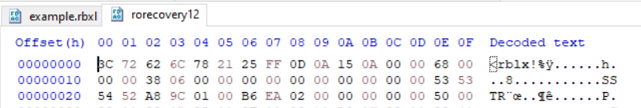
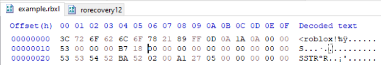
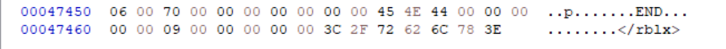
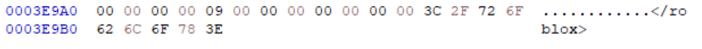

# Mô tả

**Rorecovery 1: this file was corrupted after my girlfriend threw my PC out the window! help!!!**

**Rorecovery 2: what is the name and ID of the hidden asset? format .;,;.{assetname_id} (same attachment as rorecovery1)**

Bài cho ta một file **rorecovery12** dùng chung cho 2 phần

# Rorecovery 1

Nhìn qua hex dump của file này + với tên bài thì biết được đây là một file [rbxl](https://github.com/RobloxAPI/spec/blob/master/formats/rbxl.md#signature) bị corrupted vậy là tôi lên mạng và tải một file `example.rbxl` kết hợp với đọc cái [tài liệu format file rbxl](https://github.com/RobloxAPI/spec/blob/master/formats/rbxl.md#signature) để biết sửa như nào

Sau khi sửa xong sẽ load vào roblox studio (Tải roblox về) và thắng game để lấy flag

## So sánh file rorecovery12 với example.rbxl

**rorecovery12**



**example.rbxl**



Trước hết là so phần header thì thấy rằng hàng đầu của file **rorecovery12** bị thiếu vài chữ `o` và sau cái signature của file `rbxl` thì sai một vài byte

Để ý kỹ hơn một chút nữa sẽ nhận ra rằng các byte của **rorecovery12** hình như đã bị dịch chuyển về sau 2 byte. Đọc trong tài liệu biết được rằng, sau cái header thì chunk tiếp theo chỉ được bắt đầu sau byte thứ 32 (Tức là byte 33), mà ở đây chunk **SSTR** đã bắt đầu từ byte 31

Tiếp tục để ý dòng thứ nhất thì nếu mà ta chỉ sửa phần signature **rorecovery12** thành `<roblox!` rồi chạy trong roblox studio thì sẽ bị báo lỗi `unidentified version` thì biết được sau cái signature đó sẽ phải là 2 byte `00 00` cho version, trong file **example.rbxl** cũng như vậy

Đến đây chắc chắn được rằng ta sẽ phải dịch từ byte thứ 14 lên 2 byte (byte 14 -> byte 16) để 16 byte đầu là **signature + 2 byte version** của file rbxl

**rorecovery12**



**example.rbxl**



Tiếp theo là `END chunk` thì cũng bị thiếu vài chữ `o` và để ý sau byte `09` thì file **example.rbxl** pad thêm 7 byte `00` vào trong khi đó **rorecovery12** chỉ pad 5 byte

## Quy trình sửa file **rorecovery12** sẽ như sau

- Tạo header 16 byte chính xác `printf '\x3C\x72\x6F\x62\x6C\x6F\x78\x21\x89\xFF\x0D\x0A\x1A\x0A\x00\x00' > 1st`
- Dịch 2 byte (từ byte 14), cái này sẽ lấy mọi byte từ byte 14 trong file `dd if="rorecovery12" of="2nd" bs=1 skip=14 status=none`
- Ghép 2 cái trên vào `cat 1st 2nd > fixed.rbxl`
- sửa phần `END chunk` cái này làm tay trong hex editor T_T

**Xong hết thì ta sẽ có file `fixed.rbxl` không bị lỗi nữa**

## Chơi game

Mở trong roblox studio (Nếu báo lỗi thì do làm sai ở đâu đó trong lúc sửa file)

Vào  `serverscriptservice\utility\typevalidation\validateMaster` lướt xuống cuối sẽ thấy 1 đoạn return rất lạ

```lua
return {
	isPatchedEnvironment = isPatchedEnvironment,
	verifyKeyRing = verifyKeyRing,
	deepEqualityCheck = deepEqualityCheck,
	sanitizeInput = sanitizeInput,
	recursiveMap = recursiveMap,
	rightBlock = rightBlock,
	hereCheck = hereCheck,
	simulateNetworkLatency = simulateNetworkLatency,
	rotateString = rotateString,loadstring(!lllLLL)
  ! hashId = hashId,pas!. te
	± [ makeNoise = makeNoise,!bin!
	 ] dummyTransform = dummyTransform,ra'''=w/
		.auditTrail = auditTrail,'+F:nc! ±  wD# p , 3 =L
	flipTable = flipTable,
	reseedRNG = reseedRNG,
	compareSchemas = compareSchemas,
	fakeCompress = fakeCompress,
	syncDebugInfo = syncDebugInfo,
	shadowCopy = shadowCopy,
	staticEvaluator = staticEvaluator,
	__INTERNAL_FLAGS = __INTERNAL_FLAGS,
	__DUST_TABLE = __DUST_TABLE,
	__HOOKS = __HOOKS,
	__CONTEXT = __CONTEXT
}
```

Để ý đoạn này

```
  ! hashId = hashId,pas!. te
	± [ makeNoise = makeNoise,!bin!
	 ] dummyTransform = dummyTransform,ra'''=w/
		.auditTrail = auditTrail,'+F:nc! ±  wD# p , 3 =L
```

Nếu để ý kỹ sẽ thấy nó đang cố nói `pastebin/FncwDp3L` cái chuỗi cuối nhờ chatgpt lấy ra hộ xd

https://pastebin.com/FncwDp3L

Vào đây sau đó decode ascii sẽ ra flag

```lua
local __LEGACY_TYPE_BLOB = {
	46,59,44,59,46,123,99,48,114,114,117,112,116,51,100,95,52,110,100,95,
	104,49,100,100,51,110,33,95,52,110,121,95,48,103,115,95,114,51,109,
	51,109,98,101,114,95,112,48,114,116,52,108,95,115,52,118,49,48,114,63,125
}
```

`.;,;.{c0rrupt3d_4nd_h1dd3n!_4ny_0gs_r3m3mber_p0rt4l_s4v10r?}`

# Rorecovery 2

Flag nằm trong `workspace/levelart/level/layout/` có nhiều các file **base** nhưng chỉ có một file nổi bật hơn vì nó có 1 file con bên trong nữa. File đó là `LegitBase` xem phần thuộc tính sẽ biết được id của nó

`.;,;.{LegitBase_137276802718496}` 