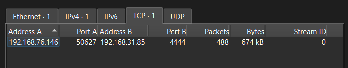
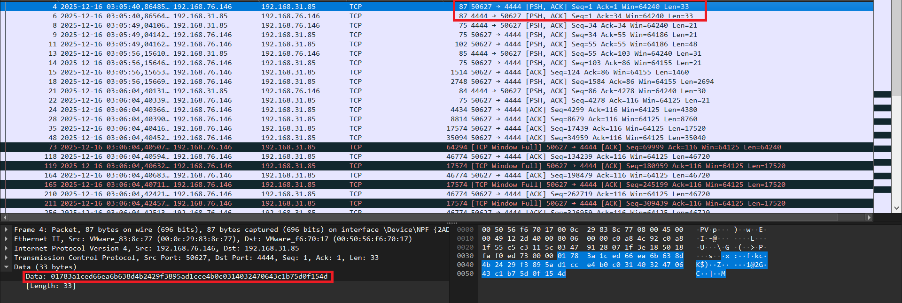

## Rat

> Our security team intercepted suspicious network traffic from a potentially compromised machine during a recent incident response. The traffic appears to be encrypted communication with an unknown Command & Control (C2) server.
> 
> 
> We also managed to recover a suspicious executable file (rat.exe) that was running on the victim's machine at the time of the incident. Initial analysis suggests it's a Remote Access Trojan (RAT), but all the critical details are heavily obfuscated.
> 
> Your goal is to investigate what the attacker did inside the system and determine what data was successfully stolen.
> 
> Good luck
> 

Looking through the pcap file, I can see that theres only 1 conversation between `192.168.76.146:50627`and `192.168.31.85:4444` all through TCP

The victim’s IP is `192.168.76.146:50627`



There are 33 packets that contain data and it seems like they are encrypted

To continue, I started analyzing `rat.exe`

Looking at the decompilation in IDA we can see the flow of the malware

### Volume Serial Number check

Firstly, the malware get the volume serial number of C drive and then performs a check by hashing the VSN with MD5 and CRC32 then compare it to 2 expected values, if the VSN doesnt match it will exit


The MD5 hash algorithm was reimplemented manually by the author, I indentified this because the constants that this function uses match the standard MD5 initialize variables `(0x67452301, 0xEFCDAB89, 0x98BADCFE, 0x10325476)`


The input of MD5 hash will be an 8 bytes buffer (v23) which is the VSN duplicated, we can see this while debugging


For example “D1E21660” is my C drive volume serial number


The input buffer is “D1E21660D1E21660”


After input was MD5 hashed we have `4FBE338CEC174B30C373B49F76F899F1`. Then the function starts building a LUT, I figured the table was used for CRC32 hashing because of the polynomial `0xEDB88320` . Finally it compares the output to 2 values


Building LUT


CRC32


Breaking at the `cmp` operation we can see that after xoring the first constant with `0xDEADBEEF` it was moved into `RCX` and compared with our hashes output in `RDX` . Through debugging, the 2 expected values are `0x7DCA862E, 0x1F1D2720`

In short, this is the whole function: `CRC32(MD5(VSNVSN)) == Expected (constant XOR 0xDEADBEEF)`  

So my VSN `D1E21660` is hashed to `283C889C` . To confirm that I’m correct, i will redo that in python


### Key exchange

After getting the target VSN, rat.exe will try to connect to the C2 server through port `4444`, this matches the port in pcap


After connected sucessfully it will create a 32 bytes public key to send to server (1 byte flag + 32 bytes key) and then recieves 33 bytes (1 byte flag + 32 bytes key)

We can also see this in the pcap



### Creating traffic decryption key

Before the rat starts recieving instructions from the C2 server, it creates a key. The public keys sent and recieved are put into a buffer then it compares the unsigned value of the keys and reorder them

```python
if key_sent < key_recv:
		buf = key_sent + key_recv
else:
		buf = key_recv + key_sent
# In our case the correct buffer is key_sent + key_recv
```


After that it used SHA256 hash twice (Similar to the above hash functions, I also identified that the function is SHA256 because of the initalize variables):

- First time hash 64bytes (key_sent + key_recv)
- Then append the VSN to the 32 bytes result (Total of 36 bytes)
- The result after 2 rounds is the key to decrypt the traffic in pcap

### Traffic encryption

The malware used ChaCha20 to encrypt and decrypt its payload


`expand 32-byte k` is the magic number of the Salsa20 or ChaCha20 cryptography function, to indentify the cipher used in the function we can check the `rotation constants` in the documentation


ChaCha20


Salsa20

Looking in the function we can see the decompiler uses `ROR4` which is right rotation while the examples above uses left rotation (`ROR(n) = ROL(32-n)`). So we have these rotation constants: `7, 16, 12, 8` which matches **ChaCha20**


So we are going to use ChaCha20

### Processing C2 instructions

Each C2 message begins with a 21-byte header. If theres is a payload, the malware performs an additional receive to get the encrypted payload and then decrypts it using the key, count and nonce in the header

This is the header format:

- Command: 1 byte
- Length: 4 byte
- Counter: 4 byte
- Nonce: 12 byte
- Payload: Remaining or in next packet

The same goes for sending encrypted results to the C2 server


Looking at the pcap again, searching for packets that were sent to the victim, I saw that the hacker used 3 commands which is `0x11` (once), `0x13` (twice) and `0xFF` (once)

- `0x11` is used to list the current directory


- `0x13` and `0x14` is used to read a file


- `0xFF` : Exit


### How to decrypt traffic

So the hacker listed the current directory and then read 2 files before exited, we also know the payload, results are encrypted using ChaCha20 so heres what we need

- Key: 32bytes
- Counter: 4 bytes
- Nonce: 12 bytes
- Rounds: 20

We already know the rounds from reading the decompiled function and counter, nonce from the header

To get the key we will need to get the VSN, and then `SHA256(SHA256(key_sent+key_recv)+VSN)` to get the 32 bytes key. Because we wasnt given the VSN, the malware also doesnt send or recieve it we are going to have to bruteforce it

Looking at the VSN check function again, I wrote a python script to brute it

- **brute_vsn.py**
  
    ```python
    import binascii
    import hashlib
    import struct
    
    expected = [0x7DCA862E, 0x1F1D2720]
    
    for serial in range (0, 0xFFFFFFFF): 
    	data = struct.pack("<II", serial, serial)
    	md5_hash = hashlib.md5(data).digest()
    	crc32_hash = binascii.crc32(md5_hash)
    
    	if crc32_hash in expected:
    		print(hex(serial))
    		
    	# 0xf1c2471b
    	# 0xa0612028
    	# 0xfc6c5235
    	# 0x6563784a
    	# 0x02a3ff67 - Correct
    	# 0x9ac82dcd
    ```
    

After running we get 6 VSNs but theres only 1 correct (`0x02a3ff67`), we can take all 6 and create a keygen to get the 6 possible keys

- keygen.py
  
    ```python
    import hashlib
    import struct
    
    key_sent = 0x783a1ced66ea6b638d4b2429f3895ad1cce4b0c0314032470643c1b75d0f154d
    key_recv = 0x7067c8be6dcbd867a90007581cfcd6d63f145f40dc6456446036864cf95dc74a
    
    vsn = [0xf1c2471b,
    0xa0612028,
    0xfc6c6235,
    0x6563784a,
    0x02a3ff67,
    0x9aaa28cd]
    
    a = key_sent.to_bytes(32, 'big')
    b = key_recv.to_bytes(32, 'big')
    
    if a < b:
        pHints = a + b
    else:
        pHints = b + a
    
    first_round = hashlib.sha256(pHints).digest()
    
    for i in vsn:
        buf = first_round + struct.pack("<I", i)
        key = hashlib.sha256(buf).digest()
        print(key.hex())
        
    # 096430d5771252df5c170249e8f493b56f94ceb53393b9978fb1290099486e0c
    # c4c63ccbcc368958710aaa0dda5e3c13748dd2289fc0703efc973b5c4b9df645
    # 84ccf9330eeb7c5ee86333e19b0ebd7f4889dd3c8f80345779ad9abe221c64a8
    # 29f0ae06c3cad94a46da77714c2e14074da12aee9e92b5bf3b8d78ef1ac97cd9
    # 90af18d6780678435f4a37308dbe43c08f18c06bff70ee99aaf2280920522628 - Correct
    # a6cfad4487ffc11583f1589e94eef67d0fbb4d3b99452562657fa2e8dd3d647a
    ```
    

We can test each keys with the result of first command which tries to list the current directory


So the first packet has the command `0x20` , a length of `0x30` , the counter is `0` and the nonce is `000000000000000000000000` 

After testing, we can see that the correct key is `90af18d6780678435f4a37308dbe43c08f18c06bff70ee99aaf2280920522628` which gives us the directory listings


Doing the same to the next 2, the hacker read the following files

- A jpg picture (`secret.jpg`)


- A Microsoft Office document file (`meme.doc`), that contains the flag


**VCS{Y0u_R0x_4t_Cry9t0_H4ck1ng_L1k3_4_B0ss}**