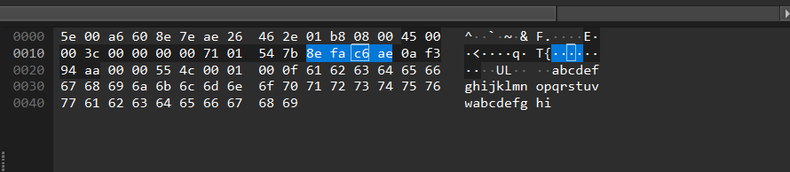
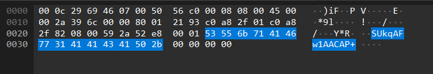

# Mô tả

There is a surprisingly high number of requests on our network. Investigate for me

Bài cho ta 1 file pcap

# Phân tích

Nghịch loanh quanh một chút khi filter `data` trong wireshark thì thấy rằng phần data của các gói **ICMP req/res** khá lạ

**ICMP thường**



Có thể thấy phần data của nó khi ta nhập 1 lệnh `ping ip.ip.ip.ip` thì sẽ thường là `bảng chữ cái + hi` nhưng ở trong file `challenge.pcap` lại khác

**ICMP trong challenge.pcap**



Lạ hơn nữa là phần data của cả gói `request` và `response` đều giống nhau + với việc đề bài tên là exiftration nên tôi đã nghĩ rằng tác giả đã truyền dữ liệu (flag) bằng cách này. Các phần data nhìn cũng khá là giống Base64 nữa

Biết vậy thì ta dùng `tshark` để lấy dữ liệu ra thôi

```sh
tshark -r challenge.pcapng -Y "icmp && ip.src == 192.168.47.130 && ip.dst == 192.168.47.1" -T fields -e data.data > data.txt
```

Vì dữ liệu lấy bị thừa khoảng trắng nên tôi đưa lên https://onlinecaseconvert.com/remove-characters-from-text-online/ để xoá khoảng trắng sau đó lưu vào file `nospace.txt`

Dữ liệu lấy được từ file pcap vẫn đang ở dưới đang ở dưới dạng hexstream nên ta sẽ đưa lên [Cyberchef](https://gchq.github.io/CyberChef/#recipe=From_Base64('A-Za-z0-9%2B/%3D',true,true)&input=U1VrcUFGdzFBQUNBUCtCUDhBUVdEUWVFUW1GUXVHUTJIUStJUkdKUk9LUldMUmVNUm1OUnVPUjJQUitRU0dSU09TU1dUU2VVU21WU3VXUzJYUytZVEdaVE9hVFdiVGVjVG1kVHVlVDJmVCtnVUdoVU9pVVdqVWVrVW1aUU9DVXFuVStvVkdwVk9xVldyVmVzVm10VnV1VjJ2Vit3V0d4V095V1d6V2UwV21pMHkxVzIzVys0WEc1WE82WFc3WGU4WG05WHUrWDIvWC9BWUcyMnpCWVhEWWZFWW5GWXZHWTNIWS9JWkhKWlBLWlhMUzJBZ0lBLzRFL3dCQllOQjRSQ1lWQzRaRFlkRDRoRVlsRTRwRll0RjR4R1kxRzQ1SFk5SDVCSVpGSTVKSlpOSjVSS1pWSzVaTFpkTDVoTVpsTTVwTlp0TjV4T1oxTzU1UFo5UDZCUWFGUTZKUmFOUjZSU1psQTRKU3FkVDZoVWFsVTZwVmF0VjZ4V2ExVzY1WGE5WDdCWWJGWTdKWmJOWjdSYWFMVExWYmJkYjdoY2JsYzdwZGJ0ZDd4ZWIxZTc1ZmI5ZjhCZ2JiYk1GaGNOaDhSaWNWaThaamNkajhoa2NsazhwbGN0TFlDQWdEL2dUL0FFRmcwSGhFSmhVTGhrTmgwUGlFUmlVVGlrVmkwWGpFWmpVYmprZGowZmtFaGtVamtrbGswbmxFcGxVcmxrdGwwdm1FeG1Vem1rMW0wM25FNW5VN25rOW4wL29GQm9WRG9sRm8xSHBGSm1VRGdsS3AxUHFGUnFWVHFsVnExWHJGWnJWYnJsZHIxZnNGaHNWanNsbHMxbnRGcG90TXRWdHQxdnVGeHVWenVsMXUxM3ZGNXZWN3ZsOXYxL3dHQnR0c3dXRncySHhHSnhXTHhtTngyUHlHUnlXVHltVnkwdGdJQ0FQK0JQOEFRV0RRZUVRbUZRdUdRMkhRK0lSR0pST0tSV0xSZHVBQmJwRkZnQkNLcE5BQmpNYUNtWmJRUk1rbUx5dVdTMlhTK1lUR1pUT2FUV1Z0eU1yZGF4MlB0U1JBQXJBQnRzVTNnQVNUYWtVbWxVdW1VMm5VK29WR3BWT3FWV3JWZXNWbXRWdXVWMnZWK3dXR3hXT3lXT2NMY0FJc3ZvUUFKcVJ5VmJBQi95bW10eTBHY3ZrcTJ5U0REb0FHWklLRUFKazMwZXk0ZW1UbU9SNlFTSytTYVVTckVUV01wRWRpVUFLb0FYNFdGWStBQTZrdVZDVERaT3ZRT0NhYlZhYTdKRzB4KzkzeUhaREI1TFY3ZmNibW5YWUFYaTlXNittWUFKQStIVUFhS2o2WGRjdm1jM25RKzdnSGZ3dVRYSzZjL3NVaTdHY0FXdVFzWVdYRzU3YnMrV3A3eElyVllabFZUNlI3S0YzNGRHYWdsWW9Fc0FHOGs4cnpmMy9OMG5DTkoyeGp2dmdnNzVQb0FEaXZ3L2IrUC9CN0VRQ1c2MUk4NEVESVU2cnhxVTZMcG9pSFJJRzJBQ2lRY3I4SlFHajhDdml6Y0V3V0FFR3E0MXJYamd2YUl0bzY4SUlqR0pGa0pHYmdJSytZQUZzVUpNeGRFa2NJdTFDd3c0dHNqb2d2MFFHSy9NaklVOUVkZ0FPRWZKYkd6eVNiTHN2S2ViakxBQUVvNEw1SURBeUl3c3Z6WE5rMm91VzR6Z0NBQWxKQ2hzTXh2TnoreDFIa2FJVE84dVR6TnplTjlQcWtUTzRyOHYzUU5GMFlocWNyeE9jc3BqSUVoU0pSVkcwd2lhTXJzanJ2TWRMVHhUd21rNEFBNlU2b25QNnZVZUw5SXd1bDFLU0hJcWxTcXRrc1ZjaXN0MHloZEJyelByNXJqSWJSMTBnMGt0WFdrcjBsQjljb2N5ckxzeUZqaEJZZ3hxR3BGS0tXWFlkc3piUjdNVG92cElLRW9palcxY2x5dDFVbFRSclVOQVhNc0U5eDdXOE1YWGRzOVZJdkx2b1ZYNEFGQ09yUnhKQ1VLRUpDeUhYMVlOeDNwaERjVENBREx4blc5RHVNL1VIWUJWazZWY3Z5VE1FbE1wNFRMc3doM01aVldrTTFwSUxhalkxeGVha3lYVTZIdy9FTVJxemhlR3AvZkxoT0ppTkxvUGlsVzN5djhoTnJqaUtMdUhhMkdvRmxwWktBRnFXdFZDVHRyam9BV2F6RXkyL2NLaTZGTDZBb0EvNEUvd0JCWU5CNFJDWVZDNFpEWWREVzRrUjJBQktjR05ENFNabHNBSCttU1RHSkJFRzQzQUEyMXFpd0FoRGdtZ0JGNGJHb0pIcERHRnVBRE9BU1VBSlpJSmdBSmxNNkJRYUZRNkpSYU5SNlJTYVZTNkV0NXVBQ1ZPNEtaZ0F0bzZBSS9USzFXNjVYYTlYN0JZYkZZNkxOWnZPYWxHSTFISi9aTGRiN0kzRnVrUUFpNVZPcGRSTFhIYXpjTDlmOEJESWpFNHJlWU9PZ0FrRzJ4UUFieEpSb2lBQjNGWmJENzNiY0RtYzFtODViOGpremhsWVVPa2hKV0tid0JqNkRnNHBGb1pQY3huZGxzOXBDNmNBYWhhWWRsNzdYN2xOaS9hTU5pRE1rRkRQc2RtOC9sTU5oOUxpOVJxcUJyTUxyNnRQdDd2cnBvTkZhdXZzZHI0WUxacHhPb1B2UEZjSUhCUFQwKzN6Sm42TUJKSWtKUUJyb1JzT3prQUI5ZnU1cnJKaS9iMndKQXNET1VpVFd1YTBodGdBMDdwUVBDTUpRbkNrQ3ZveWIvcUUrVUt3NG1hUnBxUmJncndyY053N0V5eUtjQUNjTjA4N3Z3R283bHREQUNFUVpCemt4UEhFY3ZhOGkwTmVxcXJ4ZXBxbnFpaGJFTVV4a2J4MUpVS1JURmFlSTJ2a2xxWkhqeklXcWlyRXlyQ2xOdTNNaXNTeGJHd2dya0x2cy9ETFJkS1M0T3BNeUN4ckI4MHFBOWNseXBGaVh5ZzhDL3pvZzAzU1NwTXVTSTcwQlRoUWRDTm5QVER5L0pFeFVMUmxHMGN3TTF4bWtNUzBmQTBMaStBQlZCWVBnQUZDT3I3QkpVSUFMa000QU9DbGxKU3RPOGcwclJsRG96VmF3MGpRTHNWYlcxYm9OTWtNd0RXcXRSaTdxTXgvTE5XVnhZcWpTYlFFenJaWWxiMTFObFlVRlh6M3hsSDBzUzByMC96cWhUOVdNcGRmdWJLOGdXTk9VbFZlNzFsdGxXYytVWFk4aDIxYUZlMjdlVjVvUldkZzJ0Wmw2WDFmYzAyL1BZZE1RWTJCU2ZkRitSeGUxbFNqZzF5M2RMMGp6REZDYlBMZDd6MkZhK0Y0dzl1RVN0aTE4ckxoczdZTGpPUjF6YWRnVlZrVjU0M2JlT3EvYkxkMWlybVgxcFBHU0laYzA5c1ZHMTJVYWdJZ0QvZ1QvQUVGZzBIaEVKaFVMaGtOaDBQVzRBTTRCSlFBVFVQZzVtV3dBZjZaSk1Za0VoakVSaWNWYWlRYllBWXB2RWtpa2NUQUJLaThZalVFajB1bkU1blU3bms5bjAvb0ZCb1ZBYmdBU0k3RW9BT0RHaFptQUMyam9BajlEcWxWcTFYckZaclZicmxka0ZGbzlKcGNHSFNRQURiUGpXQUFsbVVnalVjbTlldVZ6dWtPVzVuQUVVbWNQdDhkcWQxd0dCdVRjU0lBcEJ3QUZNaFZsczhyQUV0dWVFSGRyc2NQc3NwbGVRd1diem1kejA2a2tVaTBPeThxbGxjdTk1dHNOSFFBbERGQUdueit6Mm0xd21HRXVJeFVOdnR4MnR6ME1WdmNMMHVaMUY0dldrMXpiMkd5b1YzQU14NGU4cUFBMzIvN0VMNE9qcHRQcU4vN05VZ2NFOE00N2ZUaDI5OEd6NkV4cDl3OWMrOXVydm5WNi9sL0g1L1dBMitIeEtHTmExN1lzMC9jQ3dOQThFTm15VEtOM0FMbU5pYmJrUG85S05yOUJNTHE2MUxrcHBDcjd3eEQ2aHZtOUNFUFV3TCt0eS82K084VEtwUkJGMFhzR284R1E0bXo0cXc4NzZ2aEdFZHZ4RTdkUnpDMGVKeEJiY3QyNmthcTlIRUtSMDU2WVFuSTdyUnRJU3R4OUZMRnVXNXNDU21oTHh4NUpTM1E3S1RPU0lhdytTWW9NaU1yQ2trUzNOczNNM0RVbnFhKzB4VGZPMDd6d3EwNHVtNHJaVDNNRXp6elBFcXlOT2RBMEZOc3Z1SWxEVFMweUtqS1FwVkNvWW1zbzBSUzhoTEJTTTFVcEZjV3E5VFN4VW1oTUhTelRGVHFJd3IvVkhFa3cxUUFGUTBsRlNvUlpPcXExalRqaVN4QWFnUkZNRTJWZlhzSlJHaE5LdzlOOHV4M1JVZ1dQUkUwMVpWdGdXRGFkcUFCUDdMVVk0MXEyM2JrdklrMFRoc1k1ZzNzZWc5cjJaVzF1d0xRbDBYVkRGMk5aYkxuTURYMUFTRGQxOE1GYzdTTE5jZHlzakdVaW94UHRIWHphbDRPcFE5QlgzZUxHM0pncXRXZmdkNVlnbDE2dnJhV0RJZGlXTVV0UVNBZ0lBLzRFL3dCQllOQjRSQ1lWQzRaRFlkRDF1QURPQVNVQUUxRDRPWmxzQUgrbVNUR0pCSVpGSTVKQjI0a1IyQUJLY0dOR0kxQkk5SlpsTTVwTlp0TjV4T1oxTzU0QUZ1WndCRkl2TG8zSFkvUGFSU2FWUzZaVGFkVDZoTTUrQVFBU3FIQlRNQUZ0SFFCUjRUUDZEVnBCR281TWFqWjdSYVlWSndBTzVXQUpiRHJKUnJWZGJ0VExCUW93T2tnMndBeFRlSkx2QmJ6WXJIV3E1WHNIaThaamNYVTZyVjRmYzdOYWNMa29iZkFBMjhBQU1GanRCb2JWYkxjY0xoazZMbGRGU3NoaHFKWmNWWjh2SU0xbkRmbnBycmN4REplQU5WcStCQnQxWTYzdnRqd1p4QTRKeUpIRVluRmQzRGNweCtaUEpQS1pYY2JseGQvMWU5My9CVE5KYisxRE5ybmMvNGZWNi9aN1o1czR6M09wQi9ocU5oN3Z4Uy9IcHZMQyttL01BSnc2NlZKWXZhK3Ird0xIcUF2VGFBQXZwaWdCQk1Bd25DaWFtNEFDVUJLQUVDd012ekFQU3RENnNteEJNcTdDc1RzWS9iVHUyKzhVSWJDOE13Mi9yelFQRDY2eEV1VVNSTW1qaHFJbUQ1eGNucm5Jb2l5OXdjemtJeEJJS0R1VkNzaHVna1QvcWE4WnJBQVBqRXJ0QWJzeDg0ekZtNFc1SWdBV3BZRlVBQlZHb2dwalRVMmdkQUFIUVdCWUFBckNnT3NJaVRKVHd3dkw1YWdBUlpDVEthazF4bWhBZFVLQUFXQ3NLd0FDZ0piYnp2SmFHU2ZJc1JxM0VzZ09CTDh3ekhNc3p6VE5hOXpiTjg0em5PbzMwZTFjdnd4UDB6RTBscGpQTzI4OElkUFJia1dBQXZrSk5FMVVIVUl6VVVQZzYwZFdTYjFwUGsvVExWdEJvTFFxc2l0WUU3V0c0TkpNbEtTSVFXMTBXTHBTRnRvWEZWbFBqRnIxMVNTTlZqaFZ0bGtnemIwSkVia0wxcUw0QUVKYzlsVU1NdytGQ0FBNjBmYUtjUjZoNitROUNTNzI4a0xldTdiajhXTFBzL2dCUU5YSWRRczIwUlJWR1dGTE13dExGY3VZT3FHQ09KSCtCcDljZ0FUSk5HSFkwaGVJMFBSTkYwYXJ0K1BiZDJSNUtpMVA1VFVJV0Q0QUJRMzB6ejA0ODZUVTB1cE5hVnRYQ0x6Vk5zSHlTbk9nTlJrQzY2Yzdlb0psZjJweTZqRjJvaVJkY1pyYjgzVGJYMmRXQ2orWU9acVQvUjFvY1VTYkNscHlqb1NuU3BLMHNhaWxFQ2ErZzJEYlc2eXdDK3NXOHA1c0pJWHdUT0JNYm1WYkVKYzJOQjBzaFFwaldVdnFCditrSVZ4MTAyQmkwbHhndDBaWC9JOEljTzBISjF2d0NvOEh3dlJxVnhONGxWcEc4MWczRVg3OTA2Y1lCQkd6SVowdks1UW0zWmQwdFBPdzFEaXNiVWtVY041dUxXSWxJam93QXJOS3gzdXkydkkrMXRORmRxZkZyeFhHY0Q0SGRwOE05NEt0d0xhZWlZdExTRWliSTRMNWVCNHg2MlA2eGhEMWRieGZMV1h4L0lyWDJ2OHFFRE01bFlMTHludkphdXh3cURiemFJMWRXVWhjYTVWemxOY2NnNVo2cG5nbURYYytNeUw1aVNOaEZzNFVFcWZHTXVCV3EzMU1LeDJ2TVFkQzB4ZnExM252S2FvV3FCU0hYY2xTZll0aG9NTVNES3BmR2RDRGlEWUF1cWd1WXlBemwxMG0yZG0vVUFCQVNBUCtCUDhBUVdEUWVFUW1GUXVHUTJIUTliZ0F6Z0VsQUJOUStEbVpiQUIvcGtreGlRUTVibWNBUlNDcmFPZ0NQeUdXU0Z1SkVkZ0FTbkJqUmlOUVNQUzJkUWFSekVsSnFhd3dkR1lBTFpRbldWQ1FTUXB1QUJ1TGRGZ0F2ejhBVUdNRHBJTnNBTVUzMHVkMSttQUNZQ1VBVFNFMWl0Vnl2U3lYZ0Fkek9xMkNXVVNVSm1WWEs4UTJSZ0VBVlNIRG9BVmxpZ0N1M25EUWllMzJnUTJoMFdqMG0xd2VtMCtvMU9MMWFIMml0NFc4MDlJZ0JGb1E0UmJNVHVzQUJ0MXdBWkdlR2VmWXZENHlzNXZXUXVYekdaNlhZMmRJYWpWYlhkeTNiekt6UVhBWUxDY0NJU1NLUmViUnVPeXZnd2VJeE9LODdwOW1XeHFPVG50Y0xQMi9SN3FFOXpvOStRWk5iclhRYUxTWGpUNmszNnVFVTJ4Mlh5YnY0Ny9ZOFBjcEEvYjV1VTlDRXJhOFM0d0EyYTFRSkJrR3djK3F4TGUvRGVMU3ppMlBDdUQ4dUN1aVV1a3lTWU9KRFN6c0MxTGt3ZWhqcXBNN0RudTdEemdxZWtqTFFRaENodDZQZzZ2bUpMbEthVzVJcWkwVExwQ29hTmxDbk1CeE9nMERReW9RQUkwVUlBRHJIVDZRTEhyMnRHMkNEcUdvaUxTQ2h6ek84cjZuckUwSUFGVXhjUkwvRWpCd3N2RC9PS3E4MVJOSkNFeFM2NjV1aE1DZEwyeFNRSnVBRXdKR3R5cVRRNE1BeW5PYVdVQzVzK3p4RjFFVWVqaUIwZzc4Nm90TzhXd2JQYWZ3NHUxSFNSTjFDU2FsRS8wOC9zUVArb1RldmxRN2hPcUVzN016T00yUVkrMEpUZWpOR3NQUlMvTy9UaTcwbTIxVDF1aFRqeExXZElWQTJUZlFGTU5YVmhOTGtXT2pGQWgyUWhxQUFGbHNvTmE1TlN4SVZWUDRnckVwL1VMcDJMTmJhMlRSN05RWFpFTVBHZzEyV2trTmR4V2hzdjFLMk5LeFd4cElSdUFBbHlsSTdwM3JCTmwxWllDblhmR2FHWHhTZEZXdEp0dEFBYWx1R05jc3MzQlpqcWgyNitNTmplV0J2VFlXTVhQT1YzTGRKY0V3cmtXRTVkQjFhckpZYUM0Y3cyQ3ZSWDFQVTFlMW9XTmxzQ1gzUzd6dDNkVWFWbG42RzVqQ2RHTlJJMUh5VmVGaVkxaEMyQUFrWXZzVmo3eTF5bldsRlVGaWlCWmJacU12aitUWG5QU0p6NUlXajRUb0tRNXFuZWQwWW5DSlVGTHRKN2psN0VPWlhqWlpadmM1b0dnbkE1c2lVVmFGUExwNmd1T2MyQm90NzFIeFREOFpORS9jbk1PU2Fab2VnYlZ2MnRweGZLZDZWbWJ5cUxEdkNyeG04bVdqcER0Y3JMM0pkRkM3Y2RLaFc5UmZ6U3I2bkNNUTNqSnQvU2dONlB1QWJreEVXcWIzcDFoM0lBQkdvQVJ1SmJJTERIc2ZqaHZIZDRQMXpEZElxMURlMmhYVjlqVEQwYURzL3dlNWhkUS9QMU9GWlRxUEkvSjlycWM5bmxVdDhFelFZNzVYbktKZnhTR0FsTGVLb0ZHVFduSE9xYjYvWnY1dEdId0pPMjdKK2NFVktQMWNpNkZvaUVXWktFZ096YUNqY0hUcWRaYzkxYjcyazJ1NmR2QkE3TUluTnVZaFMrb2hiM3pzdHplVzF4U2poMW5tTWJiQnd2am4wdlFmVis0K0REUzNzcXJmUkRJaDRaaElHOUdvSEIrRHozb3ZUUUtVNHFCVWxCbndRVTJoU0Q0bUd3b2drZWh3Y1hXNVEyVXMzQ0dobllwR1ZpcVJtSHpzMWFRbWdxcVJna0hZY090Vk0rOWhrTDJwdm9JdzdBaGNHMmlSdVZTNENNRWU0WFI5aldzQ0l6ckdmUjFRT29TR0VMWTdTT042TFlLd3FpK21qZUFIeDRUeEN3UXFUNlVValpmUy9HbktNam1QUnJTU3c4a1V1aG1FSm4ySzZnY2l4emgybDl1NFpoRUYyem9JNFFTajQvR1djRW90RkNLSVVRaTVRREFKT1ZKS2Q5MGpZeVFXZFZHS0JVZUlTS0ltQzdHWjBnNXNOZGtLN2VRN2k1QVI0a0ZKMlhESDQvTEluSENPSWptWkl6U25TZ1NYc1I0dUl2bk9zU0hKMzUzendmazYrZWNjNUZwdG4yVGFic1FEN3k1TjVOTWxzaVNXU3ZMbEo0bHRDbUV6M1N6UFdiSnV5QWdJQS80RS93QkJZTkI0UkNZVkM0WkRZZEQxdUFET0FTVUFFMUQ0eEdZMURqTUFGcy8weUFDVEc1SkdXNGtSMkFCS2NHTkdETkh3QW1aSEpZWTNBQktCS0FKWkR4MEFFZzIyS0FEZUpKcERJakU0ckY0ZkhZL0lablJhTkV3QVNxVkRCMGtBQlFEZUFLSlVJYkp3QU81V0FKYkRxdldXTFc2N1hyWmJRQllMRWNMSkM1ZUFKQlQ3ZE5KdE9KMVpZYlBaL1FhSGVZTFI0cEZwZEhwQklzSkNjTlNZMk9xWW9hZGE4YmNMSGZzamRjcEk4dGhGdlVxcEdhdTJ3QmFjL2piZWtiRG1ZTkw0Sk10VmhUT0FJcFZZNHRydHN0bkI4ZkJaaHZON1VRRFU5eHVkM2VPSGVjeGNzMWROMWQrWHF1YmM0M1RHM2xjdk43RmZkSlA5UGc3Ym9lTG81SnNKanl1bkJwUEtaWHo3L1BxQlF0VDYvdDk4YjVPTlpxeFdxNDRicXZnaEt6djgrcVRPNG5LZG8wcGpGdlUvQ0VMMjdzRkl4QWkwditqY0l3VEFUWHVEQnoxdmFsVUpxV3hTbk1KRUQzb2F1cnBRZUFEOVBNbHpvdUU2Y1hPT2hUQVBtOFN2UXk3MEZ4SXhrV0lYSGNSUDR0QzFKcEdqcm84N0tSUU10c2hRMjVFVnlBaHNrSVZCa1N5bkxLR0lHZ2t0T1czOGF5OGpNcngvTDBUeUc2RFl3OG9zbnA0K1RCU2F2VUVSNUZNZlRXb3N3SjQvc0xUaXRrOHpjd0w2VEV0MEFvUkc4NFVHdDg1elJBYzMwRkUxRnlnMTg3UytpVER6Q2hNeVR2U0MrVVpHendOUSs4ejBrZ3pTdkRQczhVc3lFT09UR2JhdHZNY1kwMjhkTEVJQUFWUnhWRFFWZkY4aVFMUk1NTll1THJSVFdWZ0l4UXNSbHRKWWsxMHFGUndwVUVjclpaTWVxYk1ycHIyTThFMHd1bEtXUGNFSHordjg5eU00ZHh2alFOcHd4U01rMnZXZFJYYTc4aXd1akxRdHRYc3JXL0tkcXowMDFRcTlkRkRVZGRkUkpSRU5TVlpLVlhQTGJ0UzRKWnl2M2xNZDl6Rk50NTEra3NxcVhEc1dZRlpVRzNEZTlZVWJkV0kzQ3drdVpRdDJQMkxWcm1MZVc1YWdBTDRsT2NoRk5VSGFHT1RVMmVOb1puTHQwN2hPZ3VaWVRYVjlQamw0dm5qMDVYWUwzU0hVMkFYQm45dlhlNm1KNkJpclZaYlExeTNxKzJyYUJqcjhaSGZPeVpmWGVHb1Bvc3YxNWgyMjJOcCtqTmJtOUFWenVpSFg2NkcxYjBndStVL2VtVHp4dUZZNzlsalJiaWhiSkk4eWttUk1vK2FvdGhQQll6di9NV2ZvKzczSndlbDYxWXVlemxvZDNaRFJPbVQxejE3Y1ZwTnpTOXNjNjZ3a3VkOFpzSENWM2ZIRm9MRlVaYmZ0aXpZaEozUUk1cmt0ZFIxdXdvMTJFcmJMRm5hVmowV1JkWm5IbTh5M3VWZXNqZXZiN2hiZXp6dDBzK2Zzbm82eVNJemkrblJOTDlROUh0bjQ5OWRrdk96OTBBRUs5ZDkzaHpUcDNzd2hpZjdQSlhDdHA5QWNIMU1QWk1nQi9MT0hpbWdWVVloNUR0M05OUmNxZWgzcTJYTnJFYlM5MHFEODNxUGtQWEJ4R0RpSCtON2dTcGw2c0l6MlFYYUkzTnpMZ1VCdTJQdEM1NmtJbENRbGVBR1lTQWZBQUIxRGVaNUlKTm1aQ0xBQUlRVlJGeGpPVmNQQnFGRVN5RVFnZFM1ZC9EcEVZUWVJMCs5MkxwbEJ2YmNzMHB2Y0ttT1EwU3pFNTZEKzBEeFNnekJWNTBYa294b1o4OU5kTGVWcVEyVXpBdEtjV29YdXFKSTh1RTBWR3pRTmZvL1ZhVUVJWXYraGhFd3RoQVFJQS80RS93QkJZTkI0UkNZVkM0WkRZZEQxdUFET0FTVUFFMUQ0T1psc0FIK21TVEdKQkRXNGtSMkFCS2NCWUFGdEhRQkg1REw1REk1TEoyTkdJMUJJOU1KMU81NUIyNHQwaUFFV2hEaEZwcklUTktwWkxwN0NGdVp3QkZJdkdCMGtBQTIyS2J3QUpLYkRtNEFKSUpRQWNLUEQ1dUFKelhiVk9xZUFRQVNxbUFLclY2elc3WGQ3eGVRQlA2RFE2S21yTE5xVW1aYmVvUEVZbkZiakRMbldLMVhNTkM1bEpySk5wWGFLWmtZUkl3QU81T0FNREM0MUhMVFBjUkZJdEJxcTJ3QldjaG1vWFQ2amNKQm80N21kaHVZVGJiZmk0ZHR0THV1Rm5NOVJkREN1QnVPRlBlSm4rUENjYmRkZnNPYnhyTkc5dnVxL1liSHorWEJSMW8xQ1VGaEp0cEw3UHdlLzYvWlRkbFVwQjBjZjFMQm51N3RjdjZwaHZQUHRjR3dyMm9VMDdGUFE3RDlOaXFENEllMWJXamU2Y0FwOG9MaXRBa01HTmNrRDN2NmhzTFFkQ0NET3JDamZ3TTVUSXNtbWlIQjBBQklLd0FFT3JXL2pmTisvOFNRREFiVXFSRWJUSW0zcjhKeEdqdnhoSERTUi9EemRva0hiRkxLNU1pdzhnYUNTWXlNYlJpaHNsdVc1cHJBQVBpbHloRXpLdXZIMG9KNGJpdmx1Ull2Z0FRakFSQ3Jxa3BXd2tpSjFFRHZJUk5zdHMwN2I3UzlEY1ZSWkYwd3BFQUNuek91Q2FxcWpaUWplajhIei9Ka3gwRE0wMFRWT2IwUm0yRXBRV3F6SExzNzh1MG1nejB6Z3ZNNU92SWNkTGMvcjVVM0dzRXcxS2tjMFlyc015bWhWVTBYV0NkMUhFVlMxdWhsY3czVExwT0hDVG5WSTdOT1VDTTlCelV6UWRQRExKUXpleUVncVJTdGVXdFlUTzJJczFxeEsrcXhUMHhrK0dMRnRiSkRhYi9UZEFFb1V2SVZqSWRjOFVSWEJ0eXdoZGo0MkErYVJKSXlsUFBCZVVMeUxYeUdTcTdWOXhQUGNWM0hQMVl4M1ZzWlhUVUxsM3N5MWRwM2VGWFRCZ09EWEJYNjZYemE2ZldSWlZDdkVuTjZaQW5VblpRMHlKTlJXYlJWZmJEUFN4TFUzeTVqZCtnQlVHVnpHaU16RUlvMDUyYXBJK1BHQUJ0QytpdU9PUmJpNzRuY09FM0pPOXZQdmp0TlpQQU5IVExNODBxT015ckQ0T3F0Q1RyR1ZyMW5xaEMvb0RBYUZaMmlpaG8razZyS21tcjFwOWFYeFZWaEpucGJrUHppSzc0Rm1HS3BCVHJWWEZxVW1Way9IQ2JNaFhCSVhGT280WHh5WTJHNjFkWGRzM0lPaHZPeXJWems2WmpDR3RGcVJjMEZVYWpRR050c1VoWUt3K0FBT29sMFZjczhXL25LQzRKeXZlWll4TWJ4UnhIS0x4Mis1OGp6eXU4TmRFN1VieTgxMHcxbUFWN3FtKzd4NlBoNEQ2bmNybDVDRzR2Z2UvNXZiUE1WZHhzNzV4NFBKOCtqSGxNRmlFdzlENjE1MU5IakxZekl2RnFwN3Zlb0t2aWhGRUtNaWs4THNSUWgxZHEvd2hyS29FRVFaYWdSZHFCek5HblBLRkI1aUhuMnNZTXdveC94ZmlqT1JaMEpCMkxZbEZHYmUwdHQ5NWhudnZIZXUrcy9jRFhnUXFmbW1GZURrayt3c2dXVENEY0FGbG5RZy9DRlJMZWk5d2xZZkJWdTBMbVhtcWYyM3RmajlvTXFjZWN2MTNhNzRqUTNOeW5WbTBGb2hKZmliRlI5a1QxaXdRV3MvR0pESG9nSWxpODVtTUVYQ0lLc2lPUWlHakNvYlJxZjVDbCtUMGk4dDNqY3Y5N0RGbzJJVmVGSEV3MFluUlAzSVpIaUdFZGsveDBORTNWa0ozSHFrSloyODE4YnozQnVhT28raGhFTlM4UDVLcEg5OFNFM3R5Uko1SXFRY1c0TFJuYXNzR09TSHlnQUFhUytSblRvNEVFQklBLzRFL3dCQllOQjRSQ1lWQzRaRFlkRDF1QURPQVNVQUUxRDRPWmxzQUgrbVNUR0pCSVpGSTVKQjI0a1IyQUJLY0dOR0kxQkk5SlpsSm9pWnkvRlUxTFlVT2dCR2xDQURxU1JJQUtIRDI0QUpRSlFCTEllWmdBdG82QUkvTTRiSndBTzVXQUoxRFIwa0FBMjJLYjZKVklUVnF3Y0sxREtkVUV6VXJKYjRZM0tPdDBXWHdBaEp6V2gxYTFEYmFGY01CZ1lRM0pyTjR0VzRSUEo5UUwvUllkUjZUUzhSQzdYVWFuZ29OTllwRm9mWGEvWWJIbUxqS0pWVEtiVUFCTWRGQzdOV2NuQ28xSE5WR00xT05YdDl4Q01yZnR6bzVUSzlmbEkzSGN2dmVOUmtqVjlkcDlseGVQTTliYU9EaWE5WUxGanR4MGJURHRqeE9mMzRoRXdBU292SU83cy9CNmZWZ3UxMDRQbnV0b2NCN2JWVDh0N09UWiszTHRSNlBXVzR6Z0Fpanlvd25oSUxBQUEzdXdoYmFzNGtDdW0yQUN3d1c5YkJ0STRDUXQydDBHSWt6Y0NNN0E4SlFWQ3FDdm83amh2ODI2VHQrMHlHUU5CRVJ2bS9MbHZNL3JuUFZBRUJQSWtNWG1MQk1LSkZBQUF2SEQ2R3BlMU1idlRFeXVPcTBFZ1JJa1RDSWtMNUNNT2dxOWo0QUJRanFwUVNTOUtEQW9HZ2t3TkZCc2l4TzVzeVRWRmJTdmNqTWJPZXdrQXB1aTdwdmhKem9LUXJESkthK3plTnpOa01OT21Fa3BMSVVpSVhIc2Z6VWtxNXB0SWlXcjJqYStvL0o5R0l4T1FBVG8vYnFNKzY4OHNqRnI2clpEYlZ6TkVGUFBrNDFBMUV0VTRUakdicE9ZN3lRVlBTODFRMVFyYnh6QWNIeWJUOWJ0N0pkWFRUWUxXVmpUbEUxL1ZVVldSTnlDdlBYVmpMSlljWEFCQThmUmphZHR4SlZsbjJoVjYzMFBIYWQydkdGTExKV3orVUpNRmVYSWwwL1ZLaHQxUDVZdEwyOVgxVTB0ZWlIUWhFVjBWWFoxWnhTMWQ4SzVjMXM0QWtkK1NOY01LM2RNOVJ2dXFseDRpMkdIUFhhcWQyWGhVMWdCQUM3UEpTTFkwcFpsdUpuTVdUcGxobUczdGxWaFF2VnJoWFk3T1l6ZGFMQXNoUGVaSVRYTHY0cXp1RVVXa21JWExiR2g1ZklMeFhmTzlnYVRnemhaZGFrOUtWbmpkWGphVjB3NjIxKzQ0NytvWWJtamo0MW5zVWF5ZytXYVMzR2ZPTnRMRTZGYlcxUms1VlpUUldtWDdKVHI0NDdhbUJidGdtNUpEb0VhNmx3UERWTnBlTFBmdUcrSVJvcUUwVnVMYzhIRUVJd25idWJjSnU2amFwUGw4NzNlL00zcnphRmJkaS9DdkJ2TTM5UTBXd2FOYzh5OFRYM0xjbDFQUllIczdhZGxkY2tUQjFTRFp4aytkYXFuVkpRbHdIRHBEbFBrM25yY0hjMTVIbUpsMTJaOTZ6SHFQZnJ6MmM3cXlNNnhqSkl6bU9FNjJzeGFncUhCYTVramtOV2gwencrRkNzUy8ra2tIaDg4QUdtNU5OZmI0M2ZYcnZjVysyeFV6em5GRUdmeTQwdDcyR3l0aVlDM1JaTHAzU1AwZEtnRlhybzNvcmRnQWpXQmtFbnB0K1piQkZiYnYwcnZhVUJCNVlrSUlPRUdoRXRCNzhLWVhOOWZFK1JSSlBSYkUvZk9zeDlUN0RKdnVLOC9CK1VDREF1UGR3aVJ5aUo0Tm1QZ3lobUZyKzBXTGZmd2lGeTVWWWtvRmhJa3FFelVZVVBYZjQ2OWhMaUVkUUZkWEZsdHJ1MUJ2V1hGR1NJMFptSHdVWGVreDJrUUU0eFRnUEM4a1JBUWdEL2dUL0FFRmcwSGhFSmhVTGhrTmgwUFc0QU00QkpRQVRVUGc1bVd3QWY2WkpNWWtFaGtVamtrSGJpUkhZQUVwd1kwWWpVRWowbGhjbkFBN2xZQWxzTmw0QW1NeWh6Y0FFb0VvQWxrUE13QVcwZEFFZm4xTkFGQVc1bm9aS1RRNkFCbW80QWFqVWdyR3IwWUhWaEFBc0t4V0FCUUpadnBZa3AxdHQxTms4cGxjNWd3NlNEYkFERk45c3Q5T21rMk9FNGgwN250OWcxQW9WRXVrTW85SlROTHcwSWlNVGlzWGgxMkFEYnZRQXZtUm1jb2xWRm8xSm5sTXowS3Y4M3hjTGpVY3d1bjJFaXFJQWltVzBldTAyeGtkeDBPcnhrYmp1NTNYRHQycHdPK2hPdDRQRXQvR3dXWFNHWnplZDJQTzVFSTVXdjVuYnhFMnhVUHExM1lvQXZmYjgzbjlFa3FGU0FGVXExWWd0YnJ0ZjhGaXNsbXRGcUpQVTlNSnlhS0lzbHlrS1U0VGlPNm9iUkoxQWJId0tqRGVMbWtMd3MwOGorUDZnc0h3U25UU08wMUNndTlETHdBQThVS1A2NnpidVhBelFRZ2hzSlBHOHJUdit5c0JNY3lEendPNzdCd1hHcTNLaUFMMnRzd2NOd2E4N1p0cXk4UlFuRjhMSVhIc2Z1VElVbHlpZ3lCb0pLVFBSakFLUXV6SWNyUFJERHJ1eEtFZUluSjBqeEhKVEl4dkVDRk1iQWt2UTlCQ2NzSkxrdXpxdnhJcHExU0VSYkVrbHlhcWtRelBDcm16aEhFRlJwT2luU3hJQ0Zzd3pTMVVHMkV2cGRNVG1STklMY1R0R0F6dHBRRktVekxzaTA4OERvMGV6bE5TdFM4TlZCVkRVVHd3RG54WlVycHhUUExqeFBEbFd0M0ZVMXpaU3RkV0JZS0VUVk9WZjJFdzFKeFpKRVhVaTA5Vk4vVmlTMUZSbFNMd3ZWbXlKTWxSc1pIVkVvUFA5cVdxdk0wTzVWODlVeEZEaDJTaGsrWEpOTmVUQWd0MjJ4ZDliVmphRjByZmNDUVRuS045MWs2VklVMWFhRlhuWTdoeXBnNlNVV2tVdDRWRks1VjdKNllXOGg5aVVESk42SjlpOHpZekExQ3dUaDJINUd6OTdPdmtVM3NUaVNENE5aMlFYamVWbHo3SzZKUUJjTTkxbmdWeTRqbUNDMzdjdVRWeGl1U01sVGtqVS9mTCs0WmpGbVBTM2d2Z0FVTng0MW9GWVo3bEZqMmZSdWMxUGRWelZ2ZEZjNklndUNYRmEreDdScDJYb05yRzAwVm1zWlZsYTEzTmhzdDJabHVpUjZXa0ZIVnBDMk9YeHNTRzd0aHR1eHRyOTd0WTRIQldSZUdPNmE0ZTk2M3VlcVRIVHVicnJ2SEt0bGJYTVREaW0vN1hkaTc2bk8zQU94dzIzTGRoUFZJVnlXaGRhNXZITkgwRzNzcExOS2RxejNUMGJ6VGRYL21OQmRqa2V0SXoxTHpkZkRYZFRUMFZsZUZHRzRkeDBlQTY3UzNaeUQ1ZXZhRHNPaDdUd2xWNlM3bm0rdzB0L1RJUWdWY3BPdml5ZmFOaGZabkhxYzNqZkVhdnhmdTExK0M2OUpzL2gvOFpGNEFBR1d2L2ZvenhnQ3BuNXJTYzY5eGQ4Qm0rTythVTlGekVBMjlRU0prMjA2cjlYWU1RTjY0OW1iWG9ITmJmazVHQmI0SEdLS2hLN1I4clRvTkdzZU9sMS9VRklDRWdJQ0FnRC9nVC9BRUZnMEhoRUpoVUxoa05oMFBXNEFNNEJKUUFUVVBnNW1Xd0FmNlpKTVlrRWhrVWpra0hiaVJIWUFFcHdZMFlqVUVqMGxoRVJpY1ZpOGhqVWNtTXloYmNXNW5BQmZKVVhsc1BIUUFTRGJZb0FONGtua05uNEFpazNoRkhwTkxwdFByVmJybGRrTlJxY09xMUtwbE9yMFFpVVVpMGluTWRqOW5uMUFvVkVqRmpyRm1zOEZtbHFxa01IU1FBRktONEF2RjVoVW5sTXJvc09sNEFuZUd3NlJBQTdsWUF4Y010dVB5R2JrVmdvY2d6TnZ6a0p4RXFsbWdqZHUwY1liZ0FsQWxBRFdQa3cwV3IxbVN5aHd5MFAwTzJyc255ZVZ5OEx2K0JZdUR3dWI0RzUzZU0xT2EzMWNuMFNFczI1emJ4eEo1UFI3bmQ3MWZvRmhoTjJzdmY4MGgxdXZBR256QzIybVE1ZkN6QUE5eVpBRzF2Tjc2MDQ1LzQzelBMNmhMZXEyMHJGSjR2N3NPTzdhdkorQUlBTStrRGlzRXdqVndLOWkvS1FzaXN1NDlMS1BXNGFFTWE2RGZ0dytTRmpNK2lPdnUxY0d3ZkFMMnZlNzBXd2hFNzNPeTg2SFFBbDBiUkhIRHpJR2drZk1NK0xkUkFoc0J5RkpNWnhmR3NZcWZEcllRdS9rbkpHMXFmaS9GMGpLTkRLN3A2MXhJdXdONDN2OGhVbHJFd0JiRkN3YnRTVE5yT1F0TFNEUEpEYm95aEQ2U1JGTWpXQUJLOHNwTE9jRmdBOU13S1pNYXZyUy9hR3drNDhLVHFsRFRUaWpNZVQwK0VTeUszait6Y3pjZFIyblZLUHk4TWFUTzR6a1NUSWdBQlpTZE5WUFNLQ3lSVFNlMHM1dEZNQkNkQXJoV1ZXZ0JWOVlOSlhNTUt1OHRlMkhZaVN6TldqNlRVKzliMkswZFdPSld0R1dZOURYUTlLU0QwQTdsT1NuRzcvb25GMFR4UysxUDJOUkMxcWV2Nk56VWo5cG9iS3d6dGhVU1EwWFV0blVmQTFGUzVZVHZXZWhWNlVhclU3V3ZPVjlUcEZsdjNsR0Z1dDlmc0JVelp0dDFwQk9EV2F6Y2dZcWt1R3JyYU42NHcwZGpxTXBJQVFVNlY3NEd1dGRrZ1BnQURyUXpDbTVLeGFrV0FCQ0RndWlDaDBNekFDc2FqZFpQZjJSWkluekpLRkl0ZU5KYXNvMTFZcWo1eUt3QUQ1bHRsNDhxR0VTWXF1QzNiSWVUYVc4ZVU1WGx0MkpObU9aNXJtNEFaem5lZXp2amVKcWRvYWdpVm8ySG9malQ1dnJGYm81Qk0rM2IxVU9ydkhqbUFhb3p1L3RSVDBXWE53RnNhelUwK1hoY0ZkMVZOMkkyUlcyUGNxdjNCYTByWE0yaFVuQjFXU0s1WnRXZHNaMEFCUWt6anZDZGJadUJhN1llbWpOcCtvelh6bFFLbGhOSmNRa2wzM2p4Yzh4OXZiZVhGdkxEYzlWM0pzNTVLU1p5cEdvZ0FKYzJRWHVCRjVxaXlpNTB3R2UwdkxkZzRvdk00TEZ4dmg4TTl2ZXlyeC9nU1A1ZHRhdGVmTnpmcE8yS3IrV01lYkVPNmRjcnVMLzR1NXJpZjN5di9LMmZwYzZFWDdwUFYrZDlCREl5c3ZFWFJBa2lEOElDSEVaU0tFeHo0WFh2MForNHg4RHVGY0hCZThkNkJySklJSUhnbEJOM1RpeUZQQ1FyQngyTFJ6SVFuYnVpcGNrRlhId3JjT2FwSWNNRFVKVVE0YTBiZzJ4YWdBZXVib1RTSUlYS21nQ2hHQWF4SWFRV2crdll4TUhXdlJUUnc5WjdFU1YvSW9aVUhVcGliSWNSalY3RkdBaFIyZFFZZFhDQTZSVVRxdUFiUzFCcVVZaVRDM01sRWQ3TVVrTlJzaGVlcUt4VlVVSnBYSEh3aERkbWNOQmcxRlJTQ2JpMmgxRzFDSjB6S0F6Qm1CWVFnYWcxQ0NoOEdLdU5qTVRWZ1I3VGNYRWxUdTJjT29kczFPUXNkb2pSYlMwdGxIRVppL1JlZFV2c25qc0dnT2drSks5ODdJWmNSa0prUUVDQVArQlA4QVFXRFFlRVFtRlF1R1EySFFkdUFCYm1jdmdBbEpwalErTlFVZEFBekpBK0FBNm04a2dBU1J1VVNtVlN0dUxjQVJRbEFDTVN1RGpvekxZQUtFNnlVU1NlYVFWdUpFZGdBU25DTXorTngxSU50aWdBM3o2SVVLaVVha1FVekFCYlA5TWdDU3orSTBJU2dDcVZXeVdXRmpxbGdCaTArelcyRnk0emdHWXBxTlZlczF1dTI2V1ZLaTBlOVFpbFV5blZDRFVHaDMyeVhhdFZ5TlJHV29zQUYrTGdDL1N1bExaUWdBbGttVDRTYU55V2dCRjVLWlpYTFI4QUh3Nmt1dVQycTZDSmFPTFRPa1Rhc1RyVzU2Lzd1R3hNQVhLNlhXY1ZxODIzRFZQVGJ6bFNqQTAyMmN1RjZDSXR2WlJma3luYlNBNjVvUzUzZGRDSUFDZzVDaThHZjluY1UvdnltSXJkSXhVbFdQejNiY1p6MXlycFFWdHJVQUxWWUZVc1RhTE9qb3pENHpKTXM0OEVGUVhCa0dwWUFDd0xFNjhITjR0QnRyVTU4SEtDbDR2amcwcmRwc1NDY2t5TjZUUW9yeUpJbzJjSm9WQWlRSkV6YVRPKzJCYnVyQVNhbzh6QUFRUSs4Tkw0K1VHclFBQ21SS0VrTmgyb3JLTEpFTFVwRzFyWHgvRmlPQUFwYm5SN0U3Q2tqRGtQUnV0c21GREVrVFN3aHlXak95TEp5a2hnZE50QXp0dnNoVEhSck02Nk92QzBNU3ZNYVVTUEpNMHFzckRGdUxQTVRvR2dsQkljdUM1SmxReUdKdUFEaVVXalNKZ0MyZERVYlI2VW9tb2JyUzgraThTdlBjUFQ2bXE3R0t2Qy92YTk2TFNCU0Nxc1ZVMVdJUlVFbElkSVVpVEZTRk14WFRqYjA5TWt0U1JVTHNWSlY2RlVRdWRLcXpIYmkyTlJWRFZxdGRidU94RTgwdEJGWUpRM3pnSTNhdEF0ZkNFa1FsYTdsT2F3YmVWbFVVRzI0NDFmejVQTnlPZmFWVndwZFNFcS9jRjVKck5hQ2hZRmdBQ3NGUW9NMGtsYjNGZ3VEV3ZWRDRYeGc2SDFjeGxCSmJMUkZrSkFCcUdNak1KMzBNd3JKQzFhZVR4aGxZdDhMNUNUcGRDeXBzbkNkWS9rT0l0RVFrdVpPNWxHekFuaW9nQllGWm9hN0xWS2RCTGxYak5OMzVCU0dYWW5pdUw1MHdFQ1k1R0dXWkNoazRzZ3lVNlNETmt3U2ZxRk1KZlJMelozS2pCUXpyUzNVSnNlemJQdENXTkMwWkNOTEZrMXF2amp0cEpvaTN6TUhjME1CSExNcDJ6cmwzc3NLallkYnNHc2NpTDlRdS8yMmxVbWM2clN0ZTZ3YmJMSnVGUjFyWU8wQ1hiWnQwMU50dVdmY2loTGZieHFzY0p2dmtFOUR0UFY5WjF2WGRmMkhZOWwyZmFkcnMzQVFsd2M4OE1neHQ4U1dIRjhiRnZIN0YyM2pLQTBKYTRtQUJWWXN5aytvN05kK2lzSzJBaVhnZlZZWm8yS0FCaTJNUUdBQWRCWUswbXhMbitvM1pZTVhZNzdFc2FEV213U3Q0LzV2WWx4SXY5NW5tb0xwT2hYMThiSFVZbXVmb1FkU1NsRGhFRWN2QU1oTFpZRlFOZ2RBOUJjQlhLRTNnUTRSaGl6R3ZMMFd1NU5yeWFuaVBaZ2hDR0VVSTRTUWxoTkNlRkVLWVZGdGdrY0dDaXltMFFZSVBCcUZjTlliUU9mZTE5S3E1WWJ3OWhYRGtoMEw0RXdRSUNBZ0QvZ1QvQUVGZzBIaEVKaFVMaGtOaDBQaUVSaVVUaWtWaTBYakVaalViamtkakRjU0k3QUFsT0RHZ3BtV3dBZjZaSk1lbDBSa0Vpa2ttQUVvbFVzbDhjVzVuQUFCSlNhaUVvZ2s0bk5GbzFIcEZKcFZMcGxOcDFQcUZScVZUcWxWcTFYckZaclZicmtHbU1qa3NubE1ybHRkaUZmbWRpbTlsczF0dDF2dUZ4bzFvc01OTXdBVzByQUZzdVY5djEvcXM3bnMvb041QUZFd0VaZ2NFeE9OeDJQeUVhd1Urb0VGSFFBU0RiWW9BTjRreDkwa3c2eklBWXVkcmtnQUE3a2dBbWtLeStaemVteU96Mm0xMjIzM0c1M1c3M205MzFLeWVFeTJZeldjejJPMEFBMFRiMG15My9QNkhScGZKaG1pQUdhTjRBNC9TN25kdWFSMU9yMXNKMS9GNTNReGZlOVhyNStvMVJ3MWtJdTk1VE43NUFBa0lsQUYxb1dIdml0RzQvRFZQMjhhRHZtdlQvdlpCVUZ3WkJzSFFmQ0VJd2txejNQRStTOFFRKzc4d0lzU2h3VENjUVJDdVNkZ0NBRGhJWW15eVJGRmJ1RnVBQXpwOEFES3ZJU0RydEs3VHV2VEZrZHg0bk1TUk5HY0x2byt6RXVDeXJyT3hIQzNPcElVTXg3SjhvU2pLVXB5cEtzbngvRThtdnJENjR5TXkwYXlTN2NyVEhNaUt5eElNYU9ZMHN4VExOcXVSZEdBbFJrMXpSelc5U0FnSUEvNEUvd0JCWU5CNFJDWVZDNFpEWWRENGhFWWxFNHBGWXRGNHhHWTFHNDVIWWEzRWlBQjJKVGdBR05Eek10Z0EvMHlTWTlMNFZJSkZKSk5CcFRCSmJNSjFDRnVBRE9BU1VBRTFDQjBBRWcyMktBRGVKSjNUYWRUNmhVYWxVNnBWYXRWNnhXYTFXNjVYYTlYN0JZYkZZNDFNcEhKWlBEcFRLNXpaSVRacHBhUUJOd0JiYmRkN3hlYjFlNmt0NStBQ1ZRNFZSYVBTYVhmTVJpY1ZZcmhhSVFaZ0F0cFlBSmRpNWZBNEpsczFtODVuWWxqWnJFaDFrRnNvVXpsS1pYRzRBRnVrVVdBRUljS0hjcm5LcFpsY3RJQjJBSkp0QUFPcU9BR0xoODl4ZU54K1J5ZVZ5K1p6ZWR6K2hIdEJ2b2RvOGpwdFJYZFhyZGZzZG5CN1h0K2o0L0o1YTVmZ0RnTUZqOXRkdk43L2hVZDF2RGh2dUEyK0Z4UGpCc3grLzgvN21KNm42Z3ZXaktpak1TQXJBQUtBVENXM2dTb0tFa0pJb2JrS29LYmI4RnFXQkNBQVZSTkpPNmlDdUFBQ2tEZUFEVXVLOUQxSU93aWtLVkZFQVJqR1VaeHBHc2JSdkhFY3FiQVNnS0Vqa0R3VEJjR3dmQ01Kb25DclZ4SkRNTnc3RDdRb1RFY1N4UEhVcVNxcHJ0ak9MNzFMa29yUmo0QURUSmRHQ0lOV1NLUmdBK3NXS05GejlTdE56eHg1QWp3UGEzRVpQN044OFR5bDYvSkV3TW5zODBhVlRES2JtU3hDRS9SRVNFU09IUWs5VWRSOUlValNWSjBwR1UrQjNQMFFzMVFNd0p6TWRLMUJITDV0NmlMck5LMDRrMCtoRHBwc3lTNnpyVU5ZckpNc3p6U2dxMW0zVDBib0NBZ0QvZ1QvQUVGZzBIaEVKaFVMaGtOaDBQaUVSaVVUaWtWaTBYakVaalViamtkaXJjVzRBTTVmSlFBVFRHajBwaGc2QUJtV3loQUNaSklrbFUxbTBHYmlSSFlBRXB3bEFBSFJtQUNRUGgxQUJ2bWMzcFZMcGxOcDFQcUZScVZUcWxWcTFYckZaclZicmxkcjFmclVna1VrazAvc0VLbGt1bUV5bWxudDF2dUZ4dVVNVzVuQUlBSlNhaTlwbDh4cElBc1JuRXNsdlVGSFNRYllBWXB2dHR6eDJQeUZoVzZSQUNMUWh3c3VHeEdLeG1ScWtEZ21lMFdqMG1sbXNnTTRBTDZFdlRHczFXdE5FQUIxcEFBeHVtbFdCMWRsbjlCb2RGQUJMcE8zM0hGNDNINUhKNVhMNW5ONTI1blU4bjNQcGN1QUQvbVVRMUdxMWdBMTFaMko4MmUxNG5VODNuOUVWa04yd2szM3lRVUtaby9sOVAxKzBiYm1BVzYxeXVYektnTjhQajRnQXY3N291MEVEUVRCVUZvVWJqOHYyL2hZRlVWUUFHbzd6dk5laHdkSllsZ1dBQUZnckJVQUFvQ1dOOENQcEJpTFFjQUQ5a1dBQkNGVkN5VUNzQUJ0c1cyMFV4ekhVZHg1SHNmUis0eWNwMm5zTXlBaFRyT3dKS014WENBQVFsQ2taUXdpVU5xQkQ4UHhERWNTeFBJMHVTNnVNSGtqRjBZTmJJcUVTb0hVUUFBb29seFBGRXZUZTRyOHAwRW9BUXBEb3JQRU9yaE50TjA0T3VnYy9VRFFWQjBKUXREVVBSRkUwVlJkR1ViUjFIMGhTTkpVbTVxQWlBUCtCUDhBUVdEUWVFUW1GUXVHUTJIUStJUkdKUk9LUldMUmVNUm1OUnVPUjJQUitRU0dSU09TU1dUU2VVU21WU3VXUzJYUytZVEdaVE9hVFdiVGVjVG1kVHVlVDJmVCtnVUdoVU9pVVdqVWVrVW1aUU9DVXFuVStvVkdwVk9xVldyVmVzVm10VnV1VjJ2Vit3V0d4V095V1d6V2UwV21pMHkxVzIzVys0WEc1WE82WFc3WGU4WG05WHUrWDIvWC9BWUcyMnpCWVhEWWZFWW5GWXZHWTNIWS9JWkhKWlBLWlhMUzJBZ0lBLzRFL3dCQllOQjRSQ1lWQzRaRFlkRDRoRVlsRTRwRll0RjR4R1kxRzQ1SFk5SDVCSVpGSTVKSlpOSjVSS1pWSzVaTFpkTDVoTVpsTTVwTlp0TjV4T1oxTzU1UFo5UDZCUWFGUTZKUmFOUjZSU1psQTRKU3FkVDZoVWFsVTZwVmF0VjZ4V2ExVzY1WGE5WDdCWWJGWTdKWmJOWjdSYWFMVExWYmJkYjdoY2JsYzdwZGJ0ZDd4ZWIxZTc1ZmI5ZjhCZ2JiYk1GaGNOaDhSaWNWaThaamNkajhoa2NsazhwbGN0TFlDQWdEL2dUL0FFRmcwSGhFSmhVTGhrTmgwUGlFUmlVVGlrVmkwWGpFWmpVYmprZGowZmtFaGtVamtrbGswbmxFcGxVcmxrdGwwdm1FeG1Vem1rMW0wM25FNW5VN25rOW4wL29GQm9WRG9sRm8xSHBGSm1VRGdsS3AxUHFGUnFWVHFsVnExWHJGWnJWYnJsZHIxZnNGaHNWanNsbHMxbnRGcG90TXRWdHQxdnVGeHVWenVsMXUxM3ZGNXZWN3ZsOXYxL3dHQnR0c3dXRncySHhHSnhXTHhtTngyUHlHUnlXVHltVnkwdGdJQ0FQK0JQOEFRV0RRZUVRbUZRdUdRMkhRK0lSR0pST0tSV0xSZU1SbU5SdU9SMlBSK1FTR1JTT1NTV1RTZVVTbVZTdVdTMlhTK1lUR1pUT2FUV2JUZWNUbWRUdWVUMmZUK2dVR2hVT2lVV2pVZWtVbVpRT0NVcW5VK29WR3BWT3FWV3JWZXNWbXRWdXVWMnZWK3dXR3hXT3lXV3pXZTBXbWkweTFXMjNXKzRYRzVYTzZYVzdYZThYbTlYdStYMi9YL0FZRzIyekJZWERZZkVZbkZZdkdZM0hZL0laSEpaUEtaWExTMkFnQmNBL2dBRUFBRUFBQUFBQUFBQUFBRUVBQUVBQUFCNkFnQUFBUUVFQUFFQUFBQlVBQUFBQWdFREFBUUFBQUIyTmdBQUF3RURBQUVBQUFBRkFBQUFCZ0VEQUFFQUFBQUNBQUFBRVFFRUFCVUFBQUIrTmdBQUVnRURBQUVBQUFBQkFBQUFGUUVEQUFFQUFBQUVBQUFBRmdFRUFBRUFBQUFFQUFBQUZ3RUVBQlVBQUFEU05nQUFHZ0VGQUFFQUFBQW1Od0FBR3dFRkFBRUFBQUF1TndBQUhBRURBQUVBQUFBQkFBQUFLQUVEQUFFQUFBQUNBQUFBUFFFREFBRUFBQUFDQUFBQVVnRURBQUVBQUFBQ0FBQUFBUU1GQUFFQUFBQTJOd0FBa0ZBREFFQUFBQUErTndBQWtWQURBRUFBQUFDK053QUFFRkVCQUFFQUFBQUJBQUFBRVZFRUFBRUFBQUIwRWdBQUVsRUVBQUVBQUFCMEVnQUFBQUFBQUFnQUNBQUlBQWdBQ0FBQUFMVUFBQUJpQVFBQUR3SUFBT0VFQUFDUEJ3QUFHQW9BQUNFT0FBQS9Fd0FBbXhjQUFETWNBQUIySUFBQVlDUUFBQWtwQUFBSkxRQUF3QzRBQU13d0FBQ29NZ0FBVlRNQUFBSTBBQUN2TkFBQXJRQUFBSzBBQUFDdEFBQUEwZ0lBQUs0Q0FBQ0pBZ0FBQ1FRQUFCNEZBQUJjQkFBQW1BUUFBRU1FQUFEcUF3QUFxUVFBQUFBRUFBQzNBUUFBREFJQUFOd0JBQUN0QUFBQXJRQUFBSzBBQUFDdEFBQUF0dFFCQU9nREFBQzIxQUVBNkFNQUFLQ0dBUUNQc1FBQUFnQUJBQUVBQWdBREFBVUFCZ0FIQUFFQUFRQUNBQUlBQXdBSEFBY0FCd0FDQUFJQUFnQURBQVVBQndBSUFBY0FBZ0FDQUFNQUF3QUdBQW9BQ2dBSEFBSUFBd0FFQUFjQUNBQU5BQXdBQ1FBREFBUUFCd0FJQUFvQURBQU9BQXNBQmdBSUFBa0FDZ0FNQUE4QURnQU1BQWtBQ3dBTEFBd0FEUUFNQUF3QURBQUNBQUlBQXdBR0FBd0FEQUFNQUF3QUFnQURBQU1BQ0FBTUFBd0FEQUFNQUFNQUF3QUhBQXdBREFBTUFBd0FEQUFHQUFnQURBQU1BQXdBREFBTUFBd0FEQUFNQUF3QURBQU1BQXdBREFBTUFBd0FEQUFNQUF3QURBQU1BQXdBREFBTUFBd0FEQUFNQUF3QURBQU1BQXdBREFBTUFBd0FEQUFNQUF3QURBQU1BQT09&ieol=CRLF&oeol=FF) để decode hex sau đó decode b64. Sau khi decode xong Cyberchef có gợi ý rằng dữ liệu raw là một file ảnh `TIFF` => Lưu file về dưới dạng `download.tif` và xem sẽ ra flag. Đây chính là dữ liệu được "exfiltrated"

`Flag{am4z1n9_g0odj0b}`