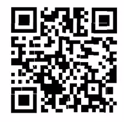

Vào, export objects/HTTP/application/octet-stream

Có 22 mảnh của file QR, ghép chúng lại (không thể làm được phải xem writeup xd) nhưng nói chung là vẫn có thể tận dụng các mảnh ở góc để ghép lại mấy cái mắt của qr xong dần dần lấp phần bên trong sẽ ra nhưng rất lâu

Tham khảo cấu trúc của qr code: https://en.wikipedia.org/wiki/QR_code

Bài `Stacked QR` phần for này cũng là một bài qr code khác nhưng cũng cần biết cấu trúc qr code: https://inseclab.uit.edu.vn/wannashare-writeups-asis-ctf-quals-2022-crypto-pwn-rev-forensics/

Tạo script để ghép chúng (Đang thực hiện)

`Flag{let_tape_the_wire}`